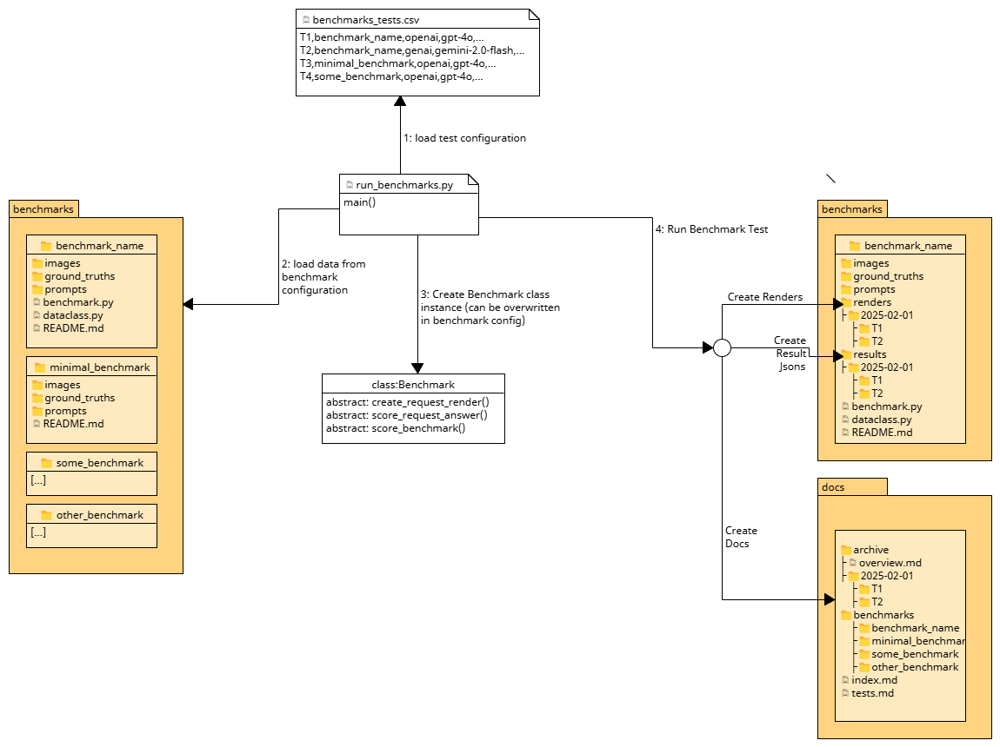

# LLM Benchmark Suite for Humanities Image Data

[](https://doi.org/10.5281/zenodo.16941752)

This repository contains benchmark datasets (images), prompts, ground truths, and evaluation scripts for
assessing the performance of large language models (LLMs) on humanities-related tasks. The suite is
designed as a resource for researchers and practitioners interested in systematically evaluating
how well various LLMs perform on digital humanities (DH) tasks involving visual materials.

> **ℹ Looking for benchmark results?**     
> This README provides an overview of the benchmark suite and explains how to use it.  
> For detailed test results and model comparisons, visit our [results dashboard](https://rise-unibas.github.io/humanities_data_benchmark/).

## What is Benchmarking and Why Should You Care?

Benchmarking is the process of systematically evaluating and ranking various models for specific tasks using well-defined ground truths and metrics. For humanities research, benchmarking provides:

- **Evidence-based decision-making** about which model(s) to use for which humanities-specific task(s)
- **Quantifiable comparisons** between different AI models on humanities data, including cost efficiency analysis
- **Standardized evaluation** of model performance on tasks like historical document analysis, transcription, and metadata extraction

This benchmark suite focuses on tasks essential to digital humanities work with visual materials, helping researchers make informed choices about which AI systems best suit their specific research needs.

> **ℹ Looking for more background?**  
> For a deeper introduction to AI benchmarking in humanities contexts, see:  
> Hindermann, M., & Marti, S. (2025, March 19). *RISE Crash Course: "AI Benchmarking"*. Zenodo. https://doi.org/10.5281/zenodo.15062831

## Table of Contents
- [Terminology](#terminology)
- [How it Works](#how-it-works)
- [Available Benchmarks](#available-benchmarks)
- [Expand on this Benchmark Suite](#expand-on-this-benchmark-suite)
  - [Create a new benchmark](#create-a-new-benchmark)
  - [API Keys](#api-keys)
  - [Run a Benchmark Test](#run-a-benchmark-test)
  - [Add Configuration to the Suite](#add-configuration-to-the-suite)
  - [Implement a Benchmark Class](#implement-a-benchmark-class)
- [Providers and Models](#providers-and-models)
- [Benchmarking Methodology](#benchmarking-methodology)
  - [Ground Truth](#ground-truth)
  - [Metrics](#metrics)
    - [Internal Metrics](#internal-metrics-task-performance)
    - [External Metrics](#external-metrics-practical-considerations)
- [Current Limitations](#current-limitations)
- [Practical Considerations](#practical-considerations)
- [Contributors](#contributors)

## Terminology
- **Benchmark**: A task for models to perform, consisting of images, ground truths, prompts, dataclasses, and scoring functions. Each benchmark is stored in a separate directory.
- **Prompt**: Text given to the model to guide its response.
- **Ground Truth**: The correct answer used to evaluate the model's response.
- **Image**: Visual input for the task. Images are paired with ground truth files.
- **Provider**: Company or service providing model access (`openai`, `genai`, `anthropic`, `mistral`, `openrouter`, or `scicore`).
- **Model**: Specific model used to perform the task.
- **Scoring Function**: Function that evaluates the model's response, implemented via the `score_answer` method.
- **Dataclass**: Pydantic models for structured output, supported across all providers.
- **Test**: A specific instance of a benchmark run with a particular configuration (provider, model, temperature, role description, prompt file, dataclass).
- **Test Configuration**: Parameters for running a test, stored in `benchmarks_tests.csv`.
- **Request**: API call(s) made during a test, consisting of images and prompts.
- **Response**: Model's answer containing metadata and output.
- **Score**: Evaluation result indicating model performance.


## How it Works

1. **Load Test Configuration**
2. **Load Data from Benchmark configuration**
3. **Create Benchmark class instance**
4. **Run Benchmark Tests**
   - **Create Request JSON Results**
   - **Create Request Renders**
   - **Create Request Scores**
   - **Create Benchmark Scores**
   - **Create Benchmark Result Documentation**



## Available Benchmarks

This benchmark suite currently includes the following benchmarks for evaluating LLM performance on humanities tasks:

| Benchmark | Description |
|-----------|-------------|
| **[Bibliographic Data](benchmarks/bibliographic_data/)** | Extract bibliographic information (publication details, authors, dates, metadata) from historical documents |
| **[Blacklist](benchmarks/blacklist/)** | Extract and structure information from historical blacklist cards |
| **[Company Lists](benchmarks/company_lists/)** | Extract structured company information from historical business listings and directories |
| **[Fraktur Text Recognition](benchmarks/fraktur/)** | Recognize and transcribe historical German Fraktur script (16th-20th centuries) |
| **[Medieval Manuscripts](benchmarks/medieval_manuscripts/)** | Page segmentation and handwritten text extraction from 15th century medieval German manuscripts |
| **[Metadata Extraction](benchmarks/metadata_extraction/)** | Extract structured metadata (names, organizations, dates, locations) from 20th century Swiss historical correspondence |
| **Test Benchmarks** | System validation and basic functionality testing ([test_benchmark](benchmarks/test_benchmark/), [test_benchmark2](benchmarks/test_benchmark2/)) |
| **[Zettelkatalog](benchmarks/zettelkatalog/)** | Catalog card analysis and information extraction from historical library catalog systems |

## Expand on this Benchmark Suite

The benchmark suite is designed to be extensible and welcomes contributions from the digital humanities community. Whether you're adding new benchmarks, improving existing ones, or enhancing the evaluation framework, your contributions help advance AI evaluation for humanities research. For detailed contribution guidelines, see [CONTRIBUTING.md](CONTRIBUTING.md). To report bugs, suggest features, or discuss improvements, please open an issue on our [GitHub Issues page](https://github.com/rise-unibas/humanities_data_benchmark/issues).

### Create a new benchmark

**Required structure:**
```
benchmarks/<benchmark_name>/
├── README.md              (use README_TEMPLATE.md)
├── images/                (image files: jpg, png)
├── prompts/               (text files with prompts)
├── ground_truths/         (json or txt files)
├── benchmark.py           (custom scoring)
└── dataclass.py           (optional: Pydantic models for structured output)
```

**Steps:**
1. **Create directories** following the structure above
2. **Add README.md** using [`README_TEMPLATE.md`](benchmarks/README_TEMPLATE.md) - describe the task, dataset, and evaluation criteria
3. **Add images** to `images/` directory (at least one). For multi-image prompts, use naming: `image1_p1.jpg`, `image1_p2.jpg`
4. **Add prompts** to `prompts/` directory (at least one text file)
5. **Add ground truths** to `ground_truths/` - one file per image/image sequence
6. **Add test configurations** to `benchmarks_tests.csv` to run with different models and settings

### API Keys
To use the benchmark suite, you need to provide API keys for the different providers.
- Create a `.env` file in the root directory of the repository.
- Add the following lines to the `.env` file:

```bash
OPENAI_API_KEY=<your_openai_api_key>
GENAI_API_KEY=<your_genai_api_key>
ANTHROPIC_API_KEY=<your_anthropic_api_key>
MISTRAL_API_KEY=<your_mistral_api_key>
OPENROUTER_API_KEY=<your_openrouter_api_key>
SCICORE_API_KEY=<your_scicore_api_key>
```

### Run a Benchmark Test

**Run all tests:**
```bash
python scripts/run_benchmarks.py
```

**Run single test:**
```bash
# With CLI arguments
python scripts/dhbm.py --name "folder_name" --provider "anthropic" --model "claude-3-7-sonnet-20250219" \
  --role_description "A useful assistant." --prompt_file "prompt.txt"

# With JSON config
python scripts/dhbm.py --config test_config.json

# With specific date
python scripts/dhbm.py --name "folder_name" --provider "anthropic" --model "..." --date "2025-03-01"

# Run specific test IDs
python -c "from scripts.run_benchmarks import main; main(limit_to=['T0017'])"
```

**Note:** API keys can be passed via `--api_key` argument or set in `.env` file.

### Add Configuration to the Suite
To add a configuration, you need to add a new row to the `benchmarks_tests.csv` file. The file has the following structure:

```csv
id,name,provider,model,dataclass,temperature,role_description,prompt_file,rules,legacy_test
T0001,test_benchmark,openai,gpt-4o,,,,,,false
```

- `id`: A unique identifier for the benchmark using 4-digit zero-padded format (e.g., T0001, T0002).
- `name`: The name of the benchmark. This must match the name of the directory in the `benchmarks` folder.
- `provider`: The provider of the model. This can be `openai`, `genai`, `anthropic`, `mistral`, `openrouter`, or `scicore`.
- `model`: The name of the model. This can be any model name that is supported by the provider.
- `dataclass`: The Pydantic model class name (from dataclass.py) used to structure the response of the request.
- `temperature`: The temperature parameter for the model. This can be any value between 0 and 1.
- `role_description`: A description of the role that the model should take on. This can be any description that is supported by the provider.
- `prompt_file`: The name of the prompt file in the `prompts` directory.
- `rules`: Additional configuration rules in JSON format for specialized test scenarios.
- `legacy_test`: A boolean value that indicates whether the benchmark is a legacy test. This can be `true` or `false`.

This allows you to run the benchmark with different models, prompts, and configurations.

### Implement a Benchmark Class
If you want to implement a custom benchmark class, you can create a `benchmark.py` file in the benchmark directory.
This file must contain a class that inherits from the `Benchmark` class. The class must be named like the benchmark 
folder but in CamelCase. Example: `TestBenchmark` for the `test_benchmark` folder.

The class can implement the following methods:

```python
from scripts.benchmark_base import Benchmark

class TestBenchmark(Benchmark):

    def score_answer(self, image_name, response, ground_truth):
        data = self.prepare_scoring_data(response)  # Extracts the relevant data from the response and returns a dictionary
        # [...] Score the answer from the model
        return {"total": 0} # Return a dictionary with scores   
        
    @property
    def convert_result_to_json(self):
        return True

    @property
    def resize_images(self):
        return True

    @property
    def get_page_part_regex(self):
        return r'(.+)_p\d+\.(jpg|jpeg|png)$'

    @property
    def get_output_format(self):
        return "json"
    
    @property
    def title(self):
        return f"{self.name} ({self.provider}/{self.model})"
```

The `score_answer` method is used to score the answer from the model. The method receives the image name, the response
from the model, and the ground truth. The method should return a dictionary with the scores. The keys of the dictionary
should be the names of the evaluation criteria, and the values should be the scores.

The rest of the methods are properties that can be used to configure the behavior of the benchmark. 
The `convert_result_to_json` property indicates whether the results should be converted to JSON format.
The `resize_images` property indicates whether the images should be resized before being sent to the model.
The `get_page_part_regex` property is a regular expression that is used to extract the page part from the image name.
The `get_output_format` property indicates the output format of the model response.
The `title` property is used to generate the title of the benchmark.

## Providers and Models

This benchmark suite currently tests models from the following providers:

| Provider | Model | Notes |
|----------|-------|-------|
| **Anthropic** | claude-3-5-sonnet-20241022 | Mid-tier Claude model with strong reasoning |
| | claude-3-7-sonnet-20250219 | Advanced Claude with improved capabilities |
| | claude-3-opus-20240229 | Highest capability Claude 3 model |
| | ~~claude-3-5-haiku-20241022~~ | ~~Fastest/smallest Claude 3.5~~ (legacy) |
| | claude-opus-4-1-20250805 | Updated Claude 4.1 Opus |
| | claude-opus-4-20250514 | Next-generation Claude 4 Opus |
| | claude-sonnet-4-20250514 | Claude 4 Sonnet |
| | claude-sonnet-4-5-20250929 | Latest Claude 4.5 Sonnet |
| **Google/Gemini** | ~~gemini-1.5-flash~~ | ~~Earlier generation flash~~ (legacy) |
| | ~~gemini-1.5-pro~~ | ~~Gemini 1.5 series~~ (legacy) |
| | gemini-2.0-flash | Fast response multimodal model |
| | gemini-2.0-flash-lite | Lighter version of 2.0-flash |
| | ~~gemini-2.0-pro-exp-02-05~~ | ~~Experimental 2.0 pro~~ (legacy) |
| | gemini-2.5-flash | Latest generation flash |
| | gemini-2.5-flash-lite | Efficient 2.5 flash |
| | gemini-2.5-flash-lite-preview-09-2025 | Preview lite flash |
| | ~~gemini-2.5-flash-preview-04-17~~ | ~~Preview flash~~ (legacy) |
| | gemini-2.5-flash-preview-09-2025 | Preview 2.5 flash |
| | gemini-2.5-pro | Production 2.5 pro |
| | ~~gemini-2.5-pro-exp-03-25~~ | ~~Experimental 2.5 pro~~ (legacy) |
| | ~~gemini-2.5-pro-preview-05-06~~ | ~~Preview 2.5 pro~~ (legacy) |
| | ~~gemini-exp-1206~~ | ~~Experimental~~ (legacy) |
| **Mistral AI** | mistral-large-latest | Most capable language model |
| | mistral-medium-2505 | Mid-tier balanced performance |
| | mistral-medium-2508 | Updated Mistral Medium |
| | pixtral-12b | 12B parameter multimodal |
| | pixtral-large-latest | Multimodal for vision tasks |
| **OpenAI** | gpt-4.1 | Latest GPT-4 iteration |
| | gpt-4.1-mini | Optimized for efficiency |
| | gpt-4.1-nano | Ultra-compact for lightweight tasks |
| | ~~gpt-4.5-preview~~ | ~~Updated GPT-4~~ (legacy) |
| | gpt-4o | Multimodal text and images |
| | gpt-4o-mini | Smaller, faster GPT-4o |
| | gpt-5 | Next-generation with advanced reasoning |
| | gpt-5-mini | Efficient GPT-5 |
| | gpt-5-nano | Compact GPT-5 |
| | o3 | Reasoning-focused model |
| **OpenRouter** | meta-llama/llama-4-maverick | Meta's Llama 4 via OpenRouter |
| | qwen/qwen3-vl-30b-a3b-instruct | Qwen3 VL 30B instruction |
| | qwen/qwen3-vl-8b-instruct | Qwen3 VL 8B instruction |
| | qwen/qwen3-vl-8b-thinking | Qwen3 VL 8B reasoning |
| | x-ai/grok-4 | xAI's Grok 4 multimodal |
| **sciCORE** | GLM-4.5V-FP8 | GLM-4.5V with FP8 quantization (University of Basel HPC) |

**Note:** OpenRouter provides access to models from multiple providers through a unified API. sciCORE provides access to models hosted on the University of Basel's high-performance computing infrastructure.

## Benchmarking Methodology

### Ground Truth
In this benchmark suite, a model's output for a task is compared to the ground truth (gold standard) for that task given the same input. Ground truth is the correct or verified output created by domain experts.

When selecting ground truth samples, we ensure:
- They are representative of the overall dataset
- They cover various edge cases and scenarios relevant to humanities tasks
- The sample size is large enough to achieve statistical significance

### Metrics
We use two categories of metrics to evaluate model performance:

#### Internal Metrics (Task Performance)
These metrics evaluate how well the model performs the specific task. Examples include:

- **F1 Score**: The harmonic mean of precision and recall, balancing both metrics
- **Precision**: The ratio of correctly predicted positive observations to all predicted positives
- **Recall**: The ratio of correctly predicted positive observations to all actual positives
- **Character/Word Error Rate**: Used for evaluating text generation and transcription accuracy

#### External Metrics (Practical Considerations)
These metrics evaluate factors beyond task performance that impact usability:

- **Compute Cost**: Automatically tracked based on token usage and date-based pricing data (`scripts/data/pricing.json`). Each run includes cost breakdown and historical pricing via Wayback Machine snapshots.
  - **Cost per Performance Point**: Efficiency metric ($/performance point) calculated per test, averaged per benchmark, then globally. Uses multi-level normalization for fair comparison across different test configurations and benchmark scales.
- **Test Time**: Automatically tracked for each API call.
  - **Time per Performance Point**: Efficiency metric (seconds/point per item) using the same multi-level normalization as cost calculation for fair comparison across different item counts and benchmark complexities.
- **Deployment Options**: Whether the model can be run locally or requires API calls
- **Legal and Ethical Considerations**: Including data privacy, IP compliance, and model bias

## Current Limitations

The benchmark suite currently has several limitations that could be addressed in future iterations:

| Category | Limitation | Description |
|----------|------------|-------------|
| **Models** | Local/self-hosted models | Limited support for models that can be run locally |
| **Capabilities** | Domain-specific fine-tuned models | Models specifically optimized for historical research not included |
| | OCR-specialized models | Models with particular strength in document processing/OCR not included |
| | Multilingual capabilities | Systematic testing across different languages not covered |
| **Benchmark Coverage** | Limited benchmark diversity | Currently focused on document analysis; missing art history, archaeology, musicology domains |
| | Language coverage | Primarily German and English; limited coverage of other European languages and non-Western scripts |
| | Historical period coverage | Concentrated on 19th-20th century; limited medieval, early modern, or contemporary sources |
| **Evaluation** | Context window testing | Evaluation across different context window sizes and document lengths not implemented |
| | Standardized error analysis | More granular error categorization and failure mode analysis needed |

## Practical Considerations

When using this benchmark suite for your own research, consider the following:

| Category | Consideration | Description |
|----------|---------------|-------------|
| **Resource Requirements** | Skills | Operationalizing tasks requires both domain knowledge and technical expertise |
| | Ground Truth Creation | Requires domain expertise and careful curation |
| | Metric Selection | Requires understanding of both the humanities domain and evaluation methods |
| **Technical** | Local vs. API Models | Determine if you need to run models locally or can use API services |
| | Data Privacy | Ensure you're allowed to share your data via APIs if needed |
| | Infrastructure | Consider if you have access to appropriate computing resources |
| **Compliance** | Legal Requirements | Check for any legal restrictions on data sharing or model usage |
| | Ethical Guidelines | Consider any ethical implications of your benchmarking approach |
| | Funder Requirements | Verify if there are any funding agency requirements |
| | FAIR Data Principles | Consider how to make your benchmark data Findable, Accessible, Interoperable, and Reusable |

## Contributors

This project is developed by a multidisciplinary team at the University of Basel's RISE (Research and Infrastructure Support). 

| Name | GitHub | ORCID |
|------|-------|-------|
| Anthea Alberto | [@antheajeanne](https://github.com/antheajeanne) | [0009-0007-0430-0050](https://orcid.org/0009-0007-0430-0050) |
| Sven Burkhardt | [@Sveburk](https://github.com/Sveburk) | [0009-0001-4954-4426](https://orcid.org/0009-0001-4954-4426) |
| Eric Decker | [@edecker](https://github.com/edecker) | [0000-0003-3035-2413](https://orcid.org/0000-0003-3035-2413) |
| Pema Frick | [@pwmff](https://github.com/pwmff) | [0000-0002-8733-7161](https://orcid.org/0000-0002-8733-7161) |
| Maximilian Hindermann | [@MHindermann](https://github.com/MHindermann) | [0000-0002-9337-4655](https://orcid.org/0000-0002-9337-4655) |
| Lea Kasper | [@lekasp](https://github.com/lekasp) | [0000-0002-4671-1700](https://orcid.org/0000-0002-4671-1700) |
| José Luis Losada Palenzuela | [@editio](https://github.com/editio) | [0000-0002-6530-1328](https://orcid.org/0000-0002-6530-1328) |
| Sorin Marti | [@sorinmarti](https://github.com/sorinmarti) | [0000-0002-9541-1202](https://orcid.org/0000-0002-9541-1202) |
| Gabriel Müller | [@gbmllr1](https://github.com/gbmllr1) | [0000-0001-8320-5148](https://orcid.org/0000-0001-8320-5148) |
| Ina Serif | [@wissen-ist-acht](https://github.com/wissen-ist-acht) | [0000-0003-2419-4252](https://orcid.org/0000-0003-2419-4252) |
| Elena Spadini | [@elespdn](https://github.com/elespdn) | [0000-0002-4522-2833](https://orcid.org/0000-0002-4522-2833) |

For detailed attribution by benchmark and contribution type, see our [CONTRIBUTORS.md](CONTRIBUTORS.md) file.
