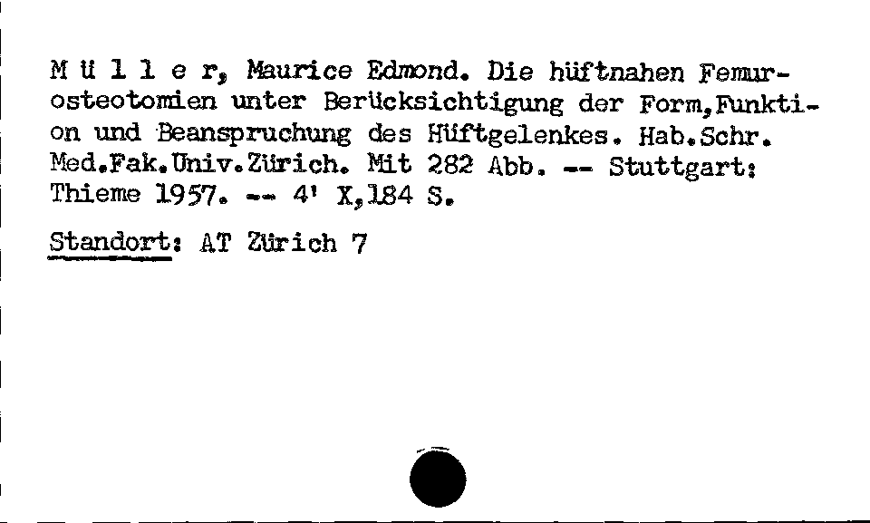

# Zettelkatalog Benchmark

## Table of Contents
- [Overview](#overview)
- [Creator](#creator)
- [Dataset Description](#dataset-description)
- [Task Description](#task-description)
- [Ground Truth](#ground-truth)
- [Evaluation Criteria](#evaluation-criteria)
- [Results](#results)
- [Observations](#observations)
- [Limitations and Future Work](#limitations-and-future-work)

## Overview
This benchmark evaluates the performance of large language models on extracting bibliograhic information from index cards. The benchmark consists of 263 images containing descriptions of historical dissertations (before 1980, some well before 1900). The set contains both typeset and handwritten cards, and the format and exact content of the descriptions varies. 

## Creator
This benchmark was created by [Gabriel Müller](https://github.com/gbmllr1) at Basel University Library and [Maximilian Hindermann](https://orcid.org/0000-0002-9337-4655) of the University of Basel's Research and Infrastructure Support RISE (rise@unibas.ch) in 2025.

## Dataset Description

### Source
- **Collection**: Dissertationenkatalog bis 1980
- **Time Period**: -1980
- **Languages**: Mostly German; some French, English, Latin, Greek, Finnish, Swedish, Polish
- **Format**: Mixed
- **Link**: https://ub.unibas.ch/cmsdata/spezialkataloge/ipac/searchform.php?KatalogID=ak2
- **License**: CC0

### Contents
The dataset contains 263 images of index cards describing historical dissertations (96.2%) or references to such dissertations (3.8%). Each image corresponds to one card and one dissertation. It is a random sample out of the ~700'000 dissertations collected by Basel University Library in the time period before 1980. The original works come predominantly from Switzerland and neighboring countries, but some may come from anywhere in the world.

Strictly speaking, a typical card may describe multiple things and events related to a given dissertation/PhD thesis (an abstract work): 

1) The author (a person), 
2) the published version of record required for the diploma (a publication), 
3) the thesis defense (an event), 
4) other published versions of the thesis (a publication, e.g. an extract in the form of a journal article). 

Not all of these elements are present in every case, and they are often not explicitly separated on the card.
Furthermore, some of the cards do not contain a full description of a thesis, but are merely references to another card in the catalogue. In these cases, the card begins with the name of the referenced author, followed by an "s." on a separate line (German "siehe"). There may or may not be other information below that.

## Ground Truth

### Ground Truth Creation
The ground truth was created by manual correction of responses generated by `chat-gpt-4o`, using the [`ground-truther.py`](https://github.com/RISE-UNIBAS/humanities_data_benchmark/blob/main/benchmarks/zettelkatalog/ground_truther.py) tool. In addition to correct readings of the text, the following rules were enforced (cf. also the instructions given in [`prompt.txt`](https://github.com/RISE-UNIBAS/humanities_data_benchmark/blob/main/benchmarks/zettelkatalog/prompts/prompt.txt)):

- A card containing the note "s." on a separate line should be classified as a reference.
- Page numbers should be given without "p." or "S.", but if there is information on additional unnumbered pages, that info should be kept (i.e. "IV S. + 67-74 S." yields "IV 67-74")
- A work in octavo format may be listed as "8°" or as "8'". The result should render the exact value as it is on the card.
 
- Note that the fields "provider", "model", "test_time", "execution_time" and "scores" are metadata of the ground truth creation and technically not part of the ground truth itself.

### Ground Truth Format
The ground truth is stored in JSON files with the following structure based on the dataclass schema:

```json
{
  "provider": "openai",
  "model": "gpt-4o", 
  "test_time": 3.314879894256592,
  "execution_time": "2025-04-16T14:16:43.444961",
  "response_text": {
    "type": {
      "type": "Dissertation or thesis" | "Reference"
    },
    "author": {
      "last_name": "string",
      "first_name": "string"
    },
    "publication": {
      "title": "string",
      "year": "integer",
      "place": "string (optional)",
      "pages": "string (optional)", 
      "publisher": "string (optional)",
      "format": "string (optional)"
    },
    "library_reference": {
      "shelfmark": "string (optional)",
      "subjects": "string (optional)"
    }
  },
  "scores": {}
}
```
## Scoring

### Evaluation Criteria
The models are tasked with extracting bibliographic information from historical dissertation index cards. Models must output a JSON structure with the fields defined in `dataclass.py`. 

**Key extraction requirements:**

- **Type classification**: Determine if the card contains a full dissertation description or is merely a reference to another record
- **Author information**: Extract first and last names of the thesis author
- **Publication details**: Extract title, year, place, pages, publisher, and format where available  
- **Library reference**: Extract shelfmark and subject classifications

**Expected output format sample (from image 00423152.jpg):**



```json
{
  "type": {"type": "Dissertation or thesis"},
  "author": {"last_name": "Müller", "first_name": "Maurice Edmond"},
  "publication": {
    "title": "Die hüftnahen Femurosteotomien unter Berücksichtigung der Form,Funktion und Beanspruchung des Hüftgelenkes",
    "year": 1957,
    "place": "Stuttgart",
    "pages": "X,184",
    "publisher": "Thieme",
    "format": "4'"
  },
  "library_reference": {
    "shelfmark": "AT Zürich 7",
    "subjects": ""
  }
}
```

### Scoring Methodology
The scoring system implements field-level F1 evaluation using the following methodology:

1. **Field Extraction**: All terminal fields from both the model response and ground truth are extracted using nested dictionary traversal
2. **Field Comparison**: Each field is compared using fuzzy string matching (RapidFuzz) with a threshold of 0.92 for exact matches
3. **TP/FP/FN Calculation**:
   - **True Positive (TP)**: Fields that match between response and ground truth above the threshold
   - **False Positive (FP)**: Fields present in response but not matching ground truth
   - **False Negative (FN)**: Fields present in ground truth but missing or not matching in response
4. **F1 Calculation**: Standard F1 formula: `F1 = 2 * precision * recall / (precision + recall)`

### Benchmark Scoring
The benchmark provides both micro and macro F1 scores:

- **Micro F1**: Aggregates TP/FP/FN across all test instances, then calculates a single F1 score
- **Macro F1**: Calculates F1 for each instance individually, then averages all F1 scores

### Example Scoring

**Ground Truth** (from image 00423152.jpg, see above):
```json
{
  "type": {"type": "Dissertation or thesis"},
  "author": {"last_name": "Müller", "first_name": "Maurice Edmond"},
  "publication": {
    "title": "Die hüftnahen Femurosteotomien unter Berücksichtigung der Form, Funktion und Beanspruchung des Hüftgelenkes",
    "year": 1957,
    "place": "Stuttgart", 
    "pages": "X,184",
    "publisher": "Thieme",
    "format": "4'"
  },
  "library_reference": {"shelfmark": "AT Zürich 7", "subjects": ""}
}
```

**Model Response**:
```json
{
  "type": {"type": "Dissertation or thesis"},
  "author": {"last_name": "Müller", "first_name": "Maurice"},
  "publication": {
    "title": "Die hüftnahen Femurosteotomien unter Berücksichtigung der Form, Funktion und Beanspruchung des Hüftgelenkes", 
    "year": 1957,
    "place": "Stuttgart",
    "pages": "X, 184",
    "publisher": "Thieme Verlag",
    "format": "4'"
  },
  "library_reference": {"shelfmark": "AT Zürich 7", "subjects": ""}
}
```

**Field-by-Field Analysis**:

- `type.type`: "Dissertation or thesis" = "Dissertation or thesis" ✓ **TP**
- `author.last_name`: "Müller" = "Müller" ✓ **TP** 
- `author.first_name`: "Maurice" ≠ "Maurice Edmond" (fuzzy match < 0.92) ✗ **FP/FN**
- `publication.title`: Perfect match ✓ **TP**
- `publication.year`: 1957 = 1957 ✓ **TP**
- `publication.place`: "Stuttgart" = "Stuttgart" ✓ **TP**
- `publication.pages`: "X, 184" ≠ "X,184" (fuzzy match < 0.92) ✗ **FP/FN**
- `publication.publisher`: "Thieme Verlag" ≠ "Thieme" (fuzzy match < 0.92) ✗ **FP/FN** 
- `publication.format`: "4'" = "4'" ✓ **TP**
- `library_reference.shelfmark`: "AT Zürich 7" = "AT Zürich 7" ✓ **TP**
- `library_reference.subjects`: "" = "" ✓ **TP**

**Results**:

- **True Positives (TP)**: 8 (exact matches above fuzzy threshold)
- **False Positives (FP)**: 3 (fields in response not matching ground truth)
- **False Negatives (FN)**: 3 (fields in ground truth not matching response)

**Calculations**:

- **Precision** = TP/(TP+FP) = 8/(8+3) = 0.73
- **Recall** = TP/(TP+FN) = 8/(8+3) = 0.73  
- **F1 Score** = 2 × Precision × Recall / (Precision + Recall) = 2 × 0.73 × 0.73 / (0.73 + 0.73) = **0.73**

## Observations

Preliminary results indicate that models generally perform well on clearly typed cards with standard formats. However, performance drops on handwritten cards and those with non-standard layouts or abbreviations. Common error patterns include:

- Shelf marks and subject classifications are often omitted or incorrectly parsed
- Minor formatting differences in complex fields (pages, publisher details)
- Over-specification of publisher names ("Verlag" additions)
- Subtle variations in format notations and academic abbreviations

## Limitations and Future Work

### Current Limitations

#### Dataset Limitations
- **Sample Size**: While 263 cards provide statistical significance, the dataset represents only ~0.04% of the full collection, potentially missing edge cases
- **Selection Bias**: Random sampling may not adequately represent the full range of historical periods, languages, and card conditions present in the complete archive
- **Format Standardization**: Ground truth creation involved some normalization decisions that may not capture all valid interpretations of ambiguous content

#### Evaluation Limitations
- **Fuzzy Matching Threshold**: The 0.92 similarity threshold for field matching may be too strict for some legitimate variations while too lenient for others
- **Field Weighting**: All fields contribute equally to the F1 score, but some fields (e.g., author names) may be more critical than others (e.g., format notation)
- **Semantic vs. Syntactic**: Current scoring focuses on string similarity rather than semantic equivalence (e.g., "Stuttgart" vs "Stuttgart, Germany")

### Future Work

#### Dataset Enhancements
- **Expanded Sampling**: Increase dataset size to 500-1000 cards with stratified sampling across time periods and institutions
- **Quality Stratification**: Categorize cards by image quality, handwriting clarity, and formatting complexity for targeted evaluation
- **Cross-institutional Validation**: Include cards from other university archives to test generalizability

#### Evaluation Improvements
- **Hierarchical Scoring**: Implement weighted scoring that reflects the relative importance of different bibliographic fields
- **Semantic Similarity**: Integrate semantic similarity measures for publisher names, place names, and academic terminology
- **Error Type Classification**: Develop taxonomy of error types (OCR-like, formatting, semantic) for more targeted analysis
- **Human Evaluation**: Conduct inter-annotator agreement studies to validate ground truth quality

#### Benchmark Extensions
- **Multi-modal Baselines**: Compare pure vision models, OCR+NLP pipelines, and end-to-end multimodal approaches
- **Cross-domain Transfer**: Test model performance on related bibliographic extraction tasks (modern citations, manuscript catalogues)
