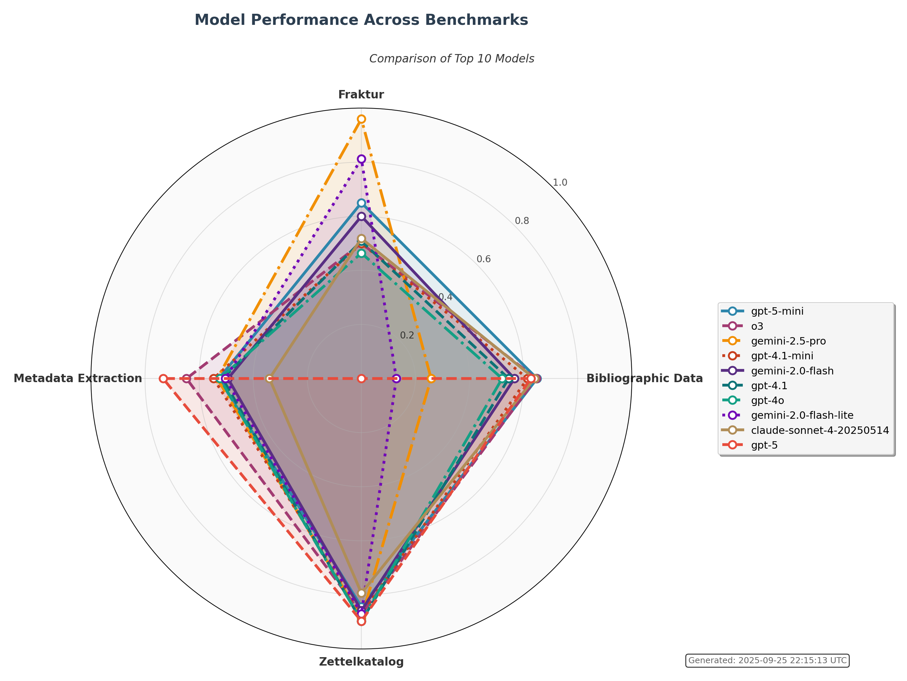

# Humanities Data Benchmark
Welcome to the **Humanities Data Benchmark** report page. This page provides an overview of all benchmark tests, 
results, and comparisons.

## Leaderboard

The table below shows the **global average performance** and **cost efficiency** of each model across the four core benchmarks:
[bibliographic_data](benchmarks/bibliographic_data/), [fraktur](benchmarks/fraktur/), [metadata_extraction](benchmarks/metadata_extraction/), and [zettelkatalog](benchmarks/zettelkatalog/). The "Cost per Point" column shows how much each performance point costs in USD, helping you identify the most cost-effective models for your research. Only models with results in all four benchmarks are included. Click on any column header to sort the table.

<table id="leaderboard-table" style="width:100%; border-collapse: collapse; margin-bottom: 20px;">
<thead>
<tr>
<th onclick="sortTable(0)" style="cursor: pointer;">Model ↕</th>
<th onclick="sortTable(1)" style="cursor: pointer;">Provider ↕</th>
<th onclick="sortTable(2)" style="cursor: pointer;">Global Average ↕</th>
<th onclick="sortTable(3)" style="cursor: pointer;">Cost per Point ↕</th>
<th onclick="sortTable(4)" style="cursor: pointer;"><a href="benchmarks/bibliographic_data/" style="color: inherit; text-decoration: none;">bibliographic_data</a> ↕</th>
<th onclick="sortTable(5)" style="cursor: pointer;"><a href="benchmarks/fraktur/" style="color: inherit; text-decoration: none;">fraktur</a> ↕</th>
<th onclick="sortTable(6)" style="cursor: pointer;"><a href="benchmarks/metadata_extraction/" style="color: inherit; text-decoration: none;">metadata_extraction</a> ↕</th>
<th onclick="sortTable(7)" style="cursor: pointer;"><a href="benchmarks/zettelkatalog/" style="color: inherit; text-decoration: none;">zettelkatalog</a> ↕</th>
</tr>
</thead>
<tbody><tr><td data-sort="o3">o3</td><td data-sort="OpenAI">OpenAI</td><td data-sort="0.666"></td><td data-sort="999">N/A</td><td data-sort="0.646"></td><td data-sort="0.500"></td><td data-sort="0.647"></td><td data-sort="0.871"></td></tr><tr><td data-sort="gpt-5-mini">gpt-5-mini</td><td data-sort="OpenAI">OpenAI</td><td data-sort="0.664"></td><td data-sort="0.0806"></td><td data-sort="0.635"></td><td data-sort="0.650"></td><td data-sort="0.527"></td><td data-sort="0.844"></td></tr><tr><td data-sort="gemini-2.5-pro">gemini-2.5-pro</td><td data-sort="Google">Google</td><td data-sort="0.659"></td><td data-sort="999">N/A</td><td data-sort="0.258"></td><td data-sort="0.960"></td><td data-sort="0.533"></td><td data-sort="0.886"></td></tr><tr><td data-sort="claude-opus-4-1-20250805">claude-opus-4-1-20250805</td><td data-sort="Anthropic">Anthropic</td><td data-sort="0.639"></td><td data-sort="1.4160"></td><td data-sort="0.633"></td><td data-sort="0.644"></td><td data-sort="0.433"></td><td data-sort="0.845"></td></tr><tr><td data-sort="gpt-4.1-mini">gpt-4.1-mini</td><td data-sort="OpenAI">OpenAI</td><td data-sort="0.633"></td><td data-sort="999">N/A</td><td data-sort="0.615"></td><td data-sort="0.500"></td><td data-sort="0.547"></td><td data-sort="0.870"></td></tr><tr><td data-sort="gpt-4.1">gpt-4.1</td><td data-sort="OpenAI">OpenAI</td><td data-sort="0.616"></td><td data-sort="999">N/A</td><td data-sort="0.544"></td><td data-sort="0.508"></td><td data-sort="0.513"></td><td data-sort="0.897"></td></tr><tr><td data-sort="gemini-2.0-flash">gemini-2.0-flash</td><td data-sort="Google">Google</td><td data-sort="0.615"></td><td data-sort="0.0076"></td><td data-sort="0.508"></td><td data-sort="0.600"></td><td data-sort="0.493"></td><td data-sort="0.858"></td></tr><tr><td data-sort="mistral-medium-2508">mistral-medium-2508</td><td data-sort="Mistral AI">Mistral AI</td><td data-sort="0.601"></td><td data-sort="0.0363"></td><td data-sort="0.723"></td><td data-sort="0.404"></td><td data-sort="0.497"></td><td data-sort="0.780"></td></tr><tr><td data-sort="gpt-4o">gpt-4o</td><td data-sort="OpenAI">OpenAI</td><td data-sort="0.601"></td><td data-sort="999">N/A</td><td data-sort="0.520"></td><td data-sort="0.464"></td><td data-sort="0.523"></td><td data-sort="0.896"></td></tr><tr><td data-sort="gemini-2.0-flash-lite">gemini-2.0-flash-lite</td><td data-sort="Google">Google</td><td data-sort="0.579"></td><td data-sort="999">N/A</td><td data-sort="0.129"></td><td data-sort="0.812"></td><td data-sort="0.503"></td><td data-sort="0.871"></td></tr><tr><td data-sort="claude-sonnet-4-20250514">claude-sonnet-4-20250514</td><td data-sort="Anthropic">Anthropic</td><td data-sort="0.573"></td><td data-sort="999">N/A</td><td data-sort="0.640"></td><td data-sort="0.518"></td><td data-sort="0.340"></td><td data-sort="0.793"></td></tr><tr><td data-sort="mistral-medium-2505">mistral-medium-2505</td><td data-sort="Mistral AI">Mistral AI</td><td data-sort="0.573"></td><td data-sort="999">N/A</td><td data-sort="0.612"></td><td data-sort="0.400"></td><td data-sort="0.500"></td><td data-sort="0.778"></td></tr><tr><td data-sort="gpt-5">gpt-5</td><td data-sort="OpenAI">OpenAI</td><td data-sort="0.564"></td><td data-sort="999">N/A</td><td data-sort="0.627"></td><td data-sort="0.000"></td><td data-sort="0.733"></td><td data-sort="0.897"></td></tr><tr><td data-sort="claude-opus-4-20250514">claude-opus-4-20250514</td><td data-sort="Anthropic">Anthropic</td><td data-sort="0.549"></td><td data-sort="999">N/A</td><td data-sort="0.327"></td><td data-sort="0.594"></td><td data-sort="0.437"></td><td data-sort="0.839"></td></tr><tr><td data-sort="gpt-4o-mini">gpt-4o-mini</td><td data-sort="OpenAI">OpenAI</td><td data-sort="0.529"></td><td data-sort="999">N/A</td><td data-sort="0.539"></td><td data-sort="0.242"></td><td data-sort="0.528"></td><td data-sort="0.807"></td></tr><tr><td data-sort="pixtral-large-latest">pixtral-large-latest</td><td data-sort="Mistral AI">Mistral AI</td><td data-sort="0.477"></td><td data-sort="999">N/A</td><td data-sort="0.394"></td><td data-sort="0.408"></td><td data-sort="0.327"></td><td data-sort="0.778"></td></tr><tr><td data-sort="gpt-5-nano">gpt-5-nano</td><td data-sort="OpenAI">OpenAI</td><td data-sort="0.407"></td><td data-sort="999">N/A</td><td data-sort="0.330"></td><td data-sort="0.000"></td><td data-sort="0.497"></td><td data-sort="0.802"></td></tr><tr><td data-sort="gpt-4.1-nano">gpt-4.1-nano</td><td data-sort="OpenAI">OpenAI</td><td data-sort="0.354"></td><td data-sort="999">N/A</td><td data-sort="0.330"></td><td data-sort="0.006"></td><td data-sort="0.470"></td><td data-sort="0.612"></td></tr><tr><td data-sort="claude-3-5-sonnet-20241022">claude-3-5-sonnet-20241022</td><td data-sort="Anthropic">Anthropic</td><td data-sort="0.339"></td><td data-sort="999">N/A</td><td data-sort="0.000"></td><td data-sort="0.042"></td><td data-sort="0.427"></td><td data-sort="0.889"></td></tr><tr><td data-sort="claude-3-7-sonnet-20250219">claude-3-7-sonnet-20250219</td><td data-sort="Anthropic">Anthropic</td><td data-sort="0.328"></td><td data-sort="999">N/A</td><td data-sort="0.000"></td><td data-sort="0.000"></td><td data-sort="0.437"></td><td data-sort="0.877"></td></tr><tr><td data-sort="claude-3-opus-20240229">claude-3-opus-20240229</td><td data-sort="Anthropic">Anthropic</td><td data-sort="0.255"></td><td data-sort="999">N/A</td><td data-sort="0.000"></td><td data-sort="0.006"></td><td data-sort="0.257"></td><td data-sort="0.756"></td></tr></tbody>
</table>

The following radar chart shows the performance distribution of top models across the four core benchmarks:

## Latest Benchmark Results

### <a href="benchmarks/bibliographic_data/">bibliographic_data</a>

<table class="inner-table sortable-table" id="bibliographic_data-table">
<thead>
<tr>
<th onclick="sortBenchmarkTable('bibliographic_data', 0)" style="cursor: pointer;">Model ↕</th>
<th onclick="sortBenchmarkTable('bibliographic_data', 1)" style="cursor: pointer;">Provider ↕</th>
<th onclick="sortBenchmarkTable('bibliographic_data', 2)" style="cursor: pointer;">Test ID ↕</th>
<th onclick="sortBenchmarkTable('bibliographic_data', 3)" style="cursor: pointer;">Date ↕</th>
<th onclick="sortBenchmarkTable('bibliographic_data', 4)" style="cursor: pointer;">Prompt ↕</th>
<th onclick="sortBenchmarkTable('bibliographic_data', 5)" style="cursor: pointer;">Rules ↕</th>
<th onclick="sortBenchmarkTable('bibliographic_data', 6)" style="cursor: pointer;">Results ↕</th>
<th onclick="sortBenchmarkTable('bibliographic_data', 7)" style="cursor: pointer;">Cost (USD) ↕</th>
</tr>
</thead>
<tbody><tr><td data-sort="mistral-medium-2508">mistral-medium-2508</td><td data-sort="Mistral AI">Mistral AI</td><td data-sort="T0169"><a href='/humanities_data_benchmark/tests/T0169'>T0169</a></td><td data-sort="2025-09-29">2025-09-29</td><td data-sort="prompt.txt">prompt.txt</td><td data-sort="">None</td><td data-sort="0.723"></td><td data-sort="$0.0218">$0.0218</td></tr><tr><td data-sort="o3">o3</td><td data-sort="OpenAI">OpenAI</td><td data-sort="T0133"><a href='/humanities_data_benchmark/tests/T0133'>T0133</a></td><td data-sort="2025-08-20">2025-08-20</td><td data-sort="prompt.txt">prompt.txt</td><td data-sort="">None</td><td data-sort="0.646"></td><td data-sort="N/A">N/A</td></tr><tr><td data-sort="claude-sonnet-4-20250514">claude-sonnet-4-20250514</td><td data-sort="Anthropic">Anthropic</td><td data-sort="T0107"><a href='/humanities_data_benchmark/tests/T0107'>T0107</a></td><td data-sort="2025-09-24">2025-09-24</td><td data-sort="prompt.txt">prompt.txt</td><td data-sort="">None</td><td data-sort="0.640"></td><td data-sort="N/A">N/A</td></tr><tr><td data-sort="gpt-5-mini">gpt-5-mini</td><td data-sort="OpenAI">OpenAI</td><td data-sort="T0130"><a href='/humanities_data_benchmark/tests/T0130'>T0130</a></td><td data-sort="2025-09-29">2025-09-29</td><td data-sort="prompt.txt">prompt.txt</td><td data-sort="">None</td><td data-sort="0.635"></td><td data-sort="$0.0535">$0.0535</td></tr><tr><td data-sort="claude-opus-4-1-20250805">claude-opus-4-1-20250805</td><td data-sort="Anthropic">Anthropic</td><td data-sort="T0127"><a href='/humanities_data_benchmark/tests/T0127'>T0127</a></td><td data-sort="2025-09-29">2025-09-29</td><td data-sort="prompt.txt">prompt.txt</td><td data-sort="">None</td><td data-sort="0.633"></td><td data-sort="$0.9045">$0.9045</td></tr><tr><td data-sort="gpt-5">gpt-5</td><td data-sort="OpenAI">OpenAI</td><td data-sort="T0129"><a href='/humanities_data_benchmark/tests/T0129'>T0129</a></td><td data-sort="2025-08-14">2025-08-14</td><td data-sort="prompt.txt">prompt.txt</td><td data-sort="">None</td><td data-sort="0.627"></td><td data-sort="N/A">N/A</td></tr><tr><td data-sort="gpt-4.1-mini">gpt-4.1-mini</td><td data-sort="OpenAI">OpenAI</td><td data-sort="T0140"><a href='/humanities_data_benchmark/tests/T0140'>T0140</a></td><td data-sort="2025-08-27">2025-08-27</td><td data-sort="prompt.txt">prompt.txt</td><td data-sort="">None</td><td data-sort="0.615"></td><td data-sort="N/A">N/A</td></tr><tr><td data-sort="mistral-medium-2505">mistral-medium-2505</td><td data-sort="Mistral AI">Mistral AI</td><td data-sort="T0170"><a href='/humanities_data_benchmark/tests/T0170'>T0170</a></td><td data-sort="2025-09-26">2025-09-26</td><td data-sort="prompt.txt">prompt.txt</td><td data-sort="">None</td><td data-sort="0.612"></td><td data-sort="N/A">N/A</td></tr><tr><td data-sort="gpt-4.1">gpt-4.1</td><td data-sort="OpenAI">OpenAI</td><td data-sort="T0139"><a href='/humanities_data_benchmark/tests/T0139'>T0139</a></td><td data-sort="2025-08-27">2025-08-27</td><td data-sort="prompt.txt">prompt.txt</td><td data-sort="">None</td><td data-sort="0.544"></td><td data-sort="N/A">N/A</td></tr><tr><td data-sort="gpt-4o-mini">gpt-4o-mini</td><td data-sort="OpenAI">OpenAI</td><td data-sort="T0027"><a href='/humanities_data_benchmark/tests/T0027'>T0027</a></td><td data-sort="2025-04-08">2025-04-08</td><td data-sort="prompt.txt">prompt.txt</td><td data-sort="">None</td><td data-sort="0.539"></td><td data-sort="N/A">N/A</td></tr><tr><td data-sort="gpt-4o">gpt-4o</td><td data-sort="OpenAI">OpenAI</td><td data-sort="T0007"><a href='/humanities_data_benchmark/tests/T0007'>T0007</a></td><td data-sort="2025-04-08">2025-04-08</td><td data-sort="prompt.txt">prompt.txt</td><td data-sort="">None</td><td data-sort="0.520"></td><td data-sort="N/A">N/A</td></tr><tr><td data-sort="gemini-2.0-flash">gemini-2.0-flash</td><td data-sort="Google">Google</td><td data-sort="T0008"><a href='/humanities_data_benchmark/tests/T0008'>T0008</a></td><td data-sort="2025-09-29">2025-09-29</td><td data-sort="prompt.txt">prompt.txt</td><td data-sort="">None</td><td data-sort="0.508"></td><td data-sort="$0.0047">$0.0047</td></tr><tr><td data-sort="pixtral-large-latest">pixtral-large-latest</td><td data-sort="Mistral AI">Mistral AI</td><td data-sort="T0035"><a href='/humanities_data_benchmark/tests/T0035'>T0035</a></td><td data-sort="2025-09-25">2025-09-25</td><td data-sort="prompt.txt">prompt.txt</td><td data-sort="">None</td><td data-sort="0.394"></td><td data-sort="N/A">N/A</td></tr><tr><td data-sort="gpt-5-nano">gpt-5-nano</td><td data-sort="OpenAI">OpenAI</td><td data-sort="T0131"><a href='/humanities_data_benchmark/tests/T0131'>T0131</a></td><td data-sort="2025-08-14">2025-08-14</td><td data-sort="prompt.txt">prompt.txt</td><td data-sort="">None</td><td data-sort="0.330"></td><td data-sort="N/A">N/A</td></tr><tr><td data-sort="gpt-4.1-nano">gpt-4.1-nano</td><td data-sort="OpenAI">OpenAI</td><td data-sort="T0141"><a href='/humanities_data_benchmark/tests/T0141'>T0141</a></td><td data-sort="2025-08-27">2025-08-27</td><td data-sort="prompt.txt">prompt.txt</td><td data-sort="">None</td><td data-sort="0.330"></td><td data-sort="N/A">N/A</td></tr><tr><td data-sort="claude-opus-4-20250514">claude-opus-4-20250514</td><td data-sort="Anthropic">Anthropic</td><td data-sort="T0106"><a href='/humanities_data_benchmark/tests/T0106'>T0106</a></td><td data-sort="2025-08-27">2025-08-27</td><td data-sort="prompt.txt">prompt.txt</td><td data-sort="">None</td><td data-sort="0.327"></td><td data-sort="N/A">N/A</td></tr><tr><td data-sort="gemini-2.5-pro">gemini-2.5-pro</td><td data-sort="Google">Google</td><td data-sort="T0128"><a href='/humanities_data_benchmark/tests/T0128'>T0128</a></td><td data-sort="2025-08-14">2025-08-14</td><td data-sort="prompt.txt">prompt.txt</td><td data-sort="">None</td><td data-sort="0.258"></td><td data-sort="N/A">N/A</td></tr><tr><td data-sort="gpt-4.5-preview">gpt-4.5-preview</td><td data-sort="OpenAI">OpenAI</td><td data-sort="T0026"><a href='/humanities_data_benchmark/tests/T0026'>T0026</a></td><td data-sort="2025-04-08">2025-04-08</td><td data-sort="prompt.txt">prompt.txt</td><td data-sort="">None</td><td data-sort="0.203"></td><td data-sort="N/A">N/A</td></tr><tr><td data-sort="gemini-2.0-flash-lite">gemini-2.0-flash-lite</td><td data-sort="Google">Google</td><td data-sort="T0033"><a href='/humanities_data_benchmark/tests/T0033'>T0033</a></td><td data-sort="2025-04-08">2025-04-08</td><td data-sort="prompt.txt">prompt.txt</td><td data-sort="">None</td><td data-sort="0.129"></td><td data-sort="N/A">N/A</td></tr><tr><td data-sort="gemini-1.5-pro">gemini-1.5-pro</td><td data-sort="Google">Google</td><td data-sort="T0030"><a href='/humanities_data_benchmark/tests/T0030'>T0030</a></td><td data-sort="2025-04-08">2025-04-08</td><td data-sort="prompt.txt">prompt.txt</td><td data-sort="">None</td><td data-sort="0.116"></td><td data-sort="N/A">N/A</td></tr><tr><td data-sort="gemini-1.5-flash">gemini-1.5-flash</td><td data-sort="Google">Google</td><td data-sort="T0029"><a href='/humanities_data_benchmark/tests/T0029'>T0029</a></td><td data-sort="2025-04-08">2025-04-08</td><td data-sort="prompt.txt">prompt.txt</td><td data-sort="">None</td><td data-sort="0.106"></td><td data-sort="N/A">N/A</td></tr><tr><td data-sort="claude-3-5-sonnet-20241022">claude-3-5-sonnet-20241022</td><td data-sort="Anthropic">Anthropic</td><td data-sort="T0009"><a href='/humanities_data_benchmark/tests/T0009'>T0009</a></td><td data-sort="2025-04-08">2025-04-08</td><td data-sort="prompt.txt">prompt.txt</td><td data-sort="">None</td><td data-sort="0.000"></td><td data-sort="N/A">N/A</td></tr><tr><td data-sort="claude-3-7-sonnet-20250219">claude-3-7-sonnet-20250219</td><td data-sort="Anthropic">Anthropic</td><td data-sort="T0031"><a href='/humanities_data_benchmark/tests/T0031'>T0031</a></td><td data-sort="2025-04-08">2025-04-08</td><td data-sort="prompt.txt">prompt.txt</td><td data-sort="">None</td><td data-sort="0.000"></td><td data-sort="N/A">N/A</td></tr><tr><td data-sort="claude-3-opus-20240229">claude-3-opus-20240229</td><td data-sort="Anthropic">Anthropic</td><td data-sort="T0138"><a href='/humanities_data_benchmark/tests/T0138'>T0138</a></td><td data-sort="2025-08-27">2025-08-27</td><td data-sort="prompt.txt">prompt.txt</td><td data-sort="">None</td><td data-sort="0.000"></td><td data-sort="N/A">N/A</td></tr></tbody></table>

### <a href="benchmarks/fraktur/">fraktur</a>

<table class="inner-table sortable-table" id="fraktur-table">
<thead>
<tr>
<th onclick="sortBenchmarkTable('fraktur', 0)" style="cursor: pointer;">Model ↕</th>
<th onclick="sortBenchmarkTable('fraktur', 1)" style="cursor: pointer;">Provider ↕</th>
<th onclick="sortBenchmarkTable('fraktur', 2)" style="cursor: pointer;">Test ID ↕</th>
<th onclick="sortBenchmarkTable('fraktur', 3)" style="cursor: pointer;">Date ↕</th>
<th onclick="sortBenchmarkTable('fraktur', 4)" style="cursor: pointer;">Prompt ↕</th>
<th onclick="sortBenchmarkTable('fraktur', 5)" style="cursor: pointer;">Rules ↕</th>
<th onclick="sortBenchmarkTable('fraktur', 6)" style="cursor: pointer;">Results ↕</th>
<th onclick="sortBenchmarkTable('fraktur', 7)" style="cursor: pointer;">Cost (USD) ↕</th>
</tr>
</thead>
<tbody><tr><td data-sort="gemini-exp-1206">gemini-exp-1206</td><td data-sort="Google">Google</td><td data-sort="T0087"><a href='/humanities_data_benchmark/tests/T0087'>T0087</a></td><td data-sort="2025-05-09">2025-05-09</td><td data-sort="prompt_optimized.txt">prompt_optimized.txt</td><td data-sort="">None</td><td data-sort="0.964"></td><td data-sort="N/A">N/A</td></tr><tr><td data-sort="gemini-2.5-pro">gemini-2.5-pro</td><td data-sort="Google">Google</td><td data-sort="T0132"><a href='/humanities_data_benchmark/tests/T0132'>T0132</a></td><td data-sort="2025-09-24">2025-09-24</td><td data-sort="prompt_optimized.txt">prompt_optimized.txt</td><td data-sort="">None</td><td data-sort="0.960"></td><td data-sort="N/A">N/A</td></tr><tr><td data-sort="gemini-2.5-pro-exp-03-25">gemini-2.5-pro-exp-03-25</td><td data-sort="Google">Google</td><td data-sort="T0022"><a href='/humanities_data_benchmark/tests/T0022'>T0022</a></td><td data-sort="2025-05-09">2025-05-09</td><td data-sort="prompt.txt">prompt.txt</td><td data-sort="">None</td><td data-sort="0.944"></td><td data-sort="N/A">N/A</td></tr><tr><td data-sort="gemini-2.5-pro-exp-03-25">gemini-2.5-pro-exp-03-25</td><td data-sort="Google">Google</td><td data-sort="T0080"><a href='/humanities_data_benchmark/tests/T0080'>T0080</a></td><td data-sort="2025-05-09">2025-05-09</td><td data-sort="prompt_optimized.txt">prompt_optimized.txt</td><td data-sort="">None</td><td data-sort="0.944"></td><td data-sort="N/A">N/A</td></tr><tr><td data-sort="gemini-2.0-pro-exp-02-05">gemini-2.0-pro-exp-02-05</td><td data-sort="Google">Google</td><td data-sort="T0091"><a href='/humanities_data_benchmark/tests/T0091'>T0091</a></td><td data-sort="2025-05-09">2025-05-09</td><td data-sort="prompt_optimized.txt">prompt_optimized.txt</td><td data-sort="">None</td><td data-sort="0.944"></td><td data-sort="N/A">N/A</td></tr><tr><td data-sort="gemini-2.5-pro-preview-05-06">gemini-2.5-pro-preview-05-06</td><td data-sort="Google">Google</td><td data-sort="T0097"><a href='/humanities_data_benchmark/tests/T0097'>T0097</a></td><td data-sort="2025-05-09">2025-05-09</td><td data-sort="prompt_optimized.txt">prompt_optimized.txt</td><td data-sort="">None</td><td data-sort="0.924"></td><td data-sort="N/A">N/A</td></tr><tr><td data-sort="gemini-2.0-flash-lite">gemini-2.0-flash-lite</td><td data-sort="Google">Google</td><td data-sort="T0090"><a href='/humanities_data_benchmark/tests/T0090'>T0090</a></td><td data-sort="2025-05-09">2025-05-09</td><td data-sort="prompt_optimized.txt">prompt_optimized.txt</td><td data-sort="">None</td><td data-sort="0.812"></td><td data-sort="N/A">N/A</td></tr><tr><td data-sort="gpt-5-mini">gpt-5-mini</td><td data-sort="OpenAI">OpenAI</td><td data-sort="T0121"><a href='/humanities_data_benchmark/tests/T0121'>T0121</a></td><td data-sort="2025-08-13">2025-08-13</td><td data-sort="prompt_optimized.txt">prompt_optimized.txt</td><td data-sort="">None</td><td data-sort="0.650"></td><td data-sort="N/A">N/A</td></tr><tr><td data-sort="claude-opus-4-1-20250805">claude-opus-4-1-20250805</td><td data-sort="Anthropic">Anthropic</td><td data-sort="T0123"><a href='/humanities_data_benchmark/tests/T0123'>T0123</a></td><td data-sort="2025-08-13">2025-08-13</td><td data-sort="prompt_optimized.txt">prompt_optimized.txt</td><td data-sort="">None</td><td data-sort="0.644"></td><td data-sort="N/A">N/A</td></tr><tr><td data-sort="gemini-1.5-pro">gemini-1.5-pro</td><td data-sort="Google">Google</td><td data-sort="T0089"><a href='/humanities_data_benchmark/tests/T0089'>T0089</a></td><td data-sort="2025-05-09">2025-05-09</td><td data-sort="prompt_optimized.txt">prompt_optimized.txt</td><td data-sort="">None</td><td data-sort="0.640"></td><td data-sort="N/A">N/A</td></tr><tr><td data-sort="gemini-2.5-flash-preview-04-17">gemini-2.5-flash-preview-04-17</td><td data-sort="Google">Google</td><td data-sort="T0096"><a href='/humanities_data_benchmark/tests/T0096'>T0096</a></td><td data-sort="2025-05-09">2025-05-09</td><td data-sort="prompt_optimized.txt">prompt_optimized.txt</td><td data-sort="">None</td><td data-sort="0.604"></td><td data-sort="N/A">N/A</td></tr><tr><td data-sort="gemini-2.0-flash">gemini-2.0-flash</td><td data-sort="Google">Google</td><td data-sort="T0086"><a href='/humanities_data_benchmark/tests/T0086'>T0086</a></td><td data-sort="2025-05-09">2025-05-09</td><td data-sort="prompt_optimized.txt">prompt_optimized.txt</td><td data-sort="">None</td><td data-sort="0.600"></td><td data-sort="N/A">N/A</td></tr><tr><td data-sort="claude-opus-4-20250514">claude-opus-4-20250514</td><td data-sort="Anthropic">Anthropic</td><td data-sort="T0098"><a href='/humanities_data_benchmark/tests/T0098'>T0098</a></td><td data-sort="2025-05-23">2025-05-23</td><td data-sort="prompt_optimized.txt">prompt_optimized.txt</td><td data-sort="">None</td><td data-sort="0.594"></td><td data-sort="N/A">N/A</td></tr><tr><td data-sort="gemini-1.5-flash">gemini-1.5-flash</td><td data-sort="Google">Google</td><td data-sort="T0088"><a href='/humanities_data_benchmark/tests/T0088'>T0088</a></td><td data-sort="2025-05-09">2025-05-09</td><td data-sort="prompt_optimized.txt">prompt_optimized.txt</td><td data-sort="">None</td><td data-sort="0.552"></td><td data-sort="N/A">N/A</td></tr><tr><td data-sort="claude-sonnet-4-20250514">claude-sonnet-4-20250514</td><td data-sort="Anthropic">Anthropic</td><td data-sort="T0099"><a href='/humanities_data_benchmark/tests/T0099'>T0099</a></td><td data-sort="2025-09-24">2025-09-24</td><td data-sort="prompt_optimized.txt">prompt_optimized.txt</td><td data-sort="">None</td><td data-sort="0.518"></td><td data-sort="N/A">N/A</td></tr><tr><td data-sort="gpt-4.1">gpt-4.1</td><td data-sort="OpenAI">OpenAI</td><td data-sort="T0083"><a href='/humanities_data_benchmark/tests/T0083'>T0083</a></td><td data-sort="2025-05-09">2025-05-09</td><td data-sort="prompt_optimized.txt">prompt_optimized.txt</td><td data-sort="">None</td><td data-sort="0.508"></td><td data-sort="N/A">N/A</td></tr><tr><td data-sort="gpt-4.1-mini">gpt-4.1-mini</td><td data-sort="OpenAI">OpenAI</td><td data-sort="T0084"><a href='/humanities_data_benchmark/tests/T0084'>T0084</a></td><td data-sort="2025-05-09">2025-05-09</td><td data-sort="prompt_optimized.txt">prompt_optimized.txt</td><td data-sort="">None</td><td data-sort="0.500"></td><td data-sort="N/A">N/A</td></tr><tr><td data-sort="o3">o3</td><td data-sort="OpenAI">OpenAI</td><td data-sort="T0137"><a href='/humanities_data_benchmark/tests/T0137'>T0137</a></td><td data-sort="2025-08-27">2025-08-27</td><td data-sort="prompt_optimized.txt">prompt_optimized.txt</td><td data-sort="">None</td><td data-sort="0.500"></td><td data-sort="N/A">N/A</td></tr><tr><td data-sort="gpt-4o">gpt-4o</td><td data-sort="OpenAI">OpenAI</td><td data-sort="T0079"><a href='/humanities_data_benchmark/tests/T0079'>T0079</a></td><td data-sort="2025-05-09">2025-05-09</td><td data-sort="prompt_optimized.txt">prompt_optimized.txt</td><td data-sort="">None</td><td data-sort="0.464"></td><td data-sort="N/A">N/A</td></tr><tr><td data-sort="pixtral-large-latest">pixtral-large-latest</td><td data-sort="Mistral AI">Mistral AI</td><td data-sort="T0095"><a href='/humanities_data_benchmark/tests/T0095'>T0095</a></td><td data-sort="2025-09-25">2025-09-25</td><td data-sort="prompt_optimized.txt">prompt_optimized.txt</td><td data-sort="">None</td><td data-sort="0.408"></td><td data-sort="N/A">N/A</td></tr><tr><td data-sort="mistral-medium-2508">mistral-medium-2508</td><td data-sort="Mistral AI">Mistral AI</td><td data-sort="T0177"><a href='/humanities_data_benchmark/tests/T0177'>T0177</a></td><td data-sort="2025-09-26">2025-09-26</td><td data-sort="prompt_optimized.txt">prompt_optimized.txt</td><td data-sort="">None</td><td data-sort="0.404"></td><td data-sort="N/A">N/A</td></tr><tr><td data-sort="mistral-medium-2505">mistral-medium-2505</td><td data-sort="Mistral AI">Mistral AI</td><td data-sort="T0178"><a href='/humanities_data_benchmark/tests/T0178'>T0178</a></td><td data-sort="2025-09-26">2025-09-26</td><td data-sort="prompt_optimized.txt">prompt_optimized.txt</td><td data-sort="">None</td><td data-sort="0.400"></td><td data-sort="N/A">N/A</td></tr><tr><td data-sort="gpt-4o-mini">gpt-4o-mini</td><td data-sort="OpenAI">OpenAI</td><td data-sort="T0082"><a href='/humanities_data_benchmark/tests/T0082'>T0082</a></td><td data-sort="2025-05-09">2025-05-09</td><td data-sort="prompt_optimized.txt">prompt_optimized.txt</td><td data-sort="">None</td><td data-sort="0.242"></td><td data-sort="N/A">N/A</td></tr><tr><td data-sort="gpt-4.5-preview">gpt-4.5-preview</td><td data-sort="OpenAI">OpenAI</td><td data-sort="T0081"><a href='/humanities_data_benchmark/tests/T0081'>T0081</a></td><td data-sort="2025-05-09">2025-05-09</td><td data-sort="prompt_optimized.txt">prompt_optimized.txt</td><td data-sort="">None</td><td data-sort="0.166"></td><td data-sort="N/A">N/A</td></tr><tr><td data-sort="claude-3-5-sonnet-20241022">claude-3-5-sonnet-20241022</td><td data-sort="Anthropic">Anthropic</td><td data-sort="T0093"><a href='/humanities_data_benchmark/tests/T0093'>T0093</a></td><td data-sort="2025-05-09">2025-05-09</td><td data-sort="prompt_optimized.txt">prompt_optimized.txt</td><td data-sort="">None</td><td data-sort="0.042"></td><td data-sort="N/A">N/A</td></tr><tr><td data-sort="gpt-4.1-nano">gpt-4.1-nano</td><td data-sort="OpenAI">OpenAI</td><td data-sort="T0085"><a href='/humanities_data_benchmark/tests/T0085'>T0085</a></td><td data-sort="2025-05-09">2025-05-09</td><td data-sort="prompt_optimized.txt">prompt_optimized.txt</td><td data-sort="">None</td><td data-sort="0.006"></td><td data-sort="N/A">N/A</td></tr><tr><td data-sort="claude-3-opus-20240229">claude-3-opus-20240229</td><td data-sort="Anthropic">Anthropic</td><td data-sort="T0094"><a href='/humanities_data_benchmark/tests/T0094'>T0094</a></td><td data-sort="2025-05-09">2025-05-09</td><td data-sort="prompt_optimized.txt">prompt_optimized.txt</td><td data-sort="">None</td><td data-sort="0.006"></td><td data-sort="N/A">N/A</td></tr><tr><td data-sort="claude-3-7-sonnet-20250219">claude-3-7-sonnet-20250219</td><td data-sort="Anthropic">Anthropic</td><td data-sort="T0092"><a href='/humanities_data_benchmark/tests/T0092'>T0092</a></td><td data-sort="2025-05-09">2025-05-09</td><td data-sort="prompt_optimized.txt">prompt_optimized.txt</td><td data-sort="">None</td><td data-sort="0.000"></td><td data-sort="N/A">N/A</td></tr><tr><td data-sort="gpt-5">gpt-5</td><td data-sort="OpenAI">OpenAI</td><td data-sort="T0120"><a href='/humanities_data_benchmark/tests/T0120'>T0120</a></td><td data-sort="2025-09-24">2025-09-24</td><td data-sort="prompt_optimized.txt">prompt_optimized.txt</td><td data-sort="">None</td><td data-sort="0.000"></td><td data-sort="N/A">N/A</td></tr><tr><td data-sort="gpt-5-nano">gpt-5-nano</td><td data-sort="OpenAI">OpenAI</td><td data-sort="T0122"><a href='/humanities_data_benchmark/tests/T0122'>T0122</a></td><td data-sort="2025-08-13">2025-08-13</td><td data-sort="prompt_optimized.txt">prompt_optimized.txt</td><td data-sort="">None</td><td data-sort="0.000"></td><td data-sort="N/A">N/A</td></tr></tbody></table>

### <a href="benchmarks/metadata_extraction/">metadata_extraction</a>

<table class="inner-table sortable-table" id="metadata_extraction-table">
<thead>
<tr>
<th onclick="sortBenchmarkTable('metadata_extraction', 0)" style="cursor: pointer;">Model ↕</th>
<th onclick="sortBenchmarkTable('metadata_extraction', 1)" style="cursor: pointer;">Provider ↕</th>
<th onclick="sortBenchmarkTable('metadata_extraction', 2)" style="cursor: pointer;">Test ID ↕</th>
<th onclick="sortBenchmarkTable('metadata_extraction', 3)" style="cursor: pointer;">Date ↕</th>
<th onclick="sortBenchmarkTable('metadata_extraction', 4)" style="cursor: pointer;">Prompt ↕</th>
<th onclick="sortBenchmarkTable('metadata_extraction', 5)" style="cursor: pointer;">Rules ↕</th>
<th onclick="sortBenchmarkTable('metadata_extraction', 6)" style="cursor: pointer;">Results ↕</th>
<th onclick="sortBenchmarkTable('metadata_extraction', 7)" style="cursor: pointer;">Cost (USD) ↕</th>
</tr>
</thead>
<tbody><tr><td data-sort="gpt-5">gpt-5</td><td data-sort="OpenAI">OpenAI</td><td data-sort="T0109"><a href='/humanities_data_benchmark/tests/T0109'>T0109</a></td><td data-sort="2025-08-13">2025-08-13</td><td data-sort="prompt.txt">prompt.txt</td><td data-sort="{"skip_signatures": true, "skip_non_signatures": false}">
{"skip_signatures": true, "skip_non_signatures": false}
</td><td data-sort="0.830"></td><td data-sort="N/A">N/A</td></tr><tr><td data-sort="gpt-5">gpt-5</td><td data-sort="OpenAI">OpenAI</td><td data-sort="T0108"><a href='/humanities_data_benchmark/tests/T0108'>T0108</a></td><td data-sort="2025-08-13">2025-08-13</td><td data-sort="prompt.txt">prompt.txt</td><td data-sort="">None</td><td data-sort="0.710"></td><td data-sort="N/A">N/A</td></tr><tr><td data-sort="o3">o3</td><td data-sort="OpenAI">OpenAI</td><td data-sort="T0135"><a href='/humanities_data_benchmark/tests/T0135'>T0135</a></td><td data-sort="2025-08-20">2025-08-20</td><td data-sort="prompt.txt">prompt.txt</td><td data-sort="{"skip_signatures": true, "skip_non_signatures": false}">
{"skip_signatures": true, "skip_non_signatures": false}
</td><td data-sort="0.690"></td><td data-sort="N/A">N/A</td></tr><tr><td data-sort="gpt-5">gpt-5</td><td data-sort="OpenAI">OpenAI</td><td data-sort="T0110"><a href='/humanities_data_benchmark/tests/T0110'>T0110</a></td><td data-sort="2025-08-13">2025-08-13</td><td data-sort="prompt.txt">prompt.txt</td><td data-sort="{"skip_signatures": false, "skip_non_signatures": true}">
{"skip_signatures": false, "skip_non_signatures": true}
</td><td data-sort="0.660"></td><td data-sort="N/A">N/A</td></tr><tr><td data-sort="o3">o3</td><td data-sort="OpenAI">OpenAI</td><td data-sort="T0134"><a href='/humanities_data_benchmark/tests/T0134'>T0134</a></td><td data-sort="2025-09-24">2025-09-24</td><td data-sort="prompt.txt">prompt.txt</td><td data-sort="">None</td><td data-sort="0.630"></td><td data-sort="N/A">N/A</td></tr><tr><td data-sort="o3">o3</td><td data-sort="OpenAI">OpenAI</td><td data-sort="T0136"><a href='/humanities_data_benchmark/tests/T0136'>T0136</a></td><td data-sort="2025-08-27">2025-08-27</td><td data-sort="prompt.txt">prompt.txt</td><td data-sort="{"skip_signatures": false, "skip_non_signatures": true}">
{"skip_signatures": false, "skip_non_signatures": true}
</td><td data-sort="0.620"></td><td data-sort="N/A">N/A</td></tr><tr><td data-sort="gpt-4.5-preview">gpt-4.5-preview</td><td data-sort="OpenAI">OpenAI</td><td data-sort="T0011"><a href='/humanities_data_benchmark/tests/T0011'>T0011</a></td><td data-sort="2025-04-11">2025-04-11</td><td data-sort="prompt.txt">prompt.txt</td><td data-sort="">None</td><td data-sort="0.610"></td><td data-sort="N/A">N/A</td></tr><tr><td data-sort="gpt-4.5-preview">gpt-4.5-preview</td><td data-sort="OpenAI">OpenAI</td><td data-sort="T0040"><a href='/humanities_data_benchmark/tests/T0040'>T0040</a></td><td data-sort="2025-04-11">2025-04-11</td><td data-sort="prompt.txt">prompt.txt</td><td data-sort="{"skip_signatures": true, "skip_non_signatures": false}">
{"skip_signatures": true, "skip_non_signatures": false}
</td><td data-sort="0.600"></td><td data-sort="N/A">N/A</td></tr><tr><td data-sort="gpt-4.5-preview">gpt-4.5-preview</td><td data-sort="OpenAI">OpenAI</td><td data-sort="T0041"><a href='/humanities_data_benchmark/tests/T0041'>T0041</a></td><td data-sort="2025-04-11">2025-04-11</td><td data-sort="prompt.txt">prompt.txt</td><td data-sort="{"skip_signatures": false, "skip_non_signatures": true}">
{"skip_signatures": false, "skip_non_signatures": true}
</td><td data-sort="0.600"></td><td data-sort="N/A">N/A</td></tr><tr><td data-sort="gemini-exp-1206">gemini-exp-1206</td><td data-sort="Google">Google</td><td data-sort="T0014"><a href='/humanities_data_benchmark/tests/T0014'>T0014</a></td><td data-sort="2025-04-11">2025-04-11</td><td data-sort="prompt.txt">prompt.txt</td><td data-sort="">None</td><td data-sort="0.580"></td><td data-sort="N/A">N/A</td></tr><tr><td data-sort="gemini-2.5-pro-exp-03-25">gemini-2.5-pro-exp-03-25</td><td data-sort="Google">Google</td><td data-sort="T0019"><a href='/humanities_data_benchmark/tests/T0019'>T0019</a></td><td data-sort="2025-04-01">2025-04-01</td><td data-sort="prompt.txt">prompt.txt</td><td data-sort="">None</td><td data-sort="0.580"></td><td data-sort="N/A">N/A</td></tr><tr><td data-sort="mistral-medium-2508">mistral-medium-2508</td><td data-sort="Mistral AI">Mistral AI</td><td data-sort="T0173"><a href='/humanities_data_benchmark/tests/T0173'>T0173</a></td><td data-sort="2025-09-26">2025-09-26</td><td data-sort="prompt.txt">prompt.txt</td><td data-sort="{"skip_signatures": true, "skip_non_signatures": false}">
{"skip_signatures": true, "skip_non_signatures": false}
</td><td data-sort="0.580"></td><td data-sort="N/A">N/A</td></tr><tr><td data-sort="gemini-2.0-pro-exp-02-05">gemini-2.0-pro-exp-02-05</td><td data-sort="Google">Google</td><td data-sort="T0021"><a href='/humanities_data_benchmark/tests/T0021'>T0021</a></td><td data-sort="2025-04-01">2025-04-01</td><td data-sort="prompt.txt">prompt.txt</td><td data-sort="">None</td><td data-sort="0.570"></td><td data-sort="N/A">N/A</td></tr><tr><td data-sort="gemini-2.5-pro">gemini-2.5-pro</td><td data-sort="Google">Google</td><td data-sort="T0125"><a href='/humanities_data_benchmark/tests/T0125'>T0125</a></td><td data-sort="2025-09-24">2025-09-24</td><td data-sort="prompt.txt">prompt.txt</td><td data-sort="{"skip_signatures": true, "skip_non_signatures": false}">
{"skip_signatures": true, "skip_non_signatures": false}
</td><td data-sort="0.570"></td><td data-sort="N/A">N/A</td></tr><tr><td data-sort="gpt-4o">gpt-4o</td><td data-sort="OpenAI">OpenAI</td><td data-sort="T0038"><a href='/humanities_data_benchmark/tests/T0038'>T0038</a></td><td data-sort="2025-04-11">2025-04-11</td><td data-sort="prompt.txt">prompt.txt</td><td data-sort="{"skip_signatures": true, "skip_non_signatures": false}">
{"skip_signatures": true, "skip_non_signatures": false}
</td><td data-sort="0.560"></td><td data-sort="N/A">N/A</td></tr><tr><td data-sort="gpt-4o-mini">gpt-4o-mini</td><td data-sort="OpenAI">OpenAI</td><td data-sort="T0077"><a href='/humanities_data_benchmark/tests/T0077'>T0077</a></td><td data-sort="2025-04-17">2025-04-17</td><td data-sort="prompt.txt">prompt.txt</td><td data-sort="{"skip_signatures": true, "skip_non_signatures": false}">
{"skip_signatures": true, "skip_non_signatures": false}
</td><td data-sort="0.560"></td><td data-sort="N/A">N/A</td></tr><tr><td data-sort="mistral-medium-2505">mistral-medium-2505</td><td data-sort="Mistral AI">Mistral AI</td><td data-sort="T0174"><a href='/humanities_data_benchmark/tests/T0174'>T0174</a></td><td data-sort="2025-09-26">2025-09-26</td><td data-sort="prompt.txt">prompt.txt</td><td data-sort="{"skip_signatures": true, "skip_non_signatures": false}">
{"skip_signatures": true, "skip_non_signatures": false}
</td><td data-sort="0.560"></td><td data-sort="N/A">N/A</td></tr><tr><td data-sort="gpt-4.1-mini">gpt-4.1-mini</td><td data-sort="OpenAI">OpenAI</td><td data-sort="T0070"><a href='/humanities_data_benchmark/tests/T0070'>T0070</a></td><td data-sort="2025-04-17">2025-04-17</td><td data-sort="prompt.txt">prompt.txt</td><td data-sort="">None</td><td data-sort="0.550"></td><td data-sort="N/A">N/A</td></tr><tr><td data-sort="gpt-5-mini">gpt-5-mini</td><td data-sort="OpenAI">OpenAI</td><td data-sort="T0112"><a href='/humanities_data_benchmark/tests/T0112'>T0112</a></td><td data-sort="2025-08-13">2025-08-13</td><td data-sort="prompt.txt">prompt.txt</td><td data-sort="{"skip_signatures": true, "skip_non_signatures": false}">
{"skip_signatures": true, "skip_non_signatures": false}
</td><td data-sort="0.550"></td><td data-sort="N/A">N/A</td></tr><tr><td data-sort="gpt-4.1-mini">gpt-4.1-mini</td><td data-sort="OpenAI">OpenAI</td><td data-sort="T0072"><a href='/humanities_data_benchmark/tests/T0072'>T0072</a></td><td data-sort="2025-04-17">2025-04-17</td><td data-sort="prompt.txt">prompt.txt</td><td data-sort="{"skip_signatures": false, "skip_non_signatures": true}">
{"skip_signatures": false, "skip_non_signatures": true}
</td><td data-sort="0.550"></td><td data-sort="N/A">N/A</td></tr><tr><td data-sort="gpt-4.1-mini">gpt-4.1-mini</td><td data-sort="OpenAI">OpenAI</td><td data-sort="T0071"><a href='/humanities_data_benchmark/tests/T0071'>T0071</a></td><td data-sort="2025-04-17">2025-04-17</td><td data-sort="prompt.txt">prompt.txt</td><td data-sort="{"skip_signatures": true, "skip_non_signatures": false}">
{"skip_signatures": true, "skip_non_signatures": false}
</td><td data-sort="0.540"></td><td data-sort="N/A">N/A</td></tr><tr><td data-sort="gpt-5-nano">gpt-5-nano</td><td data-sort="OpenAI">OpenAI</td><td data-sort="T0115"><a href='/humanities_data_benchmark/tests/T0115'>T0115</a></td><td data-sort="2025-08-13">2025-08-13</td><td data-sort="prompt.txt">prompt.txt</td><td data-sort="{"skip_signatures": true, "skip_non_signatures": false}">
{"skip_signatures": true, "skip_non_signatures": false}
</td><td data-sort="0.540"></td><td data-sort="N/A">N/A</td></tr><tr><td data-sort="gpt-5-mini">gpt-5-mini</td><td data-sort="OpenAI">OpenAI</td><td data-sort="T0111"><a href='/humanities_data_benchmark/tests/T0111'>T0111</a></td><td data-sort="2025-08-13">2025-08-13</td><td data-sort="prompt.txt">prompt.txt</td><td data-sort="">None</td><td data-sort="0.530"></td><td data-sort="N/A">N/A</td></tr><tr><td data-sort="gemini-2.5-pro">gemini-2.5-pro</td><td data-sort="Google">Google</td><td data-sort="T0124"><a href='/humanities_data_benchmark/tests/T0124'>T0124</a></td><td data-sort="2025-08-14">2025-08-14</td><td data-sort="prompt.txt">prompt.txt</td><td data-sort="">None</td><td data-sort="0.530"></td><td data-sort="N/A">N/A</td></tr><tr><td data-sort="claude-opus-4-20250514">claude-opus-4-20250514</td><td data-sort="Anthropic">Anthropic</td><td data-sort="T0101"><a href='/humanities_data_benchmark/tests/T0101'>T0101</a></td><td data-sort="2025-05-23">2025-05-23</td><td data-sort="prompt.txt">prompt.txt</td><td data-sort="{"skip_signatures": true, "skip_non_signatures": false}">
{"skip_signatures": true, "skip_non_signatures": false}
</td><td data-sort="0.530"></td><td data-sort="N/A">N/A</td></tr><tr><td data-sort="gpt-4o-mini">gpt-4o-mini</td><td data-sort="OpenAI">OpenAI</td><td data-sort="T0043"><a href='/humanities_data_benchmark/tests/T0043'>T0043</a></td><td data-sort="2025-04-11">2025-04-11</td><td data-sort="prompt.txt">prompt.txt</td><td data-sort="{"skip_signatures": false, "skip_non_signatures": true}">
{"skip_signatures": false, "skip_non_signatures": true}
</td><td data-sort="0.530"></td><td data-sort="N/A">N/A</td></tr><tr><td data-sort="gpt-4.1">gpt-4.1</td><td data-sort="OpenAI">OpenAI</td><td data-sort="T0069"><a href='/humanities_data_benchmark/tests/T0069'>T0069</a></td><td data-sort="2025-04-17">2025-04-17</td><td data-sort="prompt.txt">prompt.txt</td><td data-sort="{"skip_signatures": false, "skip_non_signatures": true}">
{"skip_signatures": false, "skip_non_signatures": true}
</td><td data-sort="0.530"></td><td data-sort="N/A">N/A</td></tr><tr><td data-sort="gpt-4o-mini">gpt-4o-mini</td><td data-sort="OpenAI">OpenAI</td><td data-sort="T0078"><a href='/humanities_data_benchmark/tests/T0078'>T0078</a></td><td data-sort="2025-04-17">2025-04-17</td><td data-sort="prompt.txt">prompt.txt</td><td data-sort="{"skip_signatures": false, "skip_non_signatures": true}">
{"skip_signatures": false, "skip_non_signatures": true}
</td><td data-sort="0.530"></td><td data-sort="N/A">N/A</td></tr><tr><td data-sort="gpt-4o-mini">gpt-4o-mini</td><td data-sort="OpenAI">OpenAI</td><td data-sort="T0012"><a href='/humanities_data_benchmark/tests/T0012'>T0012</a></td><td data-sort="2025-04-11">2025-04-11</td><td data-sort="prompt.txt">prompt.txt</td><td data-sort="">None</td><td data-sort="0.520"></td><td data-sort="N/A">N/A</td></tr><tr><td data-sort="gpt-4o-mini">gpt-4o-mini</td><td data-sort="OpenAI">OpenAI</td><td data-sort="T0076"><a href='/humanities_data_benchmark/tests/T0076'>T0076</a></td><td data-sort="2025-04-17">2025-04-17</td><td data-sort="prompt.txt">prompt.txt</td><td data-sort="">None</td><td data-sort="0.520"></td><td data-sort="N/A">N/A</td></tr><tr><td data-sort="gemini-2.0-flash">gemini-2.0-flash</td><td data-sort="Google">Google</td><td data-sort="T0044"><a href='/humanities_data_benchmark/tests/T0044'>T0044</a></td><td data-sort="2025-04-11">2025-04-11</td><td data-sort="prompt.txt">prompt.txt</td><td data-sort="{"skip_signatures": true, "skip_non_signatures": false}">
{"skip_signatures": true, "skip_non_signatures": false}
</td><td data-sort="0.520"></td><td data-sort="N/A">N/A</td></tr><tr><td data-sort="claude-opus-4-1-20250805">claude-opus-4-1-20250805</td><td data-sort="Anthropic">Anthropic</td><td data-sort="T0118"><a href='/humanities_data_benchmark/tests/T0118'>T0118</a></td><td data-sort="2025-08-13">2025-08-13</td><td data-sort="prompt.txt">prompt.txt</td><td data-sort="{"skip_signatures": true, "skip_non_signatures": false}">
{"skip_signatures": true, "skip_non_signatures": false}
</td><td data-sort="0.520"></td><td data-sort="N/A">N/A</td></tr><tr><td data-sort="gpt-4o">gpt-4o</td><td data-sort="OpenAI">OpenAI</td><td data-sort="T0010"><a href='/humanities_data_benchmark/tests/T0010'>T0010</a></td><td data-sort="2025-04-11">2025-04-11</td><td data-sort="prompt.txt">prompt.txt</td><td data-sort="">None</td><td data-sort="0.510"></td><td data-sort="N/A">N/A</td></tr><tr><td data-sort="gpt-4.1">gpt-4.1</td><td data-sort="OpenAI">OpenAI</td><td data-sort="T0067"><a href='/humanities_data_benchmark/tests/T0067'>T0067</a></td><td data-sort="2025-04-17">2025-04-17</td><td data-sort="prompt.txt">prompt.txt</td><td data-sort="">None</td><td data-sort="0.510"></td><td data-sort="N/A">N/A</td></tr><tr><td data-sort="gpt-4o-mini">gpt-4o-mini</td><td data-sort="OpenAI">OpenAI</td><td data-sort="T0042"><a href='/humanities_data_benchmark/tests/T0042'>T0042</a></td><td data-sort="2025-04-11">2025-04-11</td><td data-sort="prompt.txt">prompt.txt</td><td data-sort="{"skip_signatures": true, "skip_non_signatures": false}">
{"skip_signatures": true, "skip_non_signatures": false}
</td><td data-sort="0.510"></td><td data-sort="N/A">N/A</td></tr><tr><td data-sort="gemini-2.0-flash-lite">gemini-2.0-flash-lite</td><td data-sort="Google">Google</td><td data-sort="T0056"><a href='/humanities_data_benchmark/tests/T0056'>T0056</a></td><td data-sort="2025-04-11">2025-04-11</td><td data-sort="prompt.txt">prompt.txt</td><td data-sort="{"skip_signatures": true, "skip_non_signatures": false}">
{"skip_signatures": true, "skip_non_signatures": false}
</td><td data-sort="0.510"></td><td data-sort="N/A">N/A</td></tr><tr><td data-sort="gemini-2.0-flash-lite">gemini-2.0-flash-lite</td><td data-sort="Google">Google</td><td data-sort="T0020"><a href='/humanities_data_benchmark/tests/T0020'>T0020</a></td><td data-sort="2025-04-11">2025-04-11</td><td data-sort="prompt.txt">prompt.txt</td><td data-sort="">None</td><td data-sort="0.500"></td><td data-sort="N/A">N/A</td></tr><tr><td data-sort="mistral-medium-2505">mistral-medium-2505</td><td data-sort="Mistral AI">Mistral AI</td><td data-sort="T0172"><a href='/humanities_data_benchmark/tests/T0172'>T0172</a></td><td data-sort="2025-09-26">2025-09-26</td><td data-sort="prompt.txt">prompt.txt</td><td data-sort="">None</td><td data-sort="0.500"></td><td data-sort="N/A">N/A</td></tr><tr><td data-sort="gpt-4.1">gpt-4.1</td><td data-sort="OpenAI">OpenAI</td><td data-sort="T0068"><a href='/humanities_data_benchmark/tests/T0068'>T0068</a></td><td data-sort="2025-04-17">2025-04-17</td><td data-sort="prompt.txt">prompt.txt</td><td data-sort="{"skip_signatures": true, "skip_non_signatures": false}">
{"skip_signatures": true, "skip_non_signatures": false}
</td><td data-sort="0.500"></td><td data-sort="N/A">N/A</td></tr><tr><td data-sort="gpt-4o">gpt-4o</td><td data-sort="OpenAI">OpenAI</td><td data-sort="T0039"><a href='/humanities_data_benchmark/tests/T0039'>T0039</a></td><td data-sort="2025-04-11">2025-04-11</td><td data-sort="prompt.txt">prompt.txt</td><td data-sort="{"skip_signatures": false, "skip_non_signatures": true}">
{"skip_signatures": false, "skip_non_signatures": true}
</td><td data-sort="0.500"></td><td data-sort="N/A">N/A</td></tr><tr><td data-sort="gemini-2.0-flash-lite">gemini-2.0-flash-lite</td><td data-sort="Google">Google</td><td data-sort="T0057"><a href='/humanities_data_benchmark/tests/T0057'>T0057</a></td><td data-sort="2025-04-11">2025-04-11</td><td data-sort="prompt.txt">prompt.txt</td><td data-sort="{"skip_signatures": false, "skip_non_signatures": true}">
{"skip_signatures": false, "skip_non_signatures": true}
</td><td data-sort="0.500"></td><td data-sort="N/A">N/A</td></tr><tr><td data-sort="gpt-5-mini">gpt-5-mini</td><td data-sort="OpenAI">OpenAI</td><td data-sort="T0113"><a href='/humanities_data_benchmark/tests/T0113'>T0113</a></td><td data-sort="2025-08-13">2025-08-13</td><td data-sort="prompt.txt">prompt.txt</td><td data-sort="{"skip_signatures": false, "skip_non_signatures": true}">
{"skip_signatures": false, "skip_non_signatures": true}
</td><td data-sort="0.500"></td><td data-sort="N/A">N/A</td></tr><tr><td data-sort="gemini-2.5-pro">gemini-2.5-pro</td><td data-sort="Google">Google</td><td data-sort="T0126"><a href='/humanities_data_benchmark/tests/T0126'>T0126</a></td><td data-sort="2025-08-14">2025-08-14</td><td data-sort="prompt.txt">prompt.txt</td><td data-sort="{"skip_signatures": false, "skip_non_signatures": true}">
{"skip_signatures": false, "skip_non_signatures": true}
</td><td data-sort="0.500"></td><td data-sort="N/A">N/A</td></tr><tr><td data-sort="gemini-2.0-flash">gemini-2.0-flash</td><td data-sort="Google">Google</td><td data-sort="T0013"><a href='/humanities_data_benchmark/tests/T0013'>T0013</a></td><td data-sort="2025-04-11">2025-04-11</td><td data-sort="prompt.txt">prompt.txt</td><td data-sort="">None</td><td data-sort="0.490"></td><td data-sort="N/A">N/A</td></tr><tr><td data-sort="gpt-5-nano">gpt-5-nano</td><td data-sort="OpenAI">OpenAI</td><td data-sort="T0114"><a href='/humanities_data_benchmark/tests/T0114'>T0114</a></td><td data-sort="2025-08-13">2025-08-13</td><td data-sort="prompt.txt">prompt.txt</td><td data-sort="">None</td><td data-sort="0.490"></td><td data-sort="N/A">N/A</td></tr><tr><td data-sort="mistral-medium-2508">mistral-medium-2508</td><td data-sort="Mistral AI">Mistral AI</td><td data-sort="T0171"><a href='/humanities_data_benchmark/tests/T0171'>T0171</a></td><td data-sort="2025-09-26">2025-09-26</td><td data-sort="prompt.txt">prompt.txt</td><td data-sort="">None</td><td data-sort="0.490"></td><td data-sort="N/A">N/A</td></tr><tr><td data-sort="gpt-4.1-nano">gpt-4.1-nano</td><td data-sort="OpenAI">OpenAI</td><td data-sort="T0073"><a href='/humanities_data_benchmark/tests/T0073'>T0073</a></td><td data-sort="2025-04-17">2025-04-17</td><td data-sort="prompt.txt">prompt.txt</td><td data-sort="">None</td><td data-sort="0.480"></td><td data-sort="N/A">N/A</td></tr><tr><td data-sort="gemini-2.0-flash">gemini-2.0-flash</td><td data-sort="Google">Google</td><td data-sort="T0045"><a href='/humanities_data_benchmark/tests/T0045'>T0045</a></td><td data-sort="2025-04-11">2025-04-11</td><td data-sort="prompt.txt">prompt.txt</td><td data-sort="{"skip_signatures": false, "skip_non_signatures": true}">
{"skip_signatures": false, "skip_non_signatures": true}
</td><td data-sort="0.470"></td><td data-sort="N/A">N/A</td></tr><tr><td data-sort="gpt-4.1-nano">gpt-4.1-nano</td><td data-sort="OpenAI">OpenAI</td><td data-sort="T0075"><a href='/humanities_data_benchmark/tests/T0075'>T0075</a></td><td data-sort="2025-04-17">2025-04-17</td><td data-sort="prompt.txt">prompt.txt</td><td data-sort="{"skip_signatures": false, "skip_non_signatures": true}">
{"skip_signatures": false, "skip_non_signatures": true}
</td><td data-sort="0.470"></td><td data-sort="N/A">N/A</td></tr><tr><td data-sort="gpt-4.1-nano">gpt-4.1-nano</td><td data-sort="OpenAI">OpenAI</td><td data-sort="T0074"><a href='/humanities_data_benchmark/tests/T0074'>T0074</a></td><td data-sort="2025-04-17">2025-04-17</td><td data-sort="prompt.txt">prompt.txt</td><td data-sort="{"skip_signatures": true, "skip_non_signatures": false}">
{"skip_signatures": true, "skip_non_signatures": false}
</td><td data-sort="0.460"></td><td data-sort="N/A">N/A</td></tr><tr><td data-sort="gpt-5-nano">gpt-5-nano</td><td data-sort="OpenAI">OpenAI</td><td data-sort="T0116"><a href='/humanities_data_benchmark/tests/T0116'>T0116</a></td><td data-sort="2025-08-13">2025-08-13</td><td data-sort="prompt.txt">prompt.txt</td><td data-sort="{"skip_signatures": false, "skip_non_signatures": true}">
{"skip_signatures": false, "skip_non_signatures": true}
</td><td data-sort="0.460"></td><td data-sort="N/A">N/A</td></tr><tr><td data-sort="gemini-1.5-pro">gemini-1.5-pro</td><td data-sort="Google">Google</td><td data-sort="T0016"><a href='/humanities_data_benchmark/tests/T0016'>T0016</a></td><td data-sort="2025-04-11">2025-04-11</td><td data-sort="prompt.txt">prompt.txt</td><td data-sort="">None</td><td data-sort="0.450"></td><td data-sort="N/A">N/A</td></tr><tr><td data-sort="claude-3-7-sonnet-20250219">claude-3-7-sonnet-20250219</td><td data-sort="Anthropic">Anthropic</td><td data-sort="T0017"><a href='/humanities_data_benchmark/tests/T0017'>T0017</a></td><td data-sort="2025-04-11">2025-04-11</td><td data-sort="prompt.txt">prompt.txt</td><td data-sort="">None</td><td data-sort="0.440"></td><td data-sort="N/A">N/A</td></tr><tr><td data-sort="claude-3-7-sonnet-20250219">claude-3-7-sonnet-20250219</td><td data-sort="Anthropic">Anthropic</td><td data-sort="T0024"><a href='/humanities_data_benchmark/tests/T0024'>T0024</a></td><td data-sort="2025-04-11">2025-04-11</td><td data-sort="prompt.txt">prompt.txt</td><td data-sort="{"skip_signatures": true, "skip_non_signatures": false}">
{"skip_signatures": true, "skip_non_signatures": false}
</td><td data-sort="0.440"></td><td data-sort="N/A">N/A</td></tr><tr><td data-sort="claude-3-5-sonnet-20241022">claude-3-5-sonnet-20241022</td><td data-sort="Anthropic">Anthropic</td><td data-sort="T0052"><a href='/humanities_data_benchmark/tests/T0052'>T0052</a></td><td data-sort="2025-04-11">2025-04-11</td><td data-sort="prompt.txt">prompt.txt</td><td data-sort="{"skip_signatures": true, "skip_non_signatures": false}">
{"skip_signatures": true, "skip_non_signatures": false}
</td><td data-sort="0.440"></td><td data-sort="N/A">N/A</td></tr><tr><td data-sort="mistral-medium-2505">mistral-medium-2505</td><td data-sort="Mistral AI">Mistral AI</td><td data-sort="T0176"><a href='/humanities_data_benchmark/tests/T0176'>T0176</a></td><td data-sort="2025-09-26">2025-09-26</td><td data-sort="prompt.txt">prompt.txt</td><td data-sort="{"skip_signatures": false, "skip_non_signatures": true}">
{"skip_signatures": false, "skip_non_signatures": true}
</td><td data-sort="0.440"></td><td data-sort="N/A">N/A</td></tr><tr><td data-sort="claude-3-7-sonnet-20250219">claude-3-7-sonnet-20250219</td><td data-sort="Anthropic">Anthropic</td><td data-sort="T0025"><a href='/humanities_data_benchmark/tests/T0025'>T0025</a></td><td data-sort="2025-04-11">2025-04-11</td><td data-sort="prompt.txt">prompt.txt</td><td data-sort="{"skip_signatures": false, "skip_non_signatures": true}">
{"skip_signatures": false, "skip_non_signatures": true}
</td><td data-sort="0.430"></td><td data-sort="N/A">N/A</td></tr><tr><td data-sort="claude-3-5-sonnet-20241022">claude-3-5-sonnet-20241022</td><td data-sort="Anthropic">Anthropic</td><td data-sort="T0018"><a href='/humanities_data_benchmark/tests/T0018'>T0018</a></td><td data-sort="2025-04-11">2025-04-11</td><td data-sort="prompt.txt">prompt.txt</td><td data-sort="">None</td><td data-sort="0.420"></td><td data-sort="N/A">N/A</td></tr><tr><td data-sort="gemini-1.5-flash">gemini-1.5-flash</td><td data-sort="Google">Google</td><td data-sort="T0048"><a href='/humanities_data_benchmark/tests/T0048'>T0048</a></td><td data-sort="2025-04-11">2025-04-11</td><td data-sort="prompt.txt">prompt.txt</td><td data-sort="{"skip_signatures": true, "skip_non_signatures": false}">
{"skip_signatures": true, "skip_non_signatures": false}
</td><td data-sort="0.420"></td><td data-sort="N/A">N/A</td></tr><tr><td data-sort="claude-3-5-sonnet-20241022">claude-3-5-sonnet-20241022</td><td data-sort="Anthropic">Anthropic</td><td data-sort="T0053"><a href='/humanities_data_benchmark/tests/T0053'>T0053</a></td><td data-sort="2025-04-11">2025-04-11</td><td data-sort="prompt.txt">prompt.txt</td><td data-sort="{"skip_signatures": false, "skip_non_signatures": true}">
{"skip_signatures": false, "skip_non_signatures": true}
</td><td data-sort="0.420"></td><td data-sort="N/A">N/A</td></tr><tr><td data-sort="mistral-medium-2508">mistral-medium-2508</td><td data-sort="Mistral AI">Mistral AI</td><td data-sort="T0175"><a href='/humanities_data_benchmark/tests/T0175'>T0175</a></td><td data-sort="2025-09-26">2025-09-26</td><td data-sort="prompt.txt">prompt.txt</td><td data-sort="{"skip_signatures": false, "skip_non_signatures": true}">
{"skip_signatures": false, "skip_non_signatures": true}
</td><td data-sort="0.420"></td><td data-sort="N/A">N/A</td></tr><tr><td data-sort="claude-opus-4-20250514">claude-opus-4-20250514</td><td data-sort="Anthropic">Anthropic</td><td data-sort="T0100"><a href='/humanities_data_benchmark/tests/T0100'>T0100</a></td><td data-sort="2025-05-23">2025-05-23</td><td data-sort="prompt.txt">prompt.txt</td><td data-sort="">None</td><td data-sort="0.400"></td><td data-sort="N/A">N/A</td></tr><tr><td data-sort="gemini-1.5-flash">gemini-1.5-flash</td><td data-sort="Google">Google</td><td data-sort="T0015"><a href='/humanities_data_benchmark/tests/T0015'>T0015</a></td><td data-sort="2025-04-11">2025-04-11</td><td data-sort="prompt.txt">prompt.txt</td><td data-sort="">None</td><td data-sort="0.390"></td><td data-sort="N/A">N/A</td></tr><tr><td data-sort="claude-opus-4-1-20250805">claude-opus-4-1-20250805</td><td data-sort="Anthropic">Anthropic</td><td data-sort="T0117"><a href='/humanities_data_benchmark/tests/T0117'>T0117</a></td><td data-sort="2025-09-24">2025-09-24</td><td data-sort="prompt.txt">prompt.txt</td><td data-sort="">None</td><td data-sort="0.390"></td><td data-sort="N/A">N/A</td></tr><tr><td data-sort="claude-opus-4-1-20250805">claude-opus-4-1-20250805</td><td data-sort="Anthropic">Anthropic</td><td data-sort="T0119"><a href='/humanities_data_benchmark/tests/T0119'>T0119</a></td><td data-sort="2025-08-13">2025-08-13</td><td data-sort="prompt.txt">prompt.txt</td><td data-sort="{"skip_signatures": false, "skip_non_signatures": true}">
{"skip_signatures": false, "skip_non_signatures": true}
</td><td data-sort="0.390"></td><td data-sort="N/A">N/A</td></tr><tr><td data-sort="claude-opus-4-20250514">claude-opus-4-20250514</td><td data-sort="Anthropic">Anthropic</td><td data-sort="T0102"><a href='/humanities_data_benchmark/tests/T0102'>T0102</a></td><td data-sort="2025-05-23">2025-05-23</td><td data-sort="prompt.txt">prompt.txt</td><td data-sort="{"skip_signatures": false, "skip_non_signatures": true}">
{"skip_signatures": false, "skip_non_signatures": true}
</td><td data-sort="0.380"></td><td data-sort="N/A">N/A</td></tr><tr><td data-sort="claude-sonnet-4-20250514">claude-sonnet-4-20250514</td><td data-sort="Anthropic">Anthropic</td><td data-sort="T0105"><a href='/humanities_data_benchmark/tests/T0105'>T0105</a></td><td data-sort="2025-05-23">2025-05-23</td><td data-sort="prompt.txt">prompt.txt</td><td data-sort="{"skip_signatures": false, "skip_non_signatures": true}">
{"skip_signatures": false, "skip_non_signatures": true}
</td><td data-sort="0.370"></td><td data-sort="N/A">N/A</td></tr><tr><td data-sort="pixtral-large-latest">pixtral-large-latest</td><td data-sort="Mistral AI">Mistral AI</td><td data-sort="T0060"><a href='/humanities_data_benchmark/tests/T0060'>T0060</a></td><td data-sort="2025-04-11">2025-04-11</td><td data-sort="prompt.txt">prompt.txt</td><td data-sort="{"skip_signatures": true, "skip_non_signatures": false}">
{"skip_signatures": true, "skip_non_signatures": false}
</td><td data-sort="0.350"></td><td data-sort="N/A">N/A</td></tr><tr><td data-sort="claude-sonnet-4-20250514">claude-sonnet-4-20250514</td><td data-sort="Anthropic">Anthropic</td><td data-sort="T0103"><a href='/humanities_data_benchmark/tests/T0103'>T0103</a></td><td data-sort="2025-05-23">2025-05-23</td><td data-sort="prompt.txt">prompt.txt</td><td data-sort="">None</td><td data-sort="0.340"></td><td data-sort="N/A">N/A</td></tr><tr><td data-sort="pixtral-large-latest">pixtral-large-latest</td><td data-sort="Mistral AI">Mistral AI</td><td data-sort="T0023"><a href='/humanities_data_benchmark/tests/T0023'>T0023</a></td><td data-sort="2025-09-25">2025-09-25</td><td data-sort="prompt.txt">prompt.txt</td><td data-sort="">None</td><td data-sort="0.330"></td><td data-sort="N/A">N/A</td></tr><tr><td data-sort="gemini-1.5-flash">gemini-1.5-flash</td><td data-sort="Google">Google</td><td data-sort="T0049"><a href='/humanities_data_benchmark/tests/T0049'>T0049</a></td><td data-sort="2025-04-11">2025-04-11</td><td data-sort="prompt.txt">prompt.txt</td><td data-sort="{"skip_signatures": false, "skip_non_signatures": true}">
{"skip_signatures": false, "skip_non_signatures": true}
</td><td data-sort="0.330"></td><td data-sort="N/A">N/A</td></tr><tr><td data-sort="claude-sonnet-4-20250514">claude-sonnet-4-20250514</td><td data-sort="Anthropic">Anthropic</td><td data-sort="T0104"><a href='/humanities_data_benchmark/tests/T0104'>T0104</a></td><td data-sort="2025-05-23">2025-05-23</td><td data-sort="prompt.txt">prompt.txt</td><td data-sort="{"skip_signatures": true, "skip_non_signatures": false}">
{"skip_signatures": true, "skip_non_signatures": false}
</td><td data-sort="0.310"></td><td data-sort="N/A">N/A</td></tr><tr><td data-sort="pixtral-large-latest">pixtral-large-latest</td><td data-sort="Mistral AI">Mistral AI</td><td data-sort="T0061"><a href='/humanities_data_benchmark/tests/T0061'>T0061</a></td><td data-sort="2025-04-11">2025-04-11</td><td data-sort="prompt.txt">prompt.txt</td><td data-sort="{"skip_signatures": false, "skip_non_signatures": true}">
{"skip_signatures": false, "skip_non_signatures": true}
</td><td data-sort="0.300"></td><td data-sort="N/A">N/A</td></tr><tr><td data-sort="claude-3-opus-20240229">claude-3-opus-20240229</td><td data-sort="Anthropic">Anthropic</td><td data-sort="T0063"><a href='/humanities_data_benchmark/tests/T0063'>T0063</a></td><td data-sort="2025-04-11">2025-04-11</td><td data-sort="prompt.txt">prompt.txt</td><td data-sort="{"skip_signatures": false, "skip_non_signatures": true}">
{"skip_signatures": false, "skip_non_signatures": true}
</td><td data-sort="0.280"></td><td data-sort="N/A">N/A</td></tr><tr><td data-sort="claude-3-opus-20240229">claude-3-opus-20240229</td><td data-sort="Anthropic">Anthropic</td><td data-sort="T0062"><a href='/humanities_data_benchmark/tests/T0062'>T0062</a></td><td data-sort="2025-04-11">2025-04-11</td><td data-sort="prompt.txt">prompt.txt</td><td data-sort="{"skip_signatures": true, "skip_non_signatures": false}">
{"skip_signatures": true, "skip_non_signatures": false}
</td><td data-sort="0.250"></td><td data-sort="N/A">N/A</td></tr><tr><td data-sort="claude-3-opus-20240229">claude-3-opus-20240229</td><td data-sort="Anthropic">Anthropic</td><td data-sort="T0036"><a href='/humanities_data_benchmark/tests/T0036'>T0036</a></td><td data-sort="2025-04-11">2025-04-11</td><td data-sort="prompt.txt">prompt.txt</td><td data-sort="">None</td><td data-sort="0.240"></td><td data-sort="N/A">N/A</td></tr></tbody></table>

### <a href="benchmarks/test_benchmark/">test_benchmark</a>

<table class="inner-table sortable-table" id="test_benchmark-table">
<thead>
<tr>
<th onclick="sortBenchmarkTable('test_benchmark', 0)" style="cursor: pointer;">Model ↕</th>
<th onclick="sortBenchmarkTable('test_benchmark', 1)" style="cursor: pointer;">Provider ↕</th>
<th onclick="sortBenchmarkTable('test_benchmark', 2)" style="cursor: pointer;">Test ID ↕</th>
<th onclick="sortBenchmarkTable('test_benchmark', 3)" style="cursor: pointer;">Date ↕</th>
<th onclick="sortBenchmarkTable('test_benchmark', 4)" style="cursor: pointer;">Prompt ↕</th>
<th onclick="sortBenchmarkTable('test_benchmark', 5)" style="cursor: pointer;">Rules ↕</th>
<th onclick="sortBenchmarkTable('test_benchmark', 6)" style="cursor: pointer;">Results ↕</th>
<th onclick="sortBenchmarkTable('test_benchmark', 7)" style="cursor: pointer;">Cost (USD) ↕</th>
</tr>
</thead>
<tbody><tr><td data-sort="gpt-4o">gpt-4o</td><td data-sort="OpenAI">OpenAI</td><td data-sort="T0001"><a href='/humanities_data_benchmark/tests/T0001'>T0001</a></td><td data-sort="2025-04-01">2025-04-01</td><td data-sort="prompt.txt">prompt.txt</td><td data-sort="">None</td><td data-sort="0.000">N/A</td><td data-sort="N/A">N/A</td></tr><tr><td data-sort="gemini-2.0-flash">gemini-2.0-flash</td><td data-sort="Google">Google</td><td data-sort="T0002"><a href='/humanities_data_benchmark/tests/T0002'>T0002</a></td><td data-sort="2025-04-01">2025-04-01</td><td data-sort="prompt.txt">prompt.txt</td><td data-sort="">None</td><td data-sort="0.000">N/A</td><td data-sort="N/A">N/A</td></tr><tr><td data-sort="claude-3-5-sonnet-20241022">claude-3-5-sonnet-20241022</td><td data-sort="Anthropic">Anthropic</td><td data-sort="T0003"><a href='/humanities_data_benchmark/tests/T0003'>T0003</a></td><td data-sort="2025-04-01">2025-04-01</td><td data-sort="prompt.txt">prompt.txt</td><td data-sort="">None</td><td data-sort="0.000">N/A</td><td data-sort="N/A">N/A</td></tr></tbody></table>

### <a href="benchmarks/test_benchmark2/">test_benchmark2</a>

<table class="inner-table sortable-table" id="test_benchmark2-table">
<thead>
<tr>
<th onclick="sortBenchmarkTable('test_benchmark2', 0)" style="cursor: pointer;">Model ↕</th>
<th onclick="sortBenchmarkTable('test_benchmark2', 1)" style="cursor: pointer;">Provider ↕</th>
<th onclick="sortBenchmarkTable('test_benchmark2', 2)" style="cursor: pointer;">Test ID ↕</th>
<th onclick="sortBenchmarkTable('test_benchmark2', 3)" style="cursor: pointer;">Date ↕</th>
<th onclick="sortBenchmarkTable('test_benchmark2', 4)" style="cursor: pointer;">Prompt ↕</th>
<th onclick="sortBenchmarkTable('test_benchmark2', 5)" style="cursor: pointer;">Rules ↕</th>
<th onclick="sortBenchmarkTable('test_benchmark2', 6)" style="cursor: pointer;">Results ↕</th>
<th onclick="sortBenchmarkTable('test_benchmark2', 7)" style="cursor: pointer;">Cost (USD) ↕</th>
</tr>
</thead>
<tbody><tr><td data-sort="gpt-4o">gpt-4o</td><td data-sort="OpenAI">OpenAI</td><td data-sort="T0004"><a href='/humanities_data_benchmark/tests/T0004'>T0004</a></td><td data-sort="2025-04-01">2025-04-01</td><td data-sort="a_prompt.txt">a_prompt.txt</td><td data-sort="">None</td><td data-sort="0.000">N/A</td><td data-sort="N/A">N/A</td></tr><tr><td data-sort="gemini-2.0-flash">gemini-2.0-flash</td><td data-sort="Google">Google</td><td data-sort="T0005"><a href='/humanities_data_benchmark/tests/T0005'>T0005</a></td><td data-sort="2025-04-01">2025-04-01</td><td data-sort="a_prompt.txt">a_prompt.txt</td><td data-sort="">None</td><td data-sort="0.000">N/A</td><td data-sort="N/A">N/A</td></tr><tr><td data-sort="claude-3-5-sonnet-20241022">claude-3-5-sonnet-20241022</td><td data-sort="Anthropic">Anthropic</td><td data-sort="T0006"><a href='/humanities_data_benchmark/tests/T0006'>T0006</a></td><td data-sort="2025-04-01">2025-04-01</td><td data-sort="a_prompt.txt">a_prompt.txt</td><td data-sort="">None</td><td data-sort="0.000">N/A</td><td data-sort="N/A">N/A</td></tr></tbody></table>

### <a href="benchmarks/zettelkatalog/">zettelkatalog</a>

<table class="inner-table sortable-table" id="zettelkatalog-table">
<thead>
<tr>
<th onclick="sortBenchmarkTable('zettelkatalog', 0)" style="cursor: pointer;">Model ↕</th>
<th onclick="sortBenchmarkTable('zettelkatalog', 1)" style="cursor: pointer;">Provider ↕</th>
<th onclick="sortBenchmarkTable('zettelkatalog', 2)" style="cursor: pointer;">Test ID ↕</th>
<th onclick="sortBenchmarkTable('zettelkatalog', 3)" style="cursor: pointer;">Date ↕</th>
<th onclick="sortBenchmarkTable('zettelkatalog', 4)" style="cursor: pointer;">Prompt ↕</th>
<th onclick="sortBenchmarkTable('zettelkatalog', 5)" style="cursor: pointer;">Rules ↕</th>
<th onclick="sortBenchmarkTable('zettelkatalog', 6)" style="cursor: pointer;">Results ↕</th>
<th onclick="sortBenchmarkTable('zettelkatalog', 7)" style="cursor: pointer;">Cost (USD) ↕</th>
</tr>
</thead>
<tbody><tr><td data-sort="gpt-5">gpt-5</td><td data-sort="OpenAI">OpenAI</td><td data-sort="T0165"><a href='/humanities_data_benchmark/tests/T0165'>T0165</a></td><td data-sort="2025-09-02">2025-09-02</td><td data-sort="prompt.txt">prompt.txt</td><td data-sort="">None</td><td data-sort="0.897"></td><td data-sort="N/A">N/A</td></tr><tr><td data-sort="gpt-4.1">gpt-4.1</td><td data-sort="OpenAI">OpenAI</td><td data-sort="T0160"><a href='/humanities_data_benchmark/tests/T0160'>T0160</a></td><td data-sort="2025-09-02">2025-09-02</td><td data-sort="prompt.txt">prompt.txt</td><td data-sort="">None</td><td data-sort="0.897"></td><td data-sort="N/A">N/A</td></tr><tr><td data-sort="gpt-4o">gpt-4o</td><td data-sort="OpenAI">OpenAI</td><td data-sort="T0066"><a href='/humanities_data_benchmark/tests/T0066'>T0066</a></td><td data-sort="2025-09-02">2025-09-02</td><td data-sort="prompt.txt">prompt.txt</td><td data-sort="">None</td><td data-sort="0.896"></td><td data-sort="N/A">N/A</td></tr><tr><td data-sort="claude-3-5-sonnet-20241022">claude-3-5-sonnet-20241022</td><td data-sort="Anthropic">Anthropic</td><td data-sort="T0143"><a href='/humanities_data_benchmark/tests/T0143'>T0143</a></td><td data-sort="2025-09-02">2025-09-02</td><td data-sort="prompt.txt">prompt.txt</td><td data-sort="">None</td><td data-sort="0.889"></td><td data-sort="N/A">N/A</td></tr><tr><td data-sort="gemini-2.5-pro">gemini-2.5-pro</td><td data-sort="Google">Google</td><td data-sort="T0155"><a href='/humanities_data_benchmark/tests/T0155'>T0155</a></td><td data-sort="2025-09-02">2025-09-02</td><td data-sort="prompt.txt">prompt.txt</td><td data-sort="">None</td><td data-sort="0.886"></td><td data-sort="N/A">N/A</td></tr><tr><td data-sort="claude-3-7-sonnet-20250219">claude-3-7-sonnet-20250219</td><td data-sort="Anthropic">Anthropic</td><td data-sort="T0144"><a href='/humanities_data_benchmark/tests/T0144'>T0144</a></td><td data-sort="2025-09-02">2025-09-02</td><td data-sort="prompt.txt">prompt.txt</td><td data-sort="">None</td><td data-sort="0.877"></td><td data-sort="N/A">N/A</td></tr><tr><td data-sort="o3">o3</td><td data-sort="OpenAI">OpenAI</td><td data-sort="T0168"><a href='/humanities_data_benchmark/tests/T0168'>T0168</a></td><td data-sort="2025-09-02">2025-09-02</td><td data-sort="prompt.txt">prompt.txt</td><td data-sort="">None</td><td data-sort="0.871"></td><td data-sort="N/A">N/A</td></tr><tr><td data-sort="gemini-2.0-flash-lite">gemini-2.0-flash-lite</td><td data-sort="Google">Google</td><td data-sort="T0152"><a href='/humanities_data_benchmark/tests/T0152'>T0152</a></td><td data-sort="2025-09-02">2025-09-02</td><td data-sort="prompt.txt">prompt.txt</td><td data-sort="">None</td><td data-sort="0.871"></td><td data-sort="N/A">N/A</td></tr><tr><td data-sort="gpt-4.1-mini">gpt-4.1-mini</td><td data-sort="OpenAI">OpenAI</td><td data-sort="T0161"><a href='/humanities_data_benchmark/tests/T0161'>T0161</a></td><td data-sort="2025-09-02">2025-09-02</td><td data-sort="prompt.txt">prompt.txt</td><td data-sort="">None</td><td data-sort="0.870"></td><td data-sort="N/A">N/A</td></tr><tr><td data-sort="gemini-2.0-flash">gemini-2.0-flash</td><td data-sort="Google">Google</td><td data-sort="T0151"><a href='/humanities_data_benchmark/tests/T0151'>T0151</a></td><td data-sort="2025-09-24">2025-09-24</td><td data-sort="prompt.txt">prompt.txt</td><td data-sort="">None</td><td data-sort="0.858"></td><td data-sort="N/A">N/A</td></tr><tr><td data-sort="claude-opus-4-1-20250805">claude-opus-4-1-20250805</td><td data-sort="Anthropic">Anthropic</td><td data-sort="T0146"><a href='/humanities_data_benchmark/tests/T0146'>T0146</a></td><td data-sort="2025-09-02">2025-09-02</td><td data-sort="prompt.txt">prompt.txt</td><td data-sort="">None</td><td data-sort="0.845"></td><td data-sort="N/A">N/A</td></tr><tr><td data-sort="gpt-5-mini">gpt-5-mini</td><td data-sort="OpenAI">OpenAI</td><td data-sort="T0166"><a href='/humanities_data_benchmark/tests/T0166'>T0166</a></td><td data-sort="2025-09-02">2025-09-02</td><td data-sort="prompt.txt">prompt.txt</td><td data-sort="">None</td><td data-sort="0.844"></td><td data-sort="N/A">N/A</td></tr><tr><td data-sort="claude-opus-4-20250514">claude-opus-4-20250514</td><td data-sort="Anthropic">Anthropic</td><td data-sort="T0147"><a href='/humanities_data_benchmark/tests/T0147'>T0147</a></td><td data-sort="2025-09-02">2025-09-02</td><td data-sort="prompt.txt">prompt.txt</td><td data-sort="">None</td><td data-sort="0.839"></td><td data-sort="N/A">N/A</td></tr><tr><td data-sort="gpt-4o-mini">gpt-4o-mini</td><td data-sort="OpenAI">OpenAI</td><td data-sort="T0164"><a href='/humanities_data_benchmark/tests/T0164'>T0164</a></td><td data-sort="2025-09-02">2025-09-02</td><td data-sort="prompt.txt">prompt.txt</td><td data-sort="">None</td><td data-sort="0.807"></td><td data-sort="N/A">N/A</td></tr><tr><td data-sort="gpt-5-nano">gpt-5-nano</td><td data-sort="OpenAI">OpenAI</td><td data-sort="T0167"><a href='/humanities_data_benchmark/tests/T0167'>T0167</a></td><td data-sort="2025-09-02">2025-09-02</td><td data-sort="prompt.txt">prompt.txt</td><td data-sort="">None</td><td data-sort="0.802"></td><td data-sort="N/A">N/A</td></tr><tr><td data-sort="claude-sonnet-4-20250514">claude-sonnet-4-20250514</td><td data-sort="Anthropic">Anthropic</td><td data-sort="T0148"><a href='/humanities_data_benchmark/tests/T0148'>T0148</a></td><td data-sort="2025-09-02">2025-09-02</td><td data-sort="prompt.txt">prompt.txt</td><td data-sort="">None</td><td data-sort="0.793"></td><td data-sort="N/A">N/A</td></tr><tr><td data-sort="mistral-medium-2508">mistral-medium-2508</td><td data-sort="Mistral AI">Mistral AI</td><td data-sort="T0179"><a href='/humanities_data_benchmark/tests/T0179'>T0179</a></td><td data-sort="2025-09-26">2025-09-26</td><td data-sort="prompt.txt">prompt.txt</td><td data-sort="">None</td><td data-sort="0.780"></td><td data-sort="N/A">N/A</td></tr><tr><td data-sort="mistral-medium-2505">mistral-medium-2505</td><td data-sort="Mistral AI">Mistral AI</td><td data-sort="T0180"><a href='/humanities_data_benchmark/tests/T0180'>T0180</a></td><td data-sort="2025-09-26">2025-09-26</td><td data-sort="prompt.txt">prompt.txt</td><td data-sort="">None</td><td data-sort="0.778"></td><td data-sort="N/A">N/A</td></tr><tr><td data-sort="pixtral-large-latest">pixtral-large-latest</td><td data-sort="Mistral AI">Mistral AI</td><td data-sort="T0159"><a href='/humanities_data_benchmark/tests/T0159'>T0159</a></td><td data-sort="2025-09-25">2025-09-25</td><td data-sort="prompt.txt">prompt.txt</td><td data-sort="">None</td><td data-sort="0.778"></td><td data-sort="N/A">N/A</td></tr><tr><td data-sort="claude-3-opus-20240229">claude-3-opus-20240229</td><td data-sort="Anthropic">Anthropic</td><td data-sort="T0145"><a href='/humanities_data_benchmark/tests/T0145'>T0145</a></td><td data-sort="2025-09-24">2025-09-24</td><td data-sort="prompt.txt">prompt.txt</td><td data-sort="">None</td><td data-sort="0.756"></td><td data-sort="N/A">N/A</td></tr><tr><td data-sort="gpt-4.1-nano">gpt-4.1-nano</td><td data-sort="OpenAI">OpenAI</td><td data-sort="T0162"><a href='/humanities_data_benchmark/tests/T0162'>T0162</a></td><td data-sort="2025-09-24">2025-09-24</td><td data-sort="prompt.txt">prompt.txt</td><td data-sort="">None</td><td data-sort="0.612"></td><td data-sort="N/A">N/A</td></tr></tbody></table>

## About This Page
This benchmark suite is designed to test **AI models** on humanities data tasks. The tests run **monthly** and 
results are automatically updated.

For more details, visit the [GitHub repository](https://github.com/RISE-UNIBAS/humanities_data_benchmark).