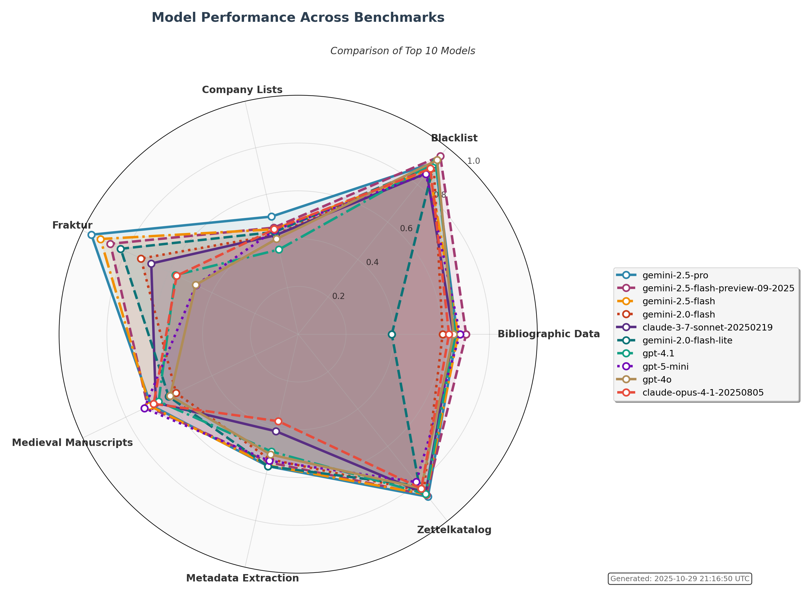

# Humanities Data Benchmark
Welcome to the **Humanities Data Benchmark** report page. This page provides an overview of all benchmark tests, 
results, and comparisons.

## Leaderboard

The table below shows the **global average performance**, **cost efficiency**, and **time efficiency** of each model
across the seven core benchmarks: [bibliographic_data](benchmarks/bibliographic_data/), [blacklist](
benchmarks/blacklist/), [company_lists](benchmarks/company_lists/), [fraktur](benchmarks/fraktur/),
[medieval_manuscripts](benchmarks/medieval_manuscripts/), [metadata_extraction](benchmarks/metadata_extraction/),
and [zettelkatalog](benchmarks/zettelkatalog/).

The **Model** and **Provider** columns identify each AI system. **Global Average** represents the mean performance
score across all seven benchmarks (higher is better). **Cost/Point** and **Time/Point** show normalized efficiency
metrics calculated per test, averaged per benchmark, then averaged globally; this multi-level normalization accounts
for different numbers of items, test configurations, and benchmark scales. For efficiency metrics, lower values are
better, indicating less cost or time needed per performance point achieved. The seven benchmark-specific columns show
average performance for each individual benchmark. Only models with results in all seven benchmarks are included.
Click on any column header to sort the table.

<table id="leaderboard-table" style="width:100%; border-collapse: collapse; margin-bottom: 20px;">
<thead>
<tr>
<th onclick="sortTable(0)" style="cursor: pointer;">Model ↕</th>
<th onclick="sortTable(1)" style="cursor: pointer;">Provider ↕</th>
<th onclick="sortTable(2)" style="cursor: pointer;">Global Average ↕</th>
<th onclick="sortTable(3)" style="cursor: pointer;">Cost/Point ↕</th>
<th onclick="sortTable(4)" style="cursor: pointer;">Time/Point ↕</th>
<th onclick="sortTable(5)" style="cursor: pointer;"><a href="benchmarks/bibliographic_data/" style="color: inherit; text-decoration: none;">bibliographic_data</a> ↕</th>
<th onclick="sortTable(6)" style="cursor: pointer;"><a href="benchmarks/blacklist/" style="color: inherit; text-decoration: none;">blacklist</a> ↕</th>
<th onclick="sortTable(7)" style="cursor: pointer;"><a href="benchmarks/company_lists/" style="color: inherit; text-decoration: none;">company_lists</a> ↕</th>
<th onclick="sortTable(8)" style="cursor: pointer;"><a href="benchmarks/fraktur/" style="color: inherit; text-decoration: none;">fraktur</a> ↕</th>
<th onclick="sortTable(9)" style="cursor: pointer;"><a href="benchmarks/medieval_manuscripts/" style="color: inherit; text-decoration: none;">medieval_manuscripts</a> ↕</th>
<th onclick="sortTable(10)" style="cursor: pointer;"><a href="benchmarks/metadata_extraction/" style="color: inherit; text-decoration: none;">metadata_extraction</a> ↕</th>
<th onclick="sortTable(11)" style="cursor: pointer;"><a href="benchmarks/zettelkatalog/" style="color: inherit; text-decoration: none;">zettelkatalog</a> ↕</th>
</tr>
</thead>
<tbody><tr><td data-sort="gemini-2.5-pro">gemini-2.5-pro</td><td data-sort="Google">Google</td><td data-sort="0.761">0.761</td><td data-sort="0.2239">$0.2239</td><td data-sort="35.79">35.79s</td><td data-sort="0.664"></td><td data-sort="0.921"></td><td data-sort="0.663"></td><td data-sort="0.960"></td><td data-sort="0.684"></td><td data-sort="0.567"></td><td data-sort="0.870"></td></tr><tr><td data-sort="gemini-2.5-flash-preview-09-2025">gemini-2.5-flash-preview-09-2025</td><td data-sort="Google">Google</td><td data-sort="0.752">0.752</td><td data-sort="0.1147">$0.1147</td><td data-sort="20.71">20.71s</td><td data-sort="0.702"></td><td data-sort="0.953"></td><td data-sort="0.631"></td><td data-sort="0.872"></td><td data-sort="0.698"></td><td data-sort="0.550"></td><td data-sort="0.860"></td></tr><tr><td data-sort="gemini-2.5-flash">gemini-2.5-flash</td><td data-sort="Google">Google</td><td data-sort="0.745">0.745</td><td data-sort="0.0545">$0.0545</td><td data-sort="28.00">28.00s</td><td data-sort="0.669"></td><td data-sort="0.878"></td><td data-sort="0.639"></td><td data-sort="0.918"></td><td data-sort="0.690"></td><td data-sort="0.563"></td><td data-sort="0.857"></td></tr><tr><td data-sort="gemini-2.0-flash">gemini-2.0-flash</td><td data-sort="Google">Google</td><td data-sort="0.682">0.682</td><td data-sort="0.0237">$0.0237</td><td data-sort="11.03">11.03s</td><td data-sort="0.604"></td><td data-sort="0.909"></td><td data-sort="0.588"></td><td data-sort="0.730"></td><td data-sort="0.567"></td><td data-sort="0.537"></td><td data-sort="0.842"></td></tr><tr><td data-sort="gemini-2.0-flash-lite">gemini-2.0-flash-lite</td><td data-sort="Google">Google</td><td data-sort="0.674">0.674</td><td data-sort="0.0191">$0.0191</td><td data-sort="12.45">12.45s</td><td data-sort="0.391"></td><td data-sort="0.910"></td><td data-sort="0.615"></td><td data-sort="0.824"></td><td data-sort="0.601"></td><td data-sort="0.567"></td><td data-sort="0.812"></td></tr><tr><td data-sort="claude-3-7-sonnet-20250219">claude-3-7-sonnet-20250219</td><td data-sort="Anthropic">Anthropic</td><td data-sort="0.674">0.674</td><td data-sort="0.7854">$0.7854</td><td data-sort="23.25">23.25s</td><td data-sort="0.649"></td><td data-sort="0.863"></td><td data-sort="0.590"></td><td data-sort="0.682"></td><td data-sort="0.661"></td><td data-sort="0.417"></td><td data-sort="0.854"></td></tr><tr><td data-sort="gpt-4.1">gpt-4.1</td><td data-sort="OpenAI">OpenAI</td><td data-sort="0.669">0.669</td><td data-sort="0.5910">$0.5910</td><td data-sort="42.13">42.13s</td><td data-sort="0.657"></td><td data-sort="0.923"></td><td data-sort="0.527"></td><td data-sort="0.570"></td><td data-sort="0.648"></td><td data-sort="0.503"></td><td data-sort="0.855"></td></tr><tr><td data-sort="gpt-5-mini">gpt-5-mini</td><td data-sort="OpenAI">OpenAI</td><td data-sort="0.666">0.666</td><td data-sort="0.3319">$0.3319</td><td data-sort="77.61">77.61s</td><td data-sort="0.677"></td><td data-sort="0.857"></td><td data-sort="0.603"></td><td data-sort="0.474"></td><td data-sort="0.714"></td><td data-sort="0.543"></td><td data-sort="0.791"></td></tr><tr><td data-sort="claude-opus-4-1-20250805">claude-opus-4-1-20250805</td><td data-sort="Anthropic">Anthropic</td><td data-sort="0.652">0.652</td><td data-sort="4.0642">$4.0642</td><td data-sort="40.34">40.34s</td><td data-sort="0.631"></td><td data-sort="0.886"></td><td data-sort="0.616"></td><td data-sort="0.564"></td><td data-sort="0.671"></td><td data-sort="0.373"></td><td data-sort="0.826"></td></tr><tr><td data-sort="gpt-4o">gpt-4o</td><td data-sort="OpenAI">OpenAI</td><td data-sort="0.651">0.651</td><td data-sort="0.3952">$0.3952</td><td data-sort="60.78">60.78s</td><td data-sort="0.650"></td><td data-sort="0.932"></td><td data-sort="0.565"></td><td data-sort="0.476"></td><td data-sort="0.594"></td><td data-sort="0.517"></td><td data-sort="0.825"></td></tr><tr><td data-sort="mistral-large-latest">mistral-large-latest</td><td data-sort="Mistral AI">Mistral AI</td><td data-sort="0.643">0.643</td><td data-sort="0.3732">$0.3732</td><td data-sort="26.51">26.51s</td><td data-sort="0.639"></td><td data-sort="0.865"></td><td data-sort="0.608"></td><td data-sort="0.514"></td><td data-sort="0.618"></td><td data-sort="0.473"></td><td data-sort="0.780"></td></tr><tr><td data-sort="mistral-medium-2505">mistral-medium-2505</td><td data-sort="Mistral AI">Mistral AI</td><td data-sort="0.632">0.632</td><td data-sort="0.0903">$0.0903</td><td data-sort="32.18">32.18s</td><td data-sort="0.661"></td><td data-sort="0.879"></td><td data-sort="0.582"></td><td data-sort="0.430"></td><td data-sort="0.601"></td><td data-sort="0.497"></td><td data-sort="0.776"></td></tr><tr><td data-sort="gpt-5">gpt-5</td><td data-sort="OpenAI">OpenAI</td><td data-sort="0.628">0.628</td><td data-sort="2.0024">$2.0024</td><td data-sort="237.28">237.28s</td><td data-sort="0.685"></td><td data-sort="0.906"></td><td data-sort="0.648"></td><td data-sort="0.152"></td><td data-sort="0.412"></td><td data-sort="0.720"></td><td data-sort="0.870"></td></tr><tr><td data-sort="mistral-medium-2508">mistral-medium-2508</td><td data-sort="Mistral AI">Mistral AI</td><td data-sort="0.624">0.624</td><td data-sort="0.0917">$0.0917</td><td data-sort="55.16">55.16s</td><td data-sort="0.654"></td><td data-sort="0.893"></td><td data-sort="0.584"></td><td data-sort="0.332"></td><td data-sort="0.648"></td><td data-sort="0.470"></td><td data-sort="0.784"></td></tr><tr><td data-sort="claude-3-5-sonnet-20241022">claude-3-5-sonnet-20241022</td><td data-sort="Anthropic">Anthropic</td><td data-sort="0.623">0.623</td><td data-sort="0.7762">$0.7762</td><td data-sort="21.64">21.64s</td><td data-sort="0.653"></td><td data-sort="0.658"></td><td data-sort="0.570"></td><td data-sort="0.496"></td><td data-sort="0.706"></td><td data-sort="0.403"></td><td data-sort="0.875"></td></tr><tr><td data-sort="gpt-4.1-mini">gpt-4.1-mini</td><td data-sort="OpenAI">OpenAI</td><td data-sort="0.618">0.618</td><td data-sort="0.0704">$0.0704</td><td data-sort="79.00">79.00s</td><td data-sort="0.648"></td><td data-sort="0.957"></td><td data-sort="0.574"></td><td data-sort="0.046"></td><td data-sort="0.798"></td><td data-sort="0.547"></td><td data-sort="0.759"></td></tr><tr><td data-sort="gemini-2.5-flash-lite-preview-09-2025">gemini-2.5-flash-lite-preview-09-2025</td><td data-sort="Google">Google</td><td data-sort="0.618">0.618</td><td data-sort="0.0751">$0.0751</td><td data-sort="5.10">5.10s</td><td data-sort="0.579"></td><td data-sort="0.854"></td><td data-sort="0.567"></td><td data-sort="0.508"></td><td data-sort="0.623"></td><td data-sort="0.510"></td><td data-sort="0.685"></td></tr><tr><td data-sort="gemini-2.5-flash-lite">gemini-2.5-flash-lite</td><td data-sort="Google">Google</td><td data-sort="0.614">0.614</td><td data-sort="0.0316">$0.0316</td><td data-sort="8.31">8.31s</td><td data-sort="0.545"></td><td data-sort="0.850"></td><td data-sort="0.525"></td><td data-sort="0.630"></td><td data-sort="0.582"></td><td data-sort="0.470"></td><td data-sort="0.697"></td></tr><tr><td data-sort="o3">o3</td><td data-sort="OpenAI">OpenAI</td><td data-sort="0.613">0.613</td><td data-sort="0.8919">$0.8919</td><td data-sort="127.62">127.62s</td><td data-sort="0.667"></td><td data-sort="0.850"></td><td data-sort="0.638"></td><td data-sort="0.140"></td><td data-sort="0.510"></td><td data-sort="0.653"></td><td data-sort="0.834"></td></tr><tr><td data-sort="claude-opus-4-20250514">claude-opus-4-20250514</td><td data-sort="Anthropic">Anthropic</td><td data-sort="0.610">0.610</td><td data-sort="4.3163">$4.3163</td><td data-sort="48.65">48.65s</td><td data-sort="0.583"></td><td data-sort="0.819"></td><td data-sort="0.611"></td><td data-sort="0.464"></td><td data-sort="0.648"></td><td data-sort="0.360"></td><td data-sort="0.785"></td></tr><tr><td data-sort="claude-sonnet-4-20250514">claude-sonnet-4-20250514</td><td data-sort="Anthropic">Anthropic</td><td data-sort="0.582">0.582</td><td data-sort="0.8804">$0.8804</td><td data-sort="40.51">40.51s</td><td data-sort="0.669"></td><td data-sort="0.790"></td><td data-sort="0.587"></td><td data-sort="0.358"></td><td data-sort="0.521"></td><td data-sort="0.307"></td><td data-sort="0.842"></td></tr><tr><td data-sort="meta-llama/llama-4-maverick">meta-llama/llama-4-maverick</td><td data-sort="Meta (via OpenRouter)">Meta (via OpenRouter)</td><td data-sort="0.572">0.572</td><td data-sort="0.1345">$0.1345</td><td data-sort="41.59">41.59s</td><td data-sort="0.626"></td><td data-sort="0.821"></td><td data-sort="0.577"></td><td data-sort="0.300"></td><td data-sort="0.543"></td><td data-sort="0.463"></td><td data-sort="0.675"></td></tr><tr><td data-sort="pixtral-large-latest">pixtral-large-latest</td><td data-sort="Mistral AI">Mistral AI</td><td data-sort="0.525">0.525</td><td data-sort="0.7993">$0.7993</td><td data-sort="34.96">34.96s</td><td data-sort="0.508"></td><td data-sort="0.779"></td><td data-sort="0.421"></td><td data-sort="0.406"></td><td data-sort="0.447"></td><td data-sort="0.337"></td><td data-sort="0.778"></td></tr><tr><td data-sort="gpt-5-nano">gpt-5-nano</td><td data-sort="OpenAI">OpenAI</td><td data-sort="0.476">0.476</td><td data-sort="0.2332">$0.2332</td><td data-sort="394.99">394.99s</td><td data-sort="0.590"></td><td data-sort="0.761"></td><td data-sort="0.517"></td><td data-sort="0.006"></td><td data-sort="0.194"></td><td data-sort="0.497"></td><td data-sort="0.771"></td></tr><tr><td data-sort="claude-sonnet-4-5-20250929">claude-sonnet-4-5-20250929</td><td data-sort="Anthropic">Anthropic</td><td data-sort="0.460">0.460</td><td data-sort="1.1149">$1.1149</td><td data-sort="16.29">16.29s</td><td data-sort="0.000"></td><td data-sort="0.853"></td><td data-sort="0.591"></td><td data-sort="0.000"></td><td data-sort="0.550"></td><td data-sort="0.420"></td><td data-sort="0.806"></td></tr><tr><td data-sort="gpt-4.1-nano">gpt-4.1-nano</td><td data-sort="OpenAI">OpenAI</td><td data-sort="0.451">0.451</td><td data-sort="0.0151">$0.0151</td><td data-sort="16.72">16.72s</td><td data-sort="0.320"></td><td data-sort="0.782"></td><td data-sort="0.500"></td><td data-sort="0.000"></td><td data-sort="0.394"></td><td data-sort="0.487"></td><td data-sort="0.676"></td></tr><tr><td data-sort="gpt-4o-mini">gpt-4o-mini</td><td data-sort="OpenAI">OpenAI</td><td data-sort="0.446">0.446</td><td data-sort="0.3391">$0.3391</td><td data-sort="2414.65">2414.65s</td><td data-sort="0.498"></td><td data-sort="0.779"></td><td data-sort="0.466"></td><td data-sort="0.268"></td><td data-sort="0.569"></td><td data-sort="0.530"></td><td data-sort="0.015"></td></tr><tr><td data-sort="claude-3-opus-20240229">claude-3-opus-20240229</td><td data-sort="Anthropic">Anthropic</td><td data-sort="0.430">0.430</td><td data-sort="5.4684">$5.4684</td><td data-sort="72.41">72.41s</td><td data-sort="0.371"></td><td data-sort="0.638"></td><td data-sort="0.384"></td><td data-sort="0.222"></td><td data-sort="0.396"></td><td data-sort="0.237"></td><td data-sort="0.763"></td></tr><tr><td data-sort="pixtral-12b">pixtral-12b</td><td data-sort="Mistral AI">Mistral AI</td><td data-sort="0.391">0.391</td><td data-sort="0.0647">$0.0647</td><td data-sort="59.95">59.95s</td><td data-sort="0.184"></td><td data-sort="0.772"></td><td data-sort="0.255"></td><td data-sort="0.218"></td><td data-sort="0.417"></td><td data-sort="0.283"></td><td data-sort="0.609"></td></tr><tr><td data-sort="GLM-4.5V-FP8">GLM-4.5V-FP8</td><td data-sort="Z.ai (via sciCORE)">Z.ai (via sciCORE)</td><td data-sort="0.291">0.291</td><td data-sort="0.0000">$0.0000</td><td data-sort="326.11">326.11s</td><td data-sort="0.232"></td><td data-sort="0.154"></td><td data-sort="0.058"></td><td data-sort="0.254"></td><td data-sort="0.574"></td><td data-sort="0.510"></td><td data-sort="0.259"></td></tr><tr><td data-sort="qwen/qwen3-vl-8b-thinking">qwen/qwen3-vl-8b-thinking</td><td data-sort="Alibaba (via OpenRouter)">Alibaba (via OpenRouter)</td><td data-sort="0.186">0.186</td><td data-sort="0.5722">$0.5722</td><td data-sort="171.81">171.81s</td><td data-sort="0.657"></td><td data-sort="0.154"></td><td data-sort="0.269"></td><td data-sort="0.000"></td><td data-sort="0.000"></td><td data-sort="0.117"></td><td data-sort="0.103"></td></tr></tbody>
</table>

The following radar chart shows the performance distribution of top models across the seven core benchmarks:

## Latest Benchmark Results

The tables below show detailed results for each benchmark, with each row representing a single test configuration run 
on the most recent date. The **Model** and **Provider** columns identify the AI system used. Each test has a unique 
**Test ID** (click to see full history) and shows the most recent execution **Date**. The **Prompt** and **Rules** 
columns indicate the configuration used. **Results** show the performance score (fuzzy match for 
bibliographic_data/fraktur, F1-micro for metadata_extraction/zettelkatalog; higher is better). **Cost (USD)** 
represents the total cost for processing all items in the test. **Cost/Point** shows cost efficiency ($/performance 
point; lower is better). **Test Time (s)** is the total execution time for all items. **Time/Point** shows time 
efficiency (seconds/performance point; lower is better).

### <a href="benchmarks/bibliographic_data/">bibliographic_data</a>

<table class="inner-table sortable-table" id="bibliographic_data-table">
<thead>
<tr>
<th onclick="sortBenchmarkTable('bibliographic_data', 0)" style="cursor: pointer;">Model ↕</th>
<th onclick="sortBenchmarkTable('bibliographic_data', 1)" style="cursor: pointer;">Provider ↕</th>
<th onclick="sortBenchmarkTable('bibliographic_data', 2)" style="cursor: pointer;">Test ID ↕</th>
<th onclick="sortBenchmarkTable('bibliographic_data', 3)" style="cursor: pointer;">Date ↕</th>
<th onclick="sortBenchmarkTable('bibliographic_data', 4)" style="cursor: pointer;">Prompt ↕</th>
<th onclick="sortBenchmarkTable('bibliographic_data', 5)" style="cursor: pointer;">Rules ↕</th>
<th onclick="sortBenchmarkTable('bibliographic_data', 6)" style="cursor: pointer;">Results ↕</th>
<th onclick="sortBenchmarkTable('bibliographic_data', 7)" style="cursor: pointer;">Cost (USD) ↕</th>
<th onclick="sortBenchmarkTable('bibliographic_data', 8)" style="cursor: pointer;">Cost/Point ↕</th>
<th onclick="sortBenchmarkTable('bibliographic_data', 9)" style="cursor: pointer;">Test Time (s) ↕</th>
<th onclick="sortBenchmarkTable('bibliographic_data', 10)" style="cursor: pointer;">Time/Point ↕</th>
</tr>
</thead>
<tbody><tr><td data-sort="gemini-2.5-flash-preview-09-2025">gemini-2.5-flash-preview-09-2025</td><td data-sort="Google">Google</td><td data-sort="T0219"><a href='/humanities_data_benchmark/tests/T0219'>T0219</a></td><td data-sort="2025-10-01">2025-10-01</td><td data-sort="prompt.txt">prompt.txt</td><td data-sort="">None</td><td data-sort="0.702"></td><td data-sort="$0.0307">$0.0307</td><td data-sort="0.0437">$0.0437</td><td data-sort="116.65">116.65</td><td data-sort="166.10">166.10</td></tr><tr><td data-sort="gpt-5">gpt-5</td><td data-sort="OpenAI">OpenAI</td><td data-sort="T0129"><a href='/humanities_data_benchmark/tests/T0129'>T0129</a></td><td data-sort="2025-10-01">2025-10-01</td><td data-sort="prompt.txt">prompt.txt</td><td data-sort="">None</td><td data-sort="0.685"></td><td data-sort="$0.3421">$0.3421</td><td data-sort="0.4992">$0.4992</td><td data-sort="591.90">591.90</td><td data-sort="863.65">863.65</td></tr><tr><td data-sort="gpt-5-mini">gpt-5-mini</td><td data-sort="OpenAI">OpenAI</td><td data-sort="T0130"><a href='/humanities_data_benchmark/tests/T0130'>T0130</a></td><td data-sort="2025-10-01">2025-10-01</td><td data-sort="prompt.txt">prompt.txt</td><td data-sort="">None</td><td data-sort="0.677"></td><td data-sort="$0.0582">$0.0582</td><td data-sort="0.0860">$0.0860</td><td data-sort="411.12">411.12</td><td data-sort="607.56">607.56</td></tr><tr><td data-sort="gemini-2.5-flash">gemini-2.5-flash</td><td data-sort="Google">Google</td><td data-sort="T0195"><a href='/humanities_data_benchmark/tests/T0195'>T0195</a></td><td data-sort="2025-09-30">2025-09-30</td><td data-sort="prompt.txt">prompt.txt</td><td data-sort="">None</td><td data-sort="0.669"></td><td data-sort="$0.0252">$0.0252</td><td data-sort="0.0376">$0.0376</td><td data-sort="195.82">195.82</td><td data-sort="292.59">292.59</td></tr><tr><td data-sort="claude-sonnet-4-20250514">claude-sonnet-4-20250514</td><td data-sort="Anthropic">Anthropic</td><td data-sort="T0107"><a href='/humanities_data_benchmark/tests/T0107'>T0107</a></td><td data-sort="2025-09-30">2025-09-30</td><td data-sort="prompt.txt">prompt.txt</td><td data-sort="">None</td><td data-sort="0.669"></td><td data-sort="$0.1692">$0.1692</td><td data-sort="0.2531">$0.2531</td><td data-sort="127.79">127.79</td><td data-sort="191.16">191.16</td></tr><tr><td data-sort="o3">o3</td><td data-sort="OpenAI">OpenAI</td><td data-sort="T0133"><a href='/humanities_data_benchmark/tests/T0133'>T0133</a></td><td data-sort="2025-10-01">2025-10-01</td><td data-sort="prompt.txt">prompt.txt</td><td data-sort="">None</td><td data-sort="0.667"></td><td data-sort="$0.1885">$0.1885</td><td data-sort="0.2827">$0.2827</td><td data-sort="391.04">391.04</td><td data-sort="586.48">586.48</td></tr><tr><td data-sort="gemini-2.5-pro">gemini-2.5-pro</td><td data-sort="Google">Google</td><td data-sort="T0128"><a href='/humanities_data_benchmark/tests/T0128'>T0128</a></td><td data-sort="2025-09-30">2025-09-30</td><td data-sort="prompt.txt">prompt.txt</td><td data-sort="">None</td><td data-sort="0.664"></td><td data-sort="$0.1032">$0.1032</td><td data-sort="0.1554">$0.1554</td><td data-sort="227.18">227.18</td><td data-sort="342.25">342.25</td></tr><tr><td data-sort="mistral-medium-2505">mistral-medium-2505</td><td data-sort="Mistral AI">Mistral AI</td><td data-sort="T0170"><a href='/humanities_data_benchmark/tests/T0170'>T0170</a></td><td data-sort="2025-10-01">2025-10-01</td><td data-sort="prompt.txt">prompt.txt</td><td data-sort="">None</td><td data-sort="0.661"></td><td data-sort="$0.0222">$0.0222</td><td data-sort="0.0336">$0.0336</td><td data-sort="128.32">128.32</td><td data-sort="194.01">194.01</td></tr><tr><td data-sort="gpt-4.1">gpt-4.1</td><td data-sort="OpenAI">OpenAI</td><td data-sort="T0139"><a href='/humanities_data_benchmark/tests/T0139'>T0139</a></td><td data-sort="2025-10-01">2025-10-01</td><td data-sort="prompt.txt">prompt.txt</td><td data-sort="">None</td><td data-sort="0.657"></td><td data-sort="$0.0952">$0.0952</td><td data-sort="0.1449">$0.1449</td><td data-sort="298.94">298.94</td><td data-sort="455.07">455.07</td></tr><tr><td data-sort="qwen/qwen3-vl-8b-thinking">qwen/qwen3-vl-8b-thinking</td><td data-sort="Alibaba (via OpenRouter)">Alibaba (via OpenRouter)</td><td data-sort="T0233"><a href='/humanities_data_benchmark/tests/T0233'>T0233</a></td><td data-sort="2025-10-17">2025-10-17</td><td data-sort="prompt.txt">prompt.txt</td><td data-sort="">None</td><td data-sort="0.657"></td><td data-sort="$0.1268">$0.1268</td><td data-sort="0.1931">$0.1931</td><td data-sort="923.12">923.12</td><td data-sort="1405.84">1405.84</td></tr><tr><td data-sort="mistral-medium-2508">mistral-medium-2508</td><td data-sort="Mistral AI">Mistral AI</td><td data-sort="T0169"><a href='/humanities_data_benchmark/tests/T0169'>T0169</a></td><td data-sort="2025-10-01">2025-10-01</td><td data-sort="prompt.txt">prompt.txt</td><td data-sort="">None</td><td data-sort="0.654"></td><td data-sort="$0.0220">$0.0220</td><td data-sort="0.0336">$0.0336</td><td data-sort="112.70">112.70</td><td data-sort="172.31">172.31</td></tr><tr><td data-sort="claude-3-5-sonnet-20241022">claude-3-5-sonnet-20241022</td><td data-sort="Anthropic">Anthropic</td><td data-sort="T0009"><a href='/humanities_data_benchmark/tests/T0009'>T0009</a></td><td data-sort="2025-09-30">2025-09-30</td><td data-sort="prompt.txt">prompt.txt</td><td data-sort="">None</td><td data-sort="0.653"></td><td data-sort="$0.1682">$0.1682</td><td data-sort="0.2576">$0.2576</td><td data-sort="124.19">124.19</td><td data-sort="190.17">190.17</td></tr><tr><td data-sort="gpt-4o">gpt-4o</td><td data-sort="OpenAI">OpenAI</td><td data-sort="T0007"><a href='/humanities_data_benchmark/tests/T0007'>T0007</a></td><td data-sort="2025-09-30">2025-09-30</td><td data-sort="prompt.txt">prompt.txt</td><td data-sort="">None</td><td data-sort="0.650"></td><td data-sort="$0.1136">$0.1136</td><td data-sort="0.1748">$0.1748</td><td data-sort="350.22">350.22</td><td data-sort="538.95">538.95</td></tr><tr><td data-sort="claude-3-7-sonnet-20250219">claude-3-7-sonnet-20250219</td><td data-sort="Anthropic">Anthropic</td><td data-sort="T0031"><a href='/humanities_data_benchmark/tests/T0031'>T0031</a></td><td data-sort="2025-09-30">2025-09-30</td><td data-sort="prompt.txt">prompt.txt</td><td data-sort="">None</td><td data-sort="0.649"></td><td data-sort="$0.1765">$0.1765</td><td data-sort="0.2720">$0.2720</td><td data-sort="136.48">136.48</td><td data-sort="210.38">210.38</td></tr><tr><td data-sort="gpt-4.1-mini">gpt-4.1-mini</td><td data-sort="OpenAI">OpenAI</td><td data-sort="T0140"><a href='/humanities_data_benchmark/tests/T0140'>T0140</a></td><td data-sort="2025-10-01">2025-10-01</td><td data-sort="prompt.txt">prompt.txt</td><td data-sort="">None</td><td data-sort="0.648"></td><td data-sort="$0.0199">$0.0199</td><td data-sort="0.0307">$0.0307</td><td data-sort="164.93">164.93</td><td data-sort="254.41">254.41</td></tr><tr><td data-sort="mistral-large-latest">mistral-large-latest</td><td data-sort="Mistral AI">Mistral AI</td><td data-sort="T0187"><a href='/humanities_data_benchmark/tests/T0187'>T0187</a></td><td data-sort="2025-10-01">2025-10-01</td><td data-sort="prompt.txt">prompt.txt</td><td data-sort="">None</td><td data-sort="0.639"></td><td data-sort="$0.0805">$0.0805</td><td data-sort="0.1259">$0.1259</td><td data-sort="136.28">136.28</td><td data-sort="213.12">213.12</td></tr><tr><td data-sort="claude-opus-4-1-20250805">claude-opus-4-1-20250805</td><td data-sort="Anthropic">Anthropic</td><td data-sort="T0127"><a href='/humanities_data_benchmark/tests/T0127'>T0127</a></td><td data-sort="2025-09-30">2025-09-30</td><td data-sort="prompt.txt">prompt.txt</td><td data-sort="">None</td><td data-sort="0.631"></td><td data-sort="$0.9735">$0.9735</td><td data-sort="1.5435">$1.5435</td><td data-sort="203.32">203.32</td><td data-sort="322.38">322.38</td></tr><tr><td data-sort="meta-llama/llama-4-maverick">meta-llama/llama-4-maverick</td><td data-sort="Meta (via OpenRouter)">Meta (via OpenRouter)</td><td data-sort="T0234"><a href='/humanities_data_benchmark/tests/T0234'>T0234</a></td><td data-sort="2025-10-17">2025-10-17</td><td data-sort="prompt.txt">prompt.txt</td><td data-sort="">None</td><td data-sort="0.626"></td><td data-sort="$0.0062">$0.0062</td><td data-sort="0.0099">$0.0099</td><td data-sort="151.02">151.02</td><td data-sort="241.35">241.35</td></tr><tr><td data-sort="gemini-2.0-flash">gemini-2.0-flash</td><td data-sort="Google">Google</td><td data-sort="T0008"><a href='/humanities_data_benchmark/tests/T0008'>T0008</a></td><td data-sort="2025-09-30">2025-09-30</td><td data-sort="prompt.txt">prompt.txt</td><td data-sort="">None</td><td data-sort="0.604"></td><td data-sort="$0.0052">$0.0052</td><td data-sort="0.0087">$0.0087</td><td data-sort="69.66">69.66</td><td data-sort="115.32">115.32</td></tr><tr><td data-sort="gpt-5-nano">gpt-5-nano</td><td data-sort="OpenAI">OpenAI</td><td data-sort="T0131"><a href='/humanities_data_benchmark/tests/T0131'>T0131</a></td><td data-sort="2025-10-01">2025-10-01</td><td data-sort="prompt.txt">prompt.txt</td><td data-sort="">None</td><td data-sort="0.590"></td><td data-sort="$0.0281">$0.0281</td><td data-sort="0.0476">$0.0476</td><td data-sort="401.62">401.62</td><td data-sort="681.07">681.07</td></tr><tr><td data-sort="claude-opus-4-20250514">claude-opus-4-20250514</td><td data-sort="Anthropic">Anthropic</td><td data-sort="T0106"><a href='/humanities_data_benchmark/tests/T0106'>T0106</a></td><td data-sort="2025-09-30">2025-09-30</td><td data-sort="prompt.txt">prompt.txt</td><td data-sort="">None</td><td data-sort="0.583"></td><td data-sort="$0.8992">$0.8992</td><td data-sort="1.5413">$1.5413</td><td data-sort="193.49">193.49</td><td data-sort="331.67">331.67</td></tr><tr><td data-sort="gemini-2.5-flash-lite-preview-09-2025">gemini-2.5-flash-lite-preview-09-2025</td><td data-sort="Google">Google</td><td data-sort="T0211"><a href='/humanities_data_benchmark/tests/T0211'>T0211</a></td><td data-sort="2025-10-01">2025-10-01</td><td data-sort="prompt.txt">prompt.txt</td><td data-sort="">None</td><td data-sort="0.579"></td><td data-sort="$0.0048">$0.0048</td><td data-sort="0.0083">$0.0083</td><td data-sort="18.69">18.69</td><td data-sort="32.28">32.28</td></tr><tr><td data-sort="gemini-2.5-flash-lite">gemini-2.5-flash-lite</td><td data-sort="Google">Google</td><td data-sort="T0203"><a href='/humanities_data_benchmark/tests/T0203'>T0203</a></td><td data-sort="2025-10-01">2025-10-01</td><td data-sort="prompt.txt">prompt.txt</td><td data-sort="">None</td><td data-sort="0.545"></td><td data-sort="$0.0039">$0.0039</td><td data-sort="0.0072">$0.0072</td><td data-sort="19.33">19.33</td><td data-sort="35.50">35.50</td></tr><tr><td data-sort="pixtral-large-latest">pixtral-large-latest</td><td data-sort="Mistral AI">Mistral AI</td><td data-sort="T0035"><a href='/humanities_data_benchmark/tests/T0035'>T0035</a></td><td data-sort="2025-09-30">2025-09-30</td><td data-sort="prompt.txt">prompt.txt</td><td data-sort="">None</td><td data-sort="0.508"></td><td data-sort="$0.1079">$0.1079</td><td data-sort="0.2123">$0.2123</td><td data-sort="199.57">199.57</td><td data-sort="392.57">392.57</td></tr><tr><td data-sort="gpt-4o-mini">gpt-4o-mini</td><td data-sort="OpenAI">OpenAI</td><td data-sort="T0027"><a href='/humanities_data_benchmark/tests/T0027'>T0027</a></td><td data-sort="2025-09-30">2025-09-30</td><td data-sort="prompt.txt">prompt.txt</td><td data-sort="">None</td><td data-sort="0.498"></td><td data-sort="$0.0261">$0.0261</td><td data-sort="0.0526">$0.0526</td><td data-sort="233.18">233.18</td><td data-sort="468.66">468.66</td></tr><tr><td data-sort="gemini-2.0-flash-lite">gemini-2.0-flash-lite</td><td data-sort="Google">Google</td><td data-sort="T0033"><a href='/humanities_data_benchmark/tests/T0033'>T0033</a></td><td data-sort="2025-09-30">2025-09-30</td><td data-sort="prompt.txt">prompt.txt</td><td data-sort="">None</td><td data-sort="0.391"></td><td data-sort="$0.0055">$0.0055</td><td data-sort="0.0140">$0.0140</td><td data-sort="90.14">90.14</td><td data-sort="230.26">230.26</td></tr><tr><td data-sort="claude-3-opus-20240229">claude-3-opus-20240229</td><td data-sort="Anthropic">Anthropic</td><td data-sort="T0138"><a href='/humanities_data_benchmark/tests/T0138'>T0138</a></td><td data-sort="2025-10-01">2025-10-01</td><td data-sort="prompt.txt">prompt.txt</td><td data-sort="">None</td><td data-sort="0.371"></td><td data-sort="$0.6830">$0.6830</td><td data-sort="1.8417">$1.8417</td><td data-sort="237.58">237.58</td><td data-sort="640.62">640.62</td></tr><tr><td data-sort="gpt-4.1-nano">gpt-4.1-nano</td><td data-sort="OpenAI">OpenAI</td><td data-sort="T0141"><a href='/humanities_data_benchmark/tests/T0141'>T0141</a></td><td data-sort="2025-10-01">2025-10-01</td><td data-sort="prompt.txt">prompt.txt</td><td data-sort="">None</td><td data-sort="0.320"></td><td data-sort="$0.0044">$0.0044</td><td data-sort="0.0139">$0.0139</td><td data-sort="105.83">105.83</td><td data-sort="330.56">330.56</td></tr><tr><td data-sort="GLM-4.5V-FP8">GLM-4.5V-FP8</td><td data-sort="Z.ai (via sciCORE)">Z.ai (via sciCORE)</td><td data-sort="T0237"><a href='/humanities_data_benchmark/tests/T0237'>T0237</a></td><td data-sort="2025-10-17">2025-10-17</td><td data-sort="prompt.txt">prompt.txt</td><td data-sort="">None</td><td data-sort="0.232"></td><td data-sort="$0.0000">$0.0000</td><td data-sort="0.0000">$0.0000</td><td data-sort="361.78">361.78</td><td data-sort="1560.25">1560.25</td></tr><tr><td data-sort="gpt-4.5-preview">gpt-4.5-preview</td><td data-sort="OpenAI">OpenAI</td><td data-sort="T0026"><a href='/humanities_data_benchmark/tests/T0026'>T0026</a></td><td data-sort="2025-04-08">2025-04-08</td><td data-sort="prompt.txt">prompt.txt</td><td data-sort="">None</td><td data-sort="0.203"></td><td data-sort="N/A">N/A</td><td data-sort="999">N/A</td><td data-sort="480.16">480.16</td><td data-sort="2367.38">2367.38</td></tr><tr><td data-sort="pixtral-12b">pixtral-12b</td><td data-sort="Mistral AI">Mistral AI</td><td data-sort="T0181"><a href='/humanities_data_benchmark/tests/T0181'>T0181</a></td><td data-sort="2025-10-01">2025-10-01</td><td data-sort="prompt.txt">prompt.txt</td><td data-sort="">None</td><td data-sort="0.184"></td><td data-sort="$0.0036">$0.0036</td><td data-sort="0.0197">$0.0197</td><td data-sort="38.06">38.06</td><td data-sort="207.04">207.04</td></tr><tr><td data-sort="gemini-1.5-pro">gemini-1.5-pro</td><td data-sort="Google">Google</td><td data-sort="T0030"><a href='/humanities_data_benchmark/tests/T0030'>T0030</a></td><td data-sort="2025-04-08">2025-04-08</td><td data-sort="prompt.txt">prompt.txt</td><td data-sort="">None</td><td data-sort="0.116"></td><td data-sort="N/A">N/A</td><td data-sort="999">N/A</td><td data-sort="88.55">88.55</td><td data-sort="763.13">763.13</td></tr><tr><td data-sort="gemini-1.5-flash">gemini-1.5-flash</td><td data-sort="Google">Google</td><td data-sort="T0029"><a href='/humanities_data_benchmark/tests/T0029'>T0029</a></td><td data-sort="2025-04-08">2025-04-08</td><td data-sort="prompt.txt">prompt.txt</td><td data-sort="">None</td><td data-sort="0.106"></td><td data-sort="N/A">N/A</td><td data-sort="999">N/A</td><td data-sort="62.39">62.39</td><td data-sort="586.44">586.44</td></tr><tr><td data-sort="claude-sonnet-4-5-20250929">claude-sonnet-4-5-20250929</td><td data-sort="Anthropic">Anthropic</td><td data-sort="T0225"><a href='/humanities_data_benchmark/tests/T0225'>T0225</a></td><td data-sort="2025-10-01">2025-10-01</td><td data-sort="prompt.txt">prompt.txt</td><td data-sort="">None</td><td data-sort="0.000"></td><td data-sort="$0.1636">$0.1636</td><td data-sort="999">N/A</td><td data-sort="121.63">121.63</td><td data-sort="999999">N/A</td></tr></tbody></table>

### <a href="benchmarks/blacklist/">blacklist</a>

<table class="inner-table sortable-table" id="blacklist-table">
<thead>
<tr>
<th onclick="sortBenchmarkTable('blacklist', 0)" style="cursor: pointer;">Model ↕</th>
<th onclick="sortBenchmarkTable('blacklist', 1)" style="cursor: pointer;">Provider ↕</th>
<th onclick="sortBenchmarkTable('blacklist', 2)" style="cursor: pointer;">Test ID ↕</th>
<th onclick="sortBenchmarkTable('blacklist', 3)" style="cursor: pointer;">Date ↕</th>
<th onclick="sortBenchmarkTable('blacklist', 4)" style="cursor: pointer;">Prompt ↕</th>
<th onclick="sortBenchmarkTable('blacklist', 5)" style="cursor: pointer;">Rules ↕</th>
<th onclick="sortBenchmarkTable('blacklist', 6)" style="cursor: pointer;">Results ↕</th>
<th onclick="sortBenchmarkTable('blacklist', 7)" style="cursor: pointer;">Cost (USD) ↕</th>
<th onclick="sortBenchmarkTable('blacklist', 8)" style="cursor: pointer;">Cost/Point ↕</th>
<th onclick="sortBenchmarkTable('blacklist', 9)" style="cursor: pointer;">Test Time (s) ↕</th>
<th onclick="sortBenchmarkTable('blacklist', 10)" style="cursor: pointer;">Time/Point ↕</th>
</tr>
</thead>
<tbody><tr><td data-sort="gpt-4.1-mini">gpt-4.1-mini</td><td data-sort="OpenAI">OpenAI</td><td data-sort="T0307"><a href='/humanities_data_benchmark/tests/T0307'>T0307</a></td><td data-sort="2025-10-24">2025-10-24</td><td data-sort="prompt.txt">prompt.txt</td><td data-sort="">None</td><td data-sort="0.957"></td><td data-sort="$0.0274">$0.0274</td><td data-sort="0.0287">$0.0287</td><td data-sort="77.51">77.51</td><td data-sort="81.03">81.03</td></tr><tr><td data-sort="gemini-2.5-flash-preview-09-2025">gemini-2.5-flash-preview-09-2025</td><td data-sort="Google">Google</td><td data-sort="T0231"><a href='/humanities_data_benchmark/tests/T0231'>T0231</a></td><td data-sort="2025-10-24">2025-10-24</td><td data-sort="prompt.txt">prompt.txt</td><td data-sort="">None</td><td data-sort="0.953"></td><td data-sort="$0.0188">$0.0188</td><td data-sort="0.0198">$0.0198</td><td data-sort="188.45">188.45</td><td data-sort="197.72">197.72</td></tr><tr><td data-sort="gpt-4o">gpt-4o</td><td data-sort="OpenAI">OpenAI</td><td data-sort="T0305"><a href='/humanities_data_benchmark/tests/T0305'>T0305</a></td><td data-sort="2025-10-24">2025-10-24</td><td data-sort="prompt.txt">prompt.txt</td><td data-sort="">None</td><td data-sort="0.932"></td><td data-sort="$0.1336">$0.1336</td><td data-sort="0.1433">$0.1433</td><td data-sort="186.39">186.39</td><td data-sort="199.98">199.98</td></tr><tr><td data-sort="gpt-4.1">gpt-4.1</td><td data-sort="OpenAI">OpenAI</td><td data-sort="T0232"><a href='/humanities_data_benchmark/tests/T0232'>T0232</a></td><td data-sort="2025-10-24">2025-10-24</td><td data-sort="prompt.txt">prompt.txt</td><td data-sort="">None</td><td data-sort="0.923"></td><td data-sort="$0.1125">$0.1125</td><td data-sort="0.1219">$0.1219</td><td data-sort="185.64">185.64</td><td data-sort="201.16">201.16</td></tr><tr><td data-sort="gemini-2.5-pro">gemini-2.5-pro</td><td data-sort="Google">Google</td><td data-sort="T0316"><a href='/humanities_data_benchmark/tests/T0316'>T0316</a></td><td data-sort="2025-10-24">2025-10-24</td><td data-sort="prompt.txt">prompt.txt</td><td data-sort="">None</td><td data-sort="0.921"></td><td data-sort="$0.0583">$0.0583</td><td data-sort="0.0633">$0.0633</td><td data-sort="793.69">793.69</td><td data-sort="861.99">861.99</td></tr><tr><td data-sort="gemini-2.0-flash-lite">gemini-2.0-flash-lite</td><td data-sort="Google">Google</td><td data-sort="T0314"><a href='/humanities_data_benchmark/tests/T0314'>T0314</a></td><td data-sort="2025-10-24">2025-10-24</td><td data-sort="prompt.txt">prompt.txt</td><td data-sort="">None</td><td data-sort="0.910"></td><td data-sort="$0.0116">$0.0116</td><td data-sort="0.0128">$0.0128</td><td data-sort="145.10">145.10</td><td data-sort="159.49">159.49</td></tr><tr><td data-sort="gemini-2.0-flash">gemini-2.0-flash</td><td data-sort="Google">Google</td><td data-sort="T0313"><a href='/humanities_data_benchmark/tests/T0313'>T0313</a></td><td data-sort="2025-10-24">2025-10-24</td><td data-sort="prompt.txt">prompt.txt</td><td data-sort="">None</td><td data-sort="0.909"></td><td data-sort="$0.0123">$0.0123</td><td data-sort="0.0135">$0.0135</td><td data-sort="145.32">145.32</td><td data-sort="159.96">159.96</td></tr><tr><td data-sort="gpt-5">gpt-5</td><td data-sort="OpenAI">OpenAI</td><td data-sort="T0309"><a href='/humanities_data_benchmark/tests/T0309'>T0309</a></td><td data-sort="2025-10-24">2025-10-24</td><td data-sort="prompt.txt">prompt.txt</td><td data-sort="">None</td><td data-sort="0.906"></td><td data-sort="$0.5062">$0.5062</td><td data-sort="0.5587">$0.5587</td><td data-sort="1640.52">1640.52</td><td data-sort="1810.67">1810.67</td></tr><tr><td data-sort="x-ai/grok-4">x-ai/grok-4</td><td data-sort="xAI (via OpenRouter)">xAI (via OpenRouter)</td><td data-sort="T0336"><a href='/humanities_data_benchmark/tests/T0336'>T0336</a></td><td data-sort="2025-10-24">2025-10-24</td><td data-sort="prompt.txt">prompt.txt</td><td data-sort="">None</td><td data-sort="0.900"></td><td data-sort="$0.9520">$0.9520</td><td data-sort="1.0572">$1.0572</td><td data-sort="1496.67">1496.67</td><td data-sort="1662.16">1662.16</td></tr><tr><td data-sort="mistral-medium-2508">mistral-medium-2508</td><td data-sort="Mistral AI">Mistral AI</td><td data-sort="T0327"><a href='/humanities_data_benchmark/tests/T0327'>T0327</a></td><td data-sort="2025-10-24">2025-10-24</td><td data-sort="prompt.txt">prompt.txt</td><td data-sort="">None</td><td data-sort="0.893"></td><td data-sort="$0.0306">$0.0306</td><td data-sort="0.0342">$0.0342</td><td data-sort="170.53">170.53</td><td data-sort="190.87">190.87</td></tr><tr><td data-sort="claude-opus-4-1-20250805">claude-opus-4-1-20250805</td><td data-sort="Anthropic">Anthropic</td><td data-sort="T0324"><a href='/humanities_data_benchmark/tests/T0324'>T0324</a></td><td data-sort="2025-10-24">2025-10-24</td><td data-sort="prompt.txt">prompt.txt</td><td data-sort="">None</td><td data-sort="0.886"></td><td data-sort="$1.4416">$1.4416</td><td data-sort="1.6265">$1.6265</td><td data-sort="304.49">304.49</td><td data-sort="343.54">343.54</td></tr><tr><td data-sort="mistral-medium-2505">mistral-medium-2505</td><td data-sort="Mistral AI">Mistral AI</td><td data-sort="T0328"><a href='/humanities_data_benchmark/tests/T0328'>T0328</a></td><td data-sort="2025-10-24">2025-10-24</td><td data-sort="prompt.txt">prompt.txt</td><td data-sort="">None</td><td data-sort="0.879"></td><td data-sort="$0.0306">$0.0306</td><td data-sort="0.0348">$0.0348</td><td data-sort="177.77">177.77</td><td data-sort="202.24">202.24</td></tr><tr><td data-sort="gemini-2.5-flash">gemini-2.5-flash</td><td data-sort="Google">Google</td><td data-sort="T0315"><a href='/humanities_data_benchmark/tests/T0315'>T0315</a></td><td data-sort="2025-10-24">2025-10-24</td><td data-sort="prompt.txt">prompt.txt</td><td data-sort="">None</td><td data-sort="0.878"></td><td data-sort="$0.0139">$0.0139</td><td data-sort="0.0158">$0.0158</td><td data-sort="216.33">216.33</td><td data-sort="246.30">246.30</td></tr><tr><td data-sort="mistral-large-latest">mistral-large-latest</td><td data-sort="Mistral AI">Mistral AI</td><td data-sort="T0330"><a href='/humanities_data_benchmark/tests/T0330'>T0330</a></td><td data-sort="2025-10-24">2025-10-24</td><td data-sort="prompt.txt">prompt.txt</td><td data-sort="">None</td><td data-sort="0.865"></td><td data-sort="$0.1344">$0.1344</td><td data-sort="0.1554">$0.1554</td><td data-sort="217.12">217.12</td><td data-sort="251.03">251.03</td></tr><tr><td data-sort="claude-3-7-sonnet-20250219">claude-3-7-sonnet-20250219</td><td data-sort="Anthropic">Anthropic</td><td data-sort="T0320"><a href='/humanities_data_benchmark/tests/T0320'>T0320</a></td><td data-sort="2025-10-24">2025-10-24</td><td data-sort="prompt.txt">prompt.txt</td><td data-sort="">None</td><td data-sort="0.863"></td><td data-sort="$0.2945">$0.2945</td><td data-sort="0.3414">$0.3414</td><td data-sort="158.36">158.36</td><td data-sort="183.55">183.55</td></tr><tr><td data-sort="gpt-5-mini">gpt-5-mini</td><td data-sort="OpenAI">OpenAI</td><td data-sort="T0310"><a href='/humanities_data_benchmark/tests/T0310'>T0310</a></td><td data-sort="2025-10-24">2025-10-24</td><td data-sort="prompt.txt">prompt.txt</td><td data-sort="">None</td><td data-sort="0.857"></td><td data-sort="$0.0844">$0.0844</td><td data-sort="0.0984">$0.0984</td><td data-sort="768.66">768.66</td><td data-sort="896.62">896.62</td></tr><tr><td data-sort="gemini-2.5-flash-lite-preview-09-2025">gemini-2.5-flash-lite-preview-09-2025</td><td data-sort="Google">Google</td><td data-sort="T0318"><a href='/humanities_data_benchmark/tests/T0318'>T0318</a></td><td data-sort="2025-10-24">2025-10-24</td><td data-sort="prompt.txt">prompt.txt</td><td data-sort="">None</td><td data-sort="0.854"></td><td data-sort="$0.0040">$0.0040</td><td data-sort="0.0047">$0.0047</td><td data-sort="29.94">29.94</td><td data-sort="35.06">35.06</td></tr><tr><td data-sort="claude-sonnet-4-5-20250929">claude-sonnet-4-5-20250929</td><td data-sort="Anthropic">Anthropic</td><td data-sort="T0325"><a href='/humanities_data_benchmark/tests/T0325'>T0325</a></td><td data-sort="2025-10-24">2025-10-24</td><td data-sort="prompt.txt">prompt.txt</td><td data-sort="">None</td><td data-sort="0.853"></td><td data-sort="$0.3212">$0.3212</td><td data-sort="0.3766">$0.3766</td><td data-sort="194.14">194.14</td><td data-sort="227.63">227.63</td></tr><tr><td data-sort="gemini-2.5-flash-lite">gemini-2.5-flash-lite</td><td data-sort="Google">Google</td><td data-sort="T0317"><a href='/humanities_data_benchmark/tests/T0317'>T0317</a></td><td data-sort="2025-10-24">2025-10-24</td><td data-sort="prompt.txt">prompt.txt</td><td data-sort="">None</td><td data-sort="0.850"></td><td data-sort="$0.0040">$0.0040</td><td data-sort="0.0047">$0.0047</td><td data-sort="89.48">89.48</td><td data-sort="105.22">105.22</td></tr><tr><td data-sort="o3">o3</td><td data-sort="OpenAI">OpenAI</td><td data-sort="T0312"><a href='/humanities_data_benchmark/tests/T0312'>T0312</a></td><td data-sort="2025-10-24">2025-10-24</td><td data-sort="prompt.txt">prompt.txt</td><td data-sort="">None</td><td data-sort="0.850"></td><td data-sort="$0.2112">$0.2112</td><td data-sort="0.2484">$0.2484</td><td data-sort="478.97">478.97</td><td data-sort="563.25">563.25</td></tr><tr><td data-sort="meta-llama/llama-4-maverick">meta-llama/llama-4-maverick</td><td data-sort="Meta (via OpenRouter)">Meta (via OpenRouter)</td><td data-sort="T0333"><a href='/humanities_data_benchmark/tests/T0333'>T0333</a></td><td data-sort="2025-10-24">2025-10-24</td><td data-sort="prompt.txt">prompt.txt</td><td data-sort="">None</td><td data-sort="0.821"></td><td data-sort="$0.0130">$0.0130</td><td data-sort="0.0159">$0.0159</td><td data-sort="89.34">89.34</td><td data-sort="108.86">108.86</td></tr><tr><td data-sort="claude-opus-4-20250514">claude-opus-4-20250514</td><td data-sort="Anthropic">Anthropic</td><td data-sort="T0322"><a href='/humanities_data_benchmark/tests/T0322'>T0322</a></td><td data-sort="2025-10-24">2025-10-24</td><td data-sort="prompt.txt">prompt.txt</td><td data-sort="">None</td><td data-sort="0.819"></td><td data-sort="$1.4412">$1.4412</td><td data-sort="1.7591">$1.7591</td><td data-sort="301.84">301.84</td><td data-sort="368.43">368.43</td></tr><tr><td data-sort="claude-sonnet-4-20250514">claude-sonnet-4-20250514</td><td data-sort="Anthropic">Anthropic</td><td data-sort="T0323"><a href='/humanities_data_benchmark/tests/T0323'>T0323</a></td><td data-sort="2025-10-24">2025-10-24</td><td data-sort="prompt.txt">prompt.txt</td><td data-sort="">None</td><td data-sort="0.790"></td><td data-sort="$0.2911">$0.2911</td><td data-sort="0.3685">$0.3685</td><td data-sort="179.58">179.58</td><td data-sort="227.31">227.31</td></tr><tr><td data-sort="gpt-4.1-nano">gpt-4.1-nano</td><td data-sort="OpenAI">OpenAI</td><td data-sort="T0308"><a href='/humanities_data_benchmark/tests/T0308'>T0308</a></td><td data-sort="2025-10-24">2025-10-24</td><td data-sort="prompt.txt">prompt.txt</td><td data-sort="">None</td><td data-sort="0.782"></td><td data-sort="$0.0090">$0.0090</td><td data-sort="0.0115">$0.0115</td><td data-sort="69.88">69.88</td><td data-sort="89.36">89.36</td></tr><tr><td data-sort="gpt-4o-mini">gpt-4o-mini</td><td data-sort="OpenAI">OpenAI</td><td data-sort="T0306"><a href='/humanities_data_benchmark/tests/T0306'>T0306</a></td><td data-sort="2025-10-24">2025-10-24</td><td data-sort="prompt.txt">prompt.txt</td><td data-sort="">None</td><td data-sort="0.779"></td><td data-sort="$0.1313">$0.1313</td><td data-sort="0.1685">$0.1685</td><td data-sort="155.92">155.92</td><td data-sort="200.10">200.10</td></tr><tr><td data-sort="pixtral-large-latest">pixtral-large-latest</td><td data-sort="Mistral AI">Mistral AI</td><td data-sort="T0326"><a href='/humanities_data_benchmark/tests/T0326'>T0326</a></td><td data-sort="2025-10-24">2025-10-24</td><td data-sort="prompt.txt">prompt.txt</td><td data-sort="">None</td><td data-sort="0.779"></td><td data-sort="$0.2711">$0.2711</td><td data-sort="0.3482">$0.3482</td><td data-sort="133.68">133.68</td><td data-sort="171.70">171.70</td></tr><tr><td data-sort="pixtral-12b">pixtral-12b</td><td data-sort="Mistral AI">Mistral AI</td><td data-sort="T0329"><a href='/humanities_data_benchmark/tests/T0329'>T0329</a></td><td data-sort="2025-10-24">2025-10-24</td><td data-sort="prompt.txt">prompt.txt</td><td data-sort="">None</td><td data-sort="0.772"></td><td data-sort="$0.0186">$0.0186</td><td data-sort="0.0241">$0.0241</td><td data-sort="62.89">62.89</td><td data-sort="81.43">81.43</td></tr><tr><td data-sort="gpt-5-nano">gpt-5-nano</td><td data-sort="OpenAI">OpenAI</td><td data-sort="T0311"><a href='/humanities_data_benchmark/tests/T0311'>T0311</a></td><td data-sort="2025-10-24">2025-10-24</td><td data-sort="prompt.txt">prompt.txt</td><td data-sort="">None</td><td data-sort="0.761"></td><td data-sort="$0.0370">$0.0370</td><td data-sort="0.0486">$0.0486</td><td data-sort="981.19">981.19</td><td data-sort="1289.00">1289.00</td></tr><tr><td data-sort="qwen/qwen3-vl-8b-instruct">qwen/qwen3-vl-8b-instruct</td><td data-sort="Alibaba (via OpenRouter)">Alibaba (via OpenRouter)</td><td data-sort="T0335"><a href='/humanities_data_benchmark/tests/T0335'>T0335</a></td><td data-sort="2025-10-24">2025-10-24</td><td data-sort="prompt.txt">prompt.txt</td><td data-sort="">None</td><td data-sort="0.715"></td><td data-sort="$0.0050">$0.0050</td><td data-sort="0.0070">$0.0070</td><td data-sort="114.55">114.55</td><td data-sort="160.22">160.22</td></tr><tr><td data-sort="qwen/qwen3-vl-30b-a3b-instruct">qwen/qwen3-vl-30b-a3b-instruct</td><td data-sort="Alibaba (via OpenRouter)">Alibaba (via OpenRouter)</td><td data-sort="T0334"><a href='/humanities_data_benchmark/tests/T0334'>T0334</a></td><td data-sort="2025-10-24">2025-10-24</td><td data-sort="prompt.txt">prompt.txt</td><td data-sort="">None</td><td data-sort="0.695"></td><td data-sort="$0.0122">$0.0122</td><td data-sort="0.0175">$0.0175</td><td data-sort="293.34">293.34</td><td data-sort="422.08">422.08</td></tr><tr><td data-sort="claude-3-5-sonnet-20241022">claude-3-5-sonnet-20241022</td><td data-sort="Anthropic">Anthropic</td><td data-sort="T0319"><a href='/humanities_data_benchmark/tests/T0319'>T0319</a></td><td data-sort="2025-10-24">2025-10-24</td><td data-sort="prompt.txt">prompt.txt</td><td data-sort="">None</td><td data-sort="0.658"></td><td data-sort="$0.2892">$0.2892</td><td data-sort="0.4392">$0.4392</td><td data-sort="141.91">141.91</td><td data-sort="215.53">215.53</td></tr><tr><td data-sort="claude-3-opus-20240229">claude-3-opus-20240229</td><td data-sort="Anthropic">Anthropic</td><td data-sort="T0321"><a href='/humanities_data_benchmark/tests/T0321'>T0321</a></td><td data-sort="2025-10-24">2025-10-24</td><td data-sort="prompt.txt">prompt.txt</td><td data-sort="">None</td><td data-sort="0.638"></td><td data-sort="$1.4458">$1.4458</td><td data-sort="2.2659">$2.2659</td><td data-sort="258.87">258.87</td><td data-sort="405.70">405.70</td></tr><tr><td data-sort="GLM-4.5V-FP8">GLM-4.5V-FP8</td><td data-sort="Z.ai (via sciCORE)">Z.ai (via sciCORE)</td><td data-sort="T0331"><a href='/humanities_data_benchmark/tests/T0331'>T0331</a></td><td data-sort="2025-10-24">2025-10-24</td><td data-sort="prompt.txt">prompt.txt</td><td data-sort="">None</td><td data-sort="0.154"></td><td data-sort="$0.0000">$0.0000</td><td data-sort="0.0000">$0.0000</td><td data-sort="N/A">N/A</td><td data-sort="999999">N/A</td></tr><tr><td data-sort="qwen/qwen3-vl-8b-thinking">qwen/qwen3-vl-8b-thinking</td><td data-sort="Alibaba (via OpenRouter)">Alibaba (via OpenRouter)</td><td data-sort="T0332"><a href='/humanities_data_benchmark/tests/T0332'>T0332</a></td><td data-sort="2025-10-24">2025-10-24</td><td data-sort="prompt.txt">prompt.txt</td><td data-sort="">None</td><td data-sort="0.154"></td><td data-sort="$0.0171">$0.0171</td><td data-sort="0.1113">$0.1113</td><td data-sort="220.78">220.78</td><td data-sort="1437.97">1437.97</td></tr></tbody></table>

### <a href="benchmarks/company_lists/">company_lists</a>

<table class="inner-table sortable-table" id="company_lists-table">
<thead>
<tr>
<th onclick="sortBenchmarkTable('company_lists', 0)" style="cursor: pointer;">Model ↕</th>
<th onclick="sortBenchmarkTable('company_lists', 1)" style="cursor: pointer;">Provider ↕</th>
<th onclick="sortBenchmarkTable('company_lists', 2)" style="cursor: pointer;">Test ID ↕</th>
<th onclick="sortBenchmarkTable('company_lists', 3)" style="cursor: pointer;">Date ↕</th>
<th onclick="sortBenchmarkTable('company_lists', 4)" style="cursor: pointer;">Prompt ↕</th>
<th onclick="sortBenchmarkTable('company_lists', 5)" style="cursor: pointer;">Rules ↕</th>
<th onclick="sortBenchmarkTable('company_lists', 6)" style="cursor: pointer;">Results ↕</th>
<th onclick="sortBenchmarkTable('company_lists', 7)" style="cursor: pointer;">Cost (USD) ↕</th>
<th onclick="sortBenchmarkTable('company_lists', 8)" style="cursor: pointer;">Cost/Point ↕</th>
<th onclick="sortBenchmarkTable('company_lists', 9)" style="cursor: pointer;">Test Time (s) ↕</th>
<th onclick="sortBenchmarkTable('company_lists', 10)" style="cursor: pointer;">Time/Point ↕</th>
</tr>
</thead>
<tbody><tr><td data-sort="gpt-5">gpt-5</td><td data-sort="OpenAI">OpenAI</td><td data-sort="T0347"><a href='/humanities_data_benchmark/tests/T0347'>T0347</a></td><td data-sort="2025-10-28">2025-10-28</td><td data-sort="prompt.txt">prompt.txt</td><td data-sort="">None</td><td data-sort="0.714"></td><td data-sort="$0.7163">$0.7163</td><td data-sort="1.0032">$1.0032</td><td data-sort="1853.75">1853.75</td><td data-sort="2596.09">2596.09</td></tr><tr><td data-sort="gemini-2.5-pro">gemini-2.5-pro</td><td data-sort="Google">Google</td><td data-sort="T0361"><a href='/humanities_data_benchmark/tests/T0361'>T0361</a></td><td data-sort="2025-10-28">2025-10-28</td><td data-sort="prompt.txt">prompt.txt</td><td data-sort="">None</td><td data-sort="0.706"></td><td data-sort="$0.1753">$0.1753</td><td data-sort="0.2482">$0.2482</td><td data-sort="468.16">468.16</td><td data-sort="662.70">662.70</td></tr><tr><td data-sort="claude-opus-4-20250514">claude-opus-4-20250514</td><td data-sort="Anthropic">Anthropic</td><td data-sort="T0373"><a href='/humanities_data_benchmark/tests/T0373'>T0373</a></td><td data-sort="2025-10-28">2025-10-28</td><td data-sort="prompt.txt">prompt.txt</td><td data-sort="">None</td><td data-sort="0.703"></td><td data-sort="$1.6953">$1.6953</td><td data-sort="2.4125">$2.4125</td><td data-sort="366.75">366.75</td><td data-sort="521.93">521.93</td></tr><tr><td data-sort="gemini-2.5-flash">gemini-2.5-flash</td><td data-sort="Google">Google</td><td data-sort="T0359"><a href='/humanities_data_benchmark/tests/T0359'>T0359</a></td><td data-sort="2025-10-28">2025-10-28</td><td data-sort="prompt.txt">prompt.txt</td><td data-sort="">None</td><td data-sort="0.700"></td><td data-sort="$0.0432">$0.0432</td><td data-sort="0.0618">$0.0618</td><td data-sort="291.69">291.69</td><td data-sort="416.61">416.61</td></tr><tr><td data-sort="o3">o3</td><td data-sort="OpenAI">OpenAI</td><td data-sort="T0353"><a href='/humanities_data_benchmark/tests/T0353'>T0353</a></td><td data-sort="2025-10-28">2025-10-28</td><td data-sort="prompt.txt">prompt.txt</td><td data-sort="">None</td><td data-sort="0.699"></td><td data-sort="$0.2726">$0.2726</td><td data-sort="0.3902">$0.3902</td><td data-sort="596.40">596.40</td><td data-sort="853.51">853.51</td></tr><tr><td data-sort="gemini-2.0-flash">gemini-2.0-flash</td><td data-sort="Google">Google</td><td data-sort="T0355"><a href='/humanities_data_benchmark/tests/T0355'>T0355</a></td><td data-sort="2025-10-28">2025-10-28</td><td data-sort="prompt.txt">prompt.txt</td><td data-sort="">None</td><td data-sort="0.674"></td><td data-sort="$0.0095">$0.0095</td><td data-sort="0.0141">$0.0141</td><td data-sort="141.12">141.12</td><td data-sort="209.40">209.40</td></tr><tr><td data-sort="claude-3-7-sonnet-20250219">claude-3-7-sonnet-20250219</td><td data-sort="Anthropic">Anthropic</td><td data-sort="T0369"><a href='/humanities_data_benchmark/tests/T0369'>T0369</a></td><td data-sort="2025-10-28">2025-10-28</td><td data-sort="prompt.txt">prompt.txt</td><td data-sort="">None</td><td data-sort="0.671"></td><td data-sort="$0.3387">$0.3387</td><td data-sort="0.5051">$0.5051</td><td data-sort="246.12">246.12</td><td data-sort="367.04">367.04</td></tr><tr><td data-sort="claude-opus-4-1-20250805">claude-opus-4-1-20250805</td><td data-sort="Anthropic">Anthropic</td><td data-sort="T0377"><a href='/humanities_data_benchmark/tests/T0377'>T0377</a></td><td data-sort="2025-10-28">2025-10-28</td><td data-sort="prompt.txt">prompt.txt</td><td data-sort="">None</td><td data-sort="0.669"></td><td data-sort="$1.6994">$1.6994</td><td data-sort="2.5403">$2.5403</td><td data-sort="495.85">495.85</td><td data-sort="741.20">741.20</td></tr><tr><td data-sort="claude-sonnet-4-20250514">claude-sonnet-4-20250514</td><td data-sort="Anthropic">Anthropic</td><td data-sort="T0375"><a href='/humanities_data_benchmark/tests/T0375'>T0375</a></td><td data-sort="2025-10-28">2025-10-28</td><td data-sort="prompt.txt">prompt.txt</td><td data-sort="">None</td><td data-sort="0.667"></td><td data-sort="$0.3448">$0.3448</td><td data-sort="0.5167">$0.5167</td><td data-sort="272.75">272.75</td><td data-sort="408.73">408.73</td></tr><tr><td data-sort="gemini-2.0-flash-lite">gemini-2.0-flash-lite</td><td data-sort="Google">Google</td><td data-sort="T0357"><a href='/humanities_data_benchmark/tests/T0357'>T0357</a></td><td data-sort="2025-10-28">2025-10-28</td><td data-sort="prompt.txt">prompt.txt</td><td data-sort="">None</td><td data-sort="0.666"></td><td data-sort="$0.0075">$0.0075</td><td data-sort="0.0112">$0.0112</td><td data-sort="101.13">101.13</td><td data-sort="151.91">151.91</td></tr><tr><td data-sort="mistral-large-latest">mistral-large-latest</td><td data-sort="Mistral AI">Mistral AI</td><td data-sort="T0389"><a href='/humanities_data_benchmark/tests/T0389'>T0389</a></td><td data-sort="2025-10-28">2025-10-28</td><td data-sort="prompt.txt">prompt.txt</td><td data-sort="">None</td><td data-sort="0.662"></td><td data-sort="$0.1304">$0.1304</td><td data-sort="0.1971">$0.1971</td><td data-sort="266.34">266.34</td><td data-sort="402.61">402.61</td></tr><tr><td data-sort="meta-llama/llama-4-maverick">meta-llama/llama-4-maverick</td><td data-sort="Meta (via OpenRouter)">Meta (via OpenRouter)</td><td data-sort="T0395"><a href='/humanities_data_benchmark/tests/T0395'>T0395</a></td><td data-sort="2025-10-28">2025-10-28</td><td data-sort="prompt.txt">prompt.txt</td><td data-sort="">None</td><td data-sort="0.656"></td><td data-sort="$0.0128">$0.0128</td><td data-sort="0.0196">$0.0196</td><td data-sort="334.89">334.89</td><td data-sort="510.45">510.45</td></tr><tr><td data-sort="claude-3-5-sonnet-20241022">claude-3-5-sonnet-20241022</td><td data-sort="Anthropic">Anthropic</td><td data-sort="T0367"><a href='/humanities_data_benchmark/tests/T0367'>T0367</a></td><td data-sort="2025-10-28">2025-10-28</td><td data-sort="prompt.txt">prompt.txt</td><td data-sort="">None</td><td data-sort="0.655"></td><td data-sort="$0.3323">$0.3323</td><td data-sort="0.5071">$0.5071</td><td data-sort="233.88">233.88</td><td data-sort="356.88">356.88</td></tr><tr><td data-sort="claude-sonnet-4-5-20250929">claude-sonnet-4-5-20250929</td><td data-sort="Anthropic">Anthropic</td><td data-sort="T0379"><a href='/humanities_data_benchmark/tests/T0379'>T0379</a></td><td data-sort="2025-10-28">2025-10-28</td><td data-sort="prompt.txt">prompt.txt</td><td data-sort="">None</td><td data-sort="0.652"></td><td data-sort="$0.3680">$0.3680</td><td data-sort="0.5646">$0.5646</td><td data-sort="314.00">314.00</td><td data-sort="481.79">481.79</td></tr><tr><td data-sort="mistral-medium-2505">mistral-medium-2505</td><td data-sort="Mistral AI">Mistral AI</td><td data-sort="T0385"><a href='/humanities_data_benchmark/tests/T0385'>T0385</a></td><td data-sort="2025-10-28">2025-10-28</td><td data-sort="prompt.txt">prompt.txt</td><td data-sort="">None</td><td data-sort="0.650"></td><td data-sort="$0.0369">$0.0369</td><td data-sort="0.0567">$0.0567</td><td data-sort="238.87">238.87</td><td data-sort="367.41">367.41</td></tr><tr><td data-sort="gemini-2.5-flash-preview-09-2025">gemini-2.5-flash-preview-09-2025</td><td data-sort="Google">Google</td><td data-sort="T0235"><a href='/humanities_data_benchmark/tests/T0235'>T0235</a></td><td data-sort="2025-10-28">2025-10-28</td><td data-sort="prompt.txt">prompt.txt</td><td data-sort="">None</td><td data-sort="0.647"></td><td data-sort="$0.2013">$0.2013</td><td data-sort="0.3110">$0.3110</td><td data-sort="483.83">483.83</td><td data-sort="747.65">747.65</td></tr><tr><td data-sort="mistral-medium-2508">mistral-medium-2508</td><td data-sort="Mistral AI">Mistral AI</td><td data-sort="T0383"><a href='/humanities_data_benchmark/tests/T0383'>T0383</a></td><td data-sort="2025-10-28">2025-10-28</td><td data-sort="prompt.txt">prompt.txt</td><td data-sort="">None</td><td data-sort="0.641"></td><td data-sort="$0.0379">$0.0379</td><td data-sort="0.0591">$0.0591</td><td data-sort="270.89">270.89</td><td data-sort="422.70">422.70</td></tr><tr><td data-sort="gpt-5-mini">gpt-5-mini</td><td data-sort="OpenAI">OpenAI</td><td data-sort="T0349"><a href='/humanities_data_benchmark/tests/T0349'>T0349</a></td><td data-sort="2025-10-28">2025-10-28</td><td data-sort="prompt.txt">prompt.txt</td><td data-sort="">None</td><td data-sort="0.632"></td><td data-sort="$0.0853">$0.0853</td><td data-sort="0.1349">$0.1349</td><td data-sort="839.22">839.22</td><td data-sort="1327.50">1327.50</td></tr><tr><td data-sort="gpt-4.1-mini">gpt-4.1-mini</td><td data-sort="OpenAI">OpenAI</td><td data-sort="T0343"><a href='/humanities_data_benchmark/tests/T0343'>T0343</a></td><td data-sort="2025-10-28">2025-10-28</td><td data-sort="prompt.txt">prompt.txt</td><td data-sort="">None</td><td data-sort="0.632"></td><td data-sort="$0.0243">$0.0243</td><td data-sort="0.0385">$0.0385</td><td data-sort="163.93">163.93</td><td data-sort="259.45">259.45</td></tr><tr><td data-sort="gemini-2.5-pro">gemini-2.5-pro</td><td data-sort="Google">Google</td><td data-sort="T0362"><a href='/humanities_data_benchmark/tests/T0362'>T0362</a></td><td data-sort="2025-10-28">2025-10-28</td><td data-sort="prompt_min.txt">prompt_min.txt</td><td data-sort="">None</td><td data-sort="0.619"></td><td data-sort="$0.1439">$0.1439</td><td data-sort="0.2325">$0.2325</td><td data-sort="328.96">328.96</td><td data-sort="531.50">531.50</td></tr><tr><td data-sort="gemini-2.5-flash-preview-09-2025">gemini-2.5-flash-preview-09-2025</td><td data-sort="Google">Google</td><td data-sort="T0236"><a href='/humanities_data_benchmark/tests/T0236'>T0236</a></td><td data-sort="2025-10-28">2025-10-28</td><td data-sort="prompt_min.txt">prompt_min.txt</td><td data-sort="">None</td><td data-sort="0.614"></td><td data-sort="$0.0388">$0.0388</td><td data-sort="0.0633">$0.0633</td><td data-sort="187.04">187.04</td><td data-sort="304.58">304.58</td></tr><tr><td data-sort="gpt-4o">gpt-4o</td><td data-sort="OpenAI">OpenAI</td><td data-sort="T0337"><a href='/humanities_data_benchmark/tests/T0337'>T0337</a></td><td data-sort="2025-10-28">2025-10-28</td><td data-sort="prompt.txt">prompt.txt</td><td data-sort="">None</td><td data-sort="0.611"></td><td data-sort="$0.1335">$0.1335</td><td data-sort="0.2184">$0.2184</td><td data-sort="463.46">463.46</td><td data-sort="757.94">757.94</td></tr><tr><td data-sort="gpt-4.1">gpt-4.1</td><td data-sort="OpenAI">OpenAI</td><td data-sort="T0341"><a href='/humanities_data_benchmark/tests/T0341'>T0341</a></td><td data-sort="2025-10-28">2025-10-28</td><td data-sort="prompt.txt">prompt.txt</td><td data-sort="">None</td><td data-sort="0.609"></td><td data-sort="$0.1110">$0.1110</td><td data-sort="0.1823">$0.1823</td><td data-sort="406.12">406.12</td><td data-sort="666.99">666.99</td></tr><tr><td data-sort="gpt-5-nano">gpt-5-nano</td><td data-sort="OpenAI">OpenAI</td><td data-sort="T0351"><a href='/humanities_data_benchmark/tests/T0351'>T0351</a></td><td data-sort="2025-10-28">2025-10-28</td><td data-sort="prompt.txt">prompt.txt</td><td data-sort="">None</td><td data-sort="0.603"></td><td data-sort="$0.0356">$0.0356</td><td data-sort="0.0590">$0.0590</td><td data-sort="780.68">780.68</td><td data-sort="1294.87">1294.87</td></tr><tr><td data-sort="gemini-2.5-flash-lite-preview-09-2025">gemini-2.5-flash-lite-preview-09-2025</td><td data-sort="Google">Google</td><td data-sort="T0365"><a href='/humanities_data_benchmark/tests/T0365'>T0365</a></td><td data-sort="2025-10-28">2025-10-28</td><td data-sort="prompt.txt">prompt.txt</td><td data-sort="">None</td><td data-sort="0.591"></td><td data-sort="$0.0091">$0.0091</td><td data-sort="0.0154">$0.0154</td><td data-sort="38.88">38.88</td><td data-sort="65.81">65.81</td></tr><tr><td data-sort="gpt-5">gpt-5</td><td data-sort="OpenAI">OpenAI</td><td data-sort="T0348"><a href='/humanities_data_benchmark/tests/T0348'>T0348</a></td><td data-sort="2025-10-28">2025-10-28</td><td data-sort="prompt_min.txt">prompt_min.txt</td><td data-sort="">None</td><td data-sort="0.583"></td><td data-sort="$0.5257">$0.5257</td><td data-sort="0.9020">$0.9020</td><td data-sort="1434.08">1434.08</td><td data-sort="2460.80">2460.80</td></tr><tr><td data-sort="gemini-2.5-flash-lite">gemini-2.5-flash-lite</td><td data-sort="Google">Google</td><td data-sort="T0363"><a href='/humanities_data_benchmark/tests/T0363'>T0363</a></td><td data-sort="2025-10-28">2025-10-28</td><td data-sort="prompt.txt">prompt.txt</td><td data-sort="">None</td><td data-sort="0.578"></td><td data-sort="$0.0342">$0.0342</td><td data-sort="0.0592">$0.0592</td><td data-sort="296.39">296.39</td><td data-sort="512.39">512.39</td></tr><tr><td data-sort="gemini-2.5-flash">gemini-2.5-flash</td><td data-sort="Google">Google</td><td data-sort="T0360"><a href='/humanities_data_benchmark/tests/T0360'>T0360</a></td><td data-sort="2025-10-28">2025-10-28</td><td data-sort="prompt_min.txt">prompt_min.txt</td><td data-sort="">None</td><td data-sort="0.578"></td><td data-sort="$0.0358">$0.0358</td><td data-sort="0.0620">$0.0620</td><td data-sort="242.59">242.59</td><td data-sort="419.60">419.60</td></tr><tr><td data-sort="o3">o3</td><td data-sort="OpenAI">OpenAI</td><td data-sort="T0354"><a href='/humanities_data_benchmark/tests/T0354'>T0354</a></td><td data-sort="2025-10-28">2025-10-28</td><td data-sort="prompt_min.txt">prompt_min.txt</td><td data-sort="">None</td><td data-sort="0.577"></td><td data-sort="$0.2749">$0.2749</td><td data-sort="0.4765">$0.4765</td><td data-sort="619.62">619.62</td><td data-sort="1074.04">1074.04</td></tr><tr><td data-sort="gpt-5-mini">gpt-5-mini</td><td data-sort="OpenAI">OpenAI</td><td data-sort="T0350"><a href='/humanities_data_benchmark/tests/T0350'>T0350</a></td><td data-sort="2025-10-28">2025-10-28</td><td data-sort="prompt_min.txt">prompt_min.txt</td><td data-sort="">None</td><td data-sort="0.573"></td><td data-sort="$0.0740">$0.0740</td><td data-sort="0.1291">$0.1291</td><td data-sort="778.50">778.50</td><td data-sort="1357.89">1357.89</td></tr><tr><td data-sort="gemini-2.0-flash-lite">gemini-2.0-flash-lite</td><td data-sort="Google">Google</td><td data-sort="T0358"><a href='/humanities_data_benchmark/tests/T0358'>T0358</a></td><td data-sort="2025-10-28">2025-10-28</td><td data-sort="prompt_min.txt">prompt_min.txt</td><td data-sort="">None</td><td data-sort="0.565"></td><td data-sort="$0.0069">$0.0069</td><td data-sort="0.0122">$0.0122</td><td data-sort="91.90">91.90</td><td data-sort="162.76">162.76</td></tr><tr><td data-sort="claude-opus-4-1-20250805">claude-opus-4-1-20250805</td><td data-sort="Anthropic">Anthropic</td><td data-sort="T0378"><a href='/humanities_data_benchmark/tests/T0378'>T0378</a></td><td data-sort="2025-10-28">2025-10-28</td><td data-sort="prompt_min.txt">prompt_min.txt</td><td data-sort="">None</td><td data-sort="0.562"></td><td data-sort="$1.6020">$1.6020</td><td data-sort="2.8483">$2.8483</td><td data-sort="494.73">494.73</td><td data-sort="879.65">879.65</td></tr><tr><td data-sort="gpt-4.1-nano">gpt-4.1-nano</td><td data-sort="OpenAI">OpenAI</td><td data-sort="T0345"><a href='/humanities_data_benchmark/tests/T0345'>T0345</a></td><td data-sort="2025-10-28">2025-10-28</td><td data-sort="prompt.txt">prompt.txt</td><td data-sort="">None</td><td data-sort="0.557"></td><td data-sort="$0.0067">$0.0067</td><td data-sort="0.0121">$0.0121</td><td data-sort="119.48">119.48</td><td data-sort="214.47">214.47</td></tr><tr><td data-sort="mistral-large-latest">mistral-large-latest</td><td data-sort="Mistral AI">Mistral AI</td><td data-sort="T0390"><a href='/humanities_data_benchmark/tests/T0390'>T0390</a></td><td data-sort="2025-10-28">2025-10-28</td><td data-sort="prompt_min.txt">prompt_min.txt</td><td data-sort="">None</td><td data-sort="0.555"></td><td data-sort="$0.1148">$0.1148</td><td data-sort="0.2068">$0.2068</td><td data-sort="279.32">279.32</td><td data-sort="503.01">503.01</td></tr><tr><td data-sort="gpt-4o-mini">gpt-4o-mini</td><td data-sort="OpenAI">OpenAI</td><td data-sort="T0339"><a href='/humanities_data_benchmark/tests/T0339'>T0339</a></td><td data-sort="2025-10-28">2025-10-28</td><td data-sort="prompt.txt">prompt.txt</td><td data-sort="">None</td><td data-sort="0.550"></td><td data-sort="$0.0655">$0.0655</td><td data-sort="0.1191">$0.1191</td><td data-sort="326.35">326.35</td><td data-sort="593.27">593.27</td></tr><tr><td data-sort="gemini-2.5-flash-lite-preview-09-2025">gemini-2.5-flash-lite-preview-09-2025</td><td data-sort="Google">Google</td><td data-sort="T0366"><a href='/humanities_data_benchmark/tests/T0366'>T0366</a></td><td data-sort="2025-10-28">2025-10-28</td><td data-sort="prompt_min.txt">prompt_min.txt</td><td data-sort="">None</td><td data-sort="0.544"></td><td data-sort="$0.0072">$0.0072</td><td data-sort="0.0132">$0.0132</td><td data-sort="31.60">31.60</td><td data-sort="58.09">58.09</td></tr><tr><td data-sort="qwen/qwen3-vl-30b-a3b-instruct">qwen/qwen3-vl-30b-a3b-instruct</td><td data-sort="Alibaba (via OpenRouter)">Alibaba (via OpenRouter)</td><td data-sort="T0397"><a href='/humanities_data_benchmark/tests/T0397'>T0397</a></td><td data-sort="2025-10-28">2025-10-28</td><td data-sort="prompt.txt">prompt.txt</td><td data-sort="">None</td><td data-sort="0.543"></td><td data-sort="$0.0147">$0.0147</td><td data-sort="0.0270">$0.0270</td><td data-sort="139.96">139.96</td><td data-sort="257.84">257.84</td></tr><tr><td data-sort="claude-sonnet-4-5-20250929">claude-sonnet-4-5-20250929</td><td data-sort="Anthropic">Anthropic</td><td data-sort="T0380"><a href='/humanities_data_benchmark/tests/T0380'>T0380</a></td><td data-sort="2025-10-28">2025-10-28</td><td data-sort="prompt_min.txt">prompt_min.txt</td><td data-sort="">None</td><td data-sort="0.531"></td><td data-sort="$0.3289">$0.3289</td><td data-sort="0.6199">$0.6199</td><td data-sort="281.66">281.66</td><td data-sort="530.89">530.89</td></tr><tr><td data-sort="mistral-medium-2508">mistral-medium-2508</td><td data-sort="Mistral AI">Mistral AI</td><td data-sort="T0384"><a href='/humanities_data_benchmark/tests/T0384'>T0384</a></td><td data-sort="2025-10-28">2025-10-28</td><td data-sort="prompt_min.txt">prompt_min.txt</td><td data-sort="">None</td><td data-sort="0.526"></td><td data-sort="$0.0342">$0.0342</td><td data-sort="0.0649">$0.0649</td><td data-sort="294.97">294.97</td><td data-sort="560.50">560.50</td></tr><tr><td data-sort="claude-opus-4-20250514">claude-opus-4-20250514</td><td data-sort="Anthropic">Anthropic</td><td data-sort="T0374"><a href='/humanities_data_benchmark/tests/T0374'>T0374</a></td><td data-sort="2025-10-28">2025-10-28</td><td data-sort="prompt_min.txt">prompt_min.txt</td><td data-sort="">None</td><td data-sort="0.520"></td><td data-sort="$1.5534">$1.5534</td><td data-sort="2.9870">$2.9870</td><td data-sort="368.93">368.93</td><td data-sort="709.40">709.40</td></tr><tr><td data-sort="gpt-4o">gpt-4o</td><td data-sort="OpenAI">OpenAI</td><td data-sort="T0338"><a href='/humanities_data_benchmark/tests/T0338'>T0338</a></td><td data-sort="2025-10-28">2025-10-28</td><td data-sort="prompt_min.txt">prompt_min.txt</td><td data-sort="">None</td><td data-sort="0.519"></td><td data-sort="$0.1185">$0.1185</td><td data-sort="0.2285">$0.2285</td><td data-sort="362.18">362.18</td><td data-sort="698.48">698.48</td></tr><tr><td data-sort="gpt-4.1-mini">gpt-4.1-mini</td><td data-sort="OpenAI">OpenAI</td><td data-sort="T0344"><a href='/humanities_data_benchmark/tests/T0344'>T0344</a></td><td data-sort="2025-10-28">2025-10-28</td><td data-sort="prompt_min.txt">prompt_min.txt</td><td data-sort="">None</td><td data-sort="0.517"></td><td data-sort="$0.0215">$0.0215</td><td data-sort="0.0416">$0.0416</td><td data-sort="141.42">141.42</td><td data-sort="273.66">273.66</td></tr><tr><td data-sort="mistral-medium-2505">mistral-medium-2505</td><td data-sort="Mistral AI">Mistral AI</td><td data-sort="T0386"><a href='/humanities_data_benchmark/tests/T0386'>T0386</a></td><td data-sort="2025-10-28">2025-10-28</td><td data-sort="prompt_min.txt">prompt_min.txt</td><td data-sort="">None</td><td data-sort="0.514"></td><td data-sort="$0.0300">$0.0300</td><td data-sort="0.0584">$0.0584</td><td data-sort="251.47">251.47</td><td data-sort="489.55">489.55</td></tr><tr><td data-sort="claude-3-7-sonnet-20250219">claude-3-7-sonnet-20250219</td><td data-sort="Anthropic">Anthropic</td><td data-sort="T0370"><a href='/humanities_data_benchmark/tests/T0370'>T0370</a></td><td data-sort="2025-10-28">2025-10-28</td><td data-sort="prompt_min.txt">prompt_min.txt</td><td data-sort="">None</td><td data-sort="0.509"></td><td data-sort="$0.3080">$0.3080</td><td data-sort="0.6052">$0.6052</td><td data-sort="240.89">240.89</td><td data-sort="473.33">473.33</td></tr><tr><td data-sort="claude-sonnet-4-20250514">claude-sonnet-4-20250514</td><td data-sort="Anthropic">Anthropic</td><td data-sort="T0376"><a href='/humanities_data_benchmark/tests/T0376'>T0376</a></td><td data-sort="2025-10-28">2025-10-28</td><td data-sort="prompt_min.txt">prompt_min.txt</td><td data-sort="">None</td><td data-sort="0.506"></td><td data-sort="$0.3161">$0.3161</td><td data-sort="0.6250">$0.6250</td><td data-sort="274.61">274.61</td><td data-sort="542.87">542.87</td></tr><tr><td data-sort="gemini-2.0-flash">gemini-2.0-flash</td><td data-sort="Google">Google</td><td data-sort="T0356"><a href='/humanities_data_benchmark/tests/T0356'>T0356</a></td><td data-sort="2025-10-28">2025-10-28</td><td data-sort="prompt_min.txt">prompt_min.txt</td><td data-sort="">None</td><td data-sort="0.502"></td><td data-sort="$0.0092">$0.0092</td><td data-sort="0.0184">$0.0184</td><td data-sort="125.15">125.15</td><td data-sort="249.16">249.16</td></tr><tr><td data-sort="meta-llama/llama-4-maverick">meta-llama/llama-4-maverick</td><td data-sort="Meta (via OpenRouter)">Meta (via OpenRouter)</td><td data-sort="T0396"><a href='/humanities_data_benchmark/tests/T0396'>T0396</a></td><td data-sort="2025-10-28">2025-10-28</td><td data-sort="prompt_min.txt">prompt_min.txt</td><td data-sort="">None</td><td data-sort="0.499"></td><td data-sort="$0.0131">$0.0131</td><td data-sort="0.0263">$0.0263</td><td data-sort="423.01">423.01</td><td data-sort="848.37">848.37</td></tr><tr><td data-sort="claude-3-opus-20240229">claude-3-opus-20240229</td><td data-sort="Anthropic">Anthropic</td><td data-sort="T0371"><a href='/humanities_data_benchmark/tests/T0371'>T0371</a></td><td data-sort="2025-10-28">2025-10-28</td><td data-sort="prompt.txt">prompt.txt</td><td data-sort="">None</td><td data-sort="0.486"></td><td data-sort="$1.9587">$1.9587</td><td data-sort="4.0304">$4.0304</td><td data-sort="705.22">705.22</td><td data-sort="1451.12">1451.12</td></tr><tr><td data-sort="claude-3-5-sonnet-20241022">claude-3-5-sonnet-20241022</td><td data-sort="Anthropic">Anthropic</td><td data-sort="T0368"><a href='/humanities_data_benchmark/tests/T0368'>T0368</a></td><td data-sort="2025-10-28">2025-10-28</td><td data-sort="prompt_min.txt">prompt_min.txt</td><td data-sort="">None</td><td data-sort="0.485"></td><td data-sort="$0.2924">$0.2924</td><td data-sort="0.6034">$0.6034</td><td data-sort="218.63">218.63</td><td data-sort="451.14">451.14</td></tr><tr><td data-sort="gemini-2.5-flash-lite">gemini-2.5-flash-lite</td><td data-sort="Google">Google</td><td data-sort="T0364"><a href='/humanities_data_benchmark/tests/T0364'>T0364</a></td><td data-sort="2025-10-28">2025-10-28</td><td data-sort="prompt_min.txt">prompt_min.txt</td><td data-sort="">None</td><td data-sort="0.472"></td><td data-sort="$0.0072">$0.0072</td><td data-sort="0.0152">$0.0152</td><td data-sort="88.32">88.32</td><td data-sort="187.11">187.11</td></tr><tr><td data-sort="pixtral-12b">pixtral-12b</td><td data-sort="Mistral AI">Mistral AI</td><td data-sort="T0387"><a href='/humanities_data_benchmark/tests/T0387'>T0387</a></td><td data-sort="2025-10-28">2025-10-28</td><td data-sort="prompt.txt">prompt.txt</td><td data-sort="">None</td><td data-sort="0.453"></td><td data-sort="$0.0089">$0.0089</td><td data-sort="0.0197">$0.0197</td><td data-sort="72.07">72.07</td><td data-sort="159.10">159.10</td></tr><tr><td data-sort="qwen/qwen3-vl-8b-instruct">qwen/qwen3-vl-8b-instruct</td><td data-sort="Alibaba (via OpenRouter)">Alibaba (via OpenRouter)</td><td data-sort="T0399"><a href='/humanities_data_benchmark/tests/T0399'>T0399</a></td><td data-sort="2025-10-28">2025-10-28</td><td data-sort="prompt.txt">prompt.txt</td><td data-sort="">None</td><td data-sort="0.453"></td><td data-sort="$0.0069">$0.0069</td><td data-sort="0.0152">$0.0152</td><td data-sort="465.24">465.24</td><td data-sort="1027.20">1027.20</td></tr><tr><td data-sort="pixtral-large-latest">pixtral-large-latest</td><td data-sort="Mistral AI">Mistral AI</td><td data-sort="T0382"><a href='/humanities_data_benchmark/tests/T0382'>T0382</a></td><td data-sort="2025-10-28">2025-10-28</td><td data-sort="prompt_min.txt">prompt_min.txt</td><td data-sort="">None</td><td data-sort="0.448"></td><td data-sort="$0.2187">$0.2187</td><td data-sort="0.4884">$0.4884</td><td data-sort="441.43">441.43</td><td data-sort="985.84">985.84</td></tr><tr><td data-sort="gpt-4.1">gpt-4.1</td><td data-sort="OpenAI">OpenAI</td><td data-sort="T0342"><a href='/humanities_data_benchmark/tests/T0342'>T0342</a></td><td data-sort="2025-10-28">2025-10-28</td><td data-sort="prompt_min.txt">prompt_min.txt</td><td data-sort="">None</td><td data-sort="0.444"></td><td data-sort="$0.0885">$0.0885</td><td data-sort="0.1992">$0.1992</td><td data-sort="248.61">248.61</td><td data-sort="559.75">559.75</td></tr><tr><td data-sort="gpt-4.1-nano">gpt-4.1-nano</td><td data-sort="OpenAI">OpenAI</td><td data-sort="T0346"><a href='/humanities_data_benchmark/tests/T0346'>T0346</a></td><td data-sort="2025-10-28">2025-10-28</td><td data-sort="prompt_min.txt">prompt_min.txt</td><td data-sort="">None</td><td data-sort="0.444"></td><td data-sort="$0.0057">$0.0057</td><td data-sort="0.0128">$0.0128</td><td data-sort="111.25">111.25</td><td data-sort="250.76">250.76</td></tr><tr><td data-sort="qwen/qwen3-vl-8b-thinking">qwen/qwen3-vl-8b-thinking</td><td data-sort="Alibaba (via OpenRouter)">Alibaba (via OpenRouter)</td><td data-sort="T0394"><a href='/humanities_data_benchmark/tests/T0394'>T0394</a></td><td data-sort="2025-10-28">2025-10-28</td><td data-sort="prompt_min.txt">prompt_min.txt</td><td data-sort="">None</td><td data-sort="0.432"></td><td data-sort="$0.1410">$0.1410</td><td data-sort="0.3262">$0.3262</td><td data-sort="2486.69">2486.69</td><td data-sort="5752.54">5752.54</td></tr><tr><td data-sort="gpt-5-nano">gpt-5-nano</td><td data-sort="OpenAI">OpenAI</td><td data-sort="T0352"><a href='/humanities_data_benchmark/tests/T0352'>T0352</a></td><td data-sort="2025-10-28">2025-10-28</td><td data-sort="prompt_min.txt">prompt_min.txt</td><td data-sort="">None</td><td data-sort="0.431"></td><td data-sort="$0.0274">$0.0274</td><td data-sort="0.0636">$0.0636</td><td data-sort="536.15">536.15</td><td data-sort="1243.08">1243.08</td></tr><tr><td data-sort="qwen/qwen3-vl-30b-a3b-instruct">qwen/qwen3-vl-30b-a3b-instruct</td><td data-sort="Alibaba (via OpenRouter)">Alibaba (via OpenRouter)</td><td data-sort="T0398"><a href='/humanities_data_benchmark/tests/T0398'>T0398</a></td><td data-sort="2025-10-28">2025-10-28</td><td data-sort="prompt_min.txt">prompt_min.txt</td><td data-sort="">None</td><td data-sort="0.427"></td><td data-sort="$0.0118">$0.0118</td><td data-sort="0.0276">$0.0276</td><td data-sort="284.79">284.79</td><td data-sort="667.50">667.50</td></tr><tr><td data-sort="pixtral-large-latest">pixtral-large-latest</td><td data-sort="Mistral AI">Mistral AI</td><td data-sort="T0381"><a href='/humanities_data_benchmark/tests/T0381'>T0381</a></td><td data-sort="2025-10-28">2025-10-28</td><td data-sort="prompt.txt">prompt.txt</td><td data-sort="">None</td><td data-sort="0.394"></td><td data-sort="$0.1928">$0.1928</td><td data-sort="0.4894">$0.4894</td><td data-sort="313.38">313.38</td><td data-sort="795.54">795.54</td></tr><tr><td data-sort="gpt-4o-mini">gpt-4o-mini</td><td data-sort="OpenAI">OpenAI</td><td data-sort="T0340"><a href='/humanities_data_benchmark/tests/T0340'>T0340</a></td><td data-sort="2025-10-28">2025-10-28</td><td data-sort="prompt_min.txt">prompt_min.txt</td><td data-sort="">None</td><td data-sort="0.381"></td><td data-sort="$0.0646">$0.0646</td><td data-sort="0.1696">$0.1696</td><td data-sort="276.13">276.13</td><td data-sort="724.82">724.82</td></tr><tr><td data-sort="x-ai/grok-4">x-ai/grok-4</td><td data-sort="xAI (via OpenRouter)">xAI (via OpenRouter)</td><td data-sort="T0401"><a href='/humanities_data_benchmark/tests/T0401'>T0401</a></td><td data-sort="2025-10-28">2025-10-28</td><td data-sort="prompt.txt">prompt.txt</td><td data-sort="">None</td><td data-sort="0.288"></td><td data-sort="$1.7651">$1.7651</td><td data-sort="6.1200">$6.1200</td><td data-sort="5302.03">5302.03</td><td data-sort="18383.23">18383.23</td></tr><tr><td data-sort="claude-3-opus-20240229">claude-3-opus-20240229</td><td data-sort="Anthropic">Anthropic</td><td data-sort="T0372"><a href='/humanities_data_benchmark/tests/T0372'>T0372</a></td><td data-sort="2025-10-28">2025-10-28</td><td data-sort="prompt_min.txt">prompt_min.txt</td><td data-sort="">None</td><td data-sort="0.282"></td><td data-sort="$1.3550">$1.3550</td><td data-sort="4.8001">$4.8001</td><td data-sort="503.03">503.03</td><td data-sort="1782.04">1782.04</td></tr><tr><td data-sort="x-ai/grok-4">x-ai/grok-4</td><td data-sort="xAI (via OpenRouter)">xAI (via OpenRouter)</td><td data-sort="T0402"><a href='/humanities_data_benchmark/tests/T0402'>T0402</a></td><td data-sort="2025-10-28">2025-10-28</td><td data-sort="prompt_min.txt">prompt_min.txt</td><td data-sort="">None</td><td data-sort="0.253"></td><td data-sort="$1.4525">$1.4525</td><td data-sort="5.7518">$5.7518</td><td data-sort="3063.28">3063.28</td><td data-sort="12130.21">12130.21</td></tr><tr><td data-sort="qwen/qwen3-vl-8b-thinking">qwen/qwen3-vl-8b-thinking</td><td data-sort="Alibaba (via OpenRouter)">Alibaba (via OpenRouter)</td><td data-sort="T0393"><a href='/humanities_data_benchmark/tests/T0393'>T0393</a></td><td data-sort="2025-10-28">2025-10-28</td><td data-sort="prompt.txt">prompt.txt</td><td data-sort="">None</td><td data-sort="0.105"></td><td data-sort="$0.0508">$0.0508</td><td data-sort="0.4833">$0.4833</td><td data-sort="754.65">754.65</td><td data-sort="7173.17">7173.17</td></tr><tr><td data-sort="qwen/qwen3-vl-8b-instruct">qwen/qwen3-vl-8b-instruct</td><td data-sort="Alibaba (via OpenRouter)">Alibaba (via OpenRouter)</td><td data-sort="T0400"><a href='/humanities_data_benchmark/tests/T0400'>T0400</a></td><td data-sort="2025-10-28">2025-10-28</td><td data-sort="prompt_min.txt">prompt_min.txt</td><td data-sort="">None</td><td data-sort="0.059"></td><td data-sort="$0.0124">$0.0124</td><td data-sort="0.2102">$0.2102</td><td data-sort="538.37">538.37</td><td data-sort="9134.56">9134.56</td></tr><tr><td data-sort="GLM-4.5V-FP8">GLM-4.5V-FP8</td><td data-sort="Z.ai (via sciCORE)">Z.ai (via sciCORE)</td><td data-sort="T0391"><a href='/humanities_data_benchmark/tests/T0391'>T0391</a></td><td data-sort="2025-10-28">2025-10-28</td><td data-sort="prompt.txt">prompt.txt</td><td data-sort="">None</td><td data-sort="0.058"></td><td data-sort="$0.0000">$0.0000</td><td data-sort="0.0000">$0.0000</td><td data-sort="N/A">N/A</td><td data-sort="999999">N/A</td></tr><tr><td data-sort="pixtral-12b">pixtral-12b</td><td data-sort="Mistral AI">Mistral AI</td><td data-sort="T0388"><a href='/humanities_data_benchmark/tests/T0388'>T0388</a></td><td data-sort="2025-10-28">2025-10-28</td><td data-sort="prompt_min.txt">prompt_min.txt</td><td data-sort="">None</td><td data-sort="0.058"></td><td data-sort="$0.0073">$0.0073</td><td data-sort="0.1267">$0.1267</td><td data-sort="24.35">24.35</td><td data-sort="421.21">421.21</td></tr><tr><td data-sort="GLM-4.5V-FP8">GLM-4.5V-FP8</td><td data-sort="Z.ai (via sciCORE)">Z.ai (via sciCORE)</td><td data-sort="T0392"><a href='/humanities_data_benchmark/tests/T0392'>T0392</a></td><td data-sort="2025-10-28">2025-10-28</td><td data-sort="prompt_min.txt">prompt_min.txt</td><td data-sort="">None</td><td data-sort="0.058"></td><td data-sort="$0.0000">$0.0000</td><td data-sort="0.0000">$0.0000</td><td data-sort="N/A">N/A</td><td data-sort="999999">N/A</td></tr></tbody></table>

### <a href="benchmarks/fraktur/">fraktur</a>

<table class="inner-table sortable-table" id="fraktur-table">
<thead>
<tr>
<th onclick="sortBenchmarkTable('fraktur', 0)" style="cursor: pointer;">Model ↕</th>
<th onclick="sortBenchmarkTable('fraktur', 1)" style="cursor: pointer;">Provider ↕</th>
<th onclick="sortBenchmarkTable('fraktur', 2)" style="cursor: pointer;">Test ID ↕</th>
<th onclick="sortBenchmarkTable('fraktur', 3)" style="cursor: pointer;">Date ↕</th>
<th onclick="sortBenchmarkTable('fraktur', 4)" style="cursor: pointer;">Prompt ↕</th>
<th onclick="sortBenchmarkTable('fraktur', 5)" style="cursor: pointer;">Rules ↕</th>
<th onclick="sortBenchmarkTable('fraktur', 6)" style="cursor: pointer;">Results ↕</th>
<th onclick="sortBenchmarkTable('fraktur', 7)" style="cursor: pointer;">Cost (USD) ↕</th>
<th onclick="sortBenchmarkTable('fraktur', 8)" style="cursor: pointer;">Cost/Point ↕</th>
<th onclick="sortBenchmarkTable('fraktur', 9)" style="cursor: pointer;">Test Time (s) ↕</th>
<th onclick="sortBenchmarkTable('fraktur', 10)" style="cursor: pointer;">Time/Point ↕</th>
</tr>
</thead>
<tbody><tr><td data-sort="gemini-exp-1206">gemini-exp-1206</td><td data-sort="Google">Google</td><td data-sort="T0087"><a href='/humanities_data_benchmark/tests/T0087'>T0087</a></td><td data-sort="2025-05-09">2025-05-09</td><td data-sort="prompt_optimized.txt">prompt_optimized.txt</td><td data-sort="">None</td><td data-sort="0.964"></td><td data-sort="N/A">N/A</td><td data-sort="999">N/A</td><td data-sort="875.69">875.69</td><td data-sort="908.39">908.39</td></tr><tr><td data-sort="gemini-2.5-pro">gemini-2.5-pro</td><td data-sort="Google">Google</td><td data-sort="T0132"><a href='/humanities_data_benchmark/tests/T0132'>T0132</a></td><td data-sort="2025-10-01">2025-10-01</td><td data-sort="prompt_optimized.txt">prompt_optimized.txt</td><td data-sort="">None</td><td data-sort="0.960"></td><td data-sort="$0.1068">$0.1068</td><td data-sort="0.1112">$0.1112</td><td data-sort="244.01">244.01</td><td data-sort="254.18">254.18</td></tr><tr><td data-sort="gemini-2.5-pro-exp-03-25">gemini-2.5-pro-exp-03-25</td><td data-sort="Google">Google</td><td data-sort="T0022"><a href='/humanities_data_benchmark/tests/T0022'>T0022</a></td><td data-sort="2025-05-09">2025-05-09</td><td data-sort="prompt.txt">prompt.txt</td><td data-sort="">None</td><td data-sort="0.944"></td><td data-sort="N/A">N/A</td><td data-sort="999">N/A</td><td data-sort="807.86">807.86</td><td data-sort="855.79">855.79</td></tr><tr><td data-sort="gemini-2.5-pro-exp-03-25">gemini-2.5-pro-exp-03-25</td><td data-sort="Google">Google</td><td data-sort="T0080"><a href='/humanities_data_benchmark/tests/T0080'>T0080</a></td><td data-sort="2025-05-09">2025-05-09</td><td data-sort="prompt_optimized.txt">prompt_optimized.txt</td><td data-sort="">None</td><td data-sort="0.944"></td><td data-sort="N/A">N/A</td><td data-sort="999">N/A</td><td data-sort="799.79">799.79</td><td data-sort="847.24">847.24</td></tr><tr><td data-sort="gemini-2.0-pro-exp-02-05">gemini-2.0-pro-exp-02-05</td><td data-sort="Google">Google</td><td data-sort="T0091"><a href='/humanities_data_benchmark/tests/T0091'>T0091</a></td><td data-sort="2025-05-09">2025-05-09</td><td data-sort="prompt_optimized.txt">prompt_optimized.txt</td><td data-sort="">None</td><td data-sort="0.944"></td><td data-sort="N/A">N/A</td><td data-sort="999">N/A</td><td data-sort="855.41">855.41</td><td data-sort="906.15">906.15</td></tr><tr><td data-sort="gemini-2.5-pro-preview-05-06">gemini-2.5-pro-preview-05-06</td><td data-sort="Google">Google</td><td data-sort="T0097"><a href='/humanities_data_benchmark/tests/T0097'>T0097</a></td><td data-sort="2025-05-09">2025-05-09</td><td data-sort="prompt_optimized.txt">prompt_optimized.txt</td><td data-sort="">None</td><td data-sort="0.924"></td><td data-sort="N/A">N/A</td><td data-sort="999">N/A</td><td data-sort="891.10">891.10</td><td data-sort="964.40">964.40</td></tr><tr><td data-sort="gemini-2.5-flash">gemini-2.5-flash</td><td data-sort="Google">Google</td><td data-sort="T0199"><a href='/humanities_data_benchmark/tests/T0199'>T0199</a></td><td data-sort="2025-09-30">2025-09-30</td><td data-sort="prompt_optimized.txt">prompt_optimized.txt</td><td data-sort="">None</td><td data-sort="0.918"></td><td data-sort="$0.0253">$0.0253</td><td data-sort="0.0276">$0.0276</td><td data-sort="243.38">243.38</td><td data-sort="265.12">265.12</td></tr><tr><td data-sort="gemini-2.5-flash-preview-09-2025">gemini-2.5-flash-preview-09-2025</td><td data-sort="Google">Google</td><td data-sort="T0223"><a href='/humanities_data_benchmark/tests/T0223'>T0223</a></td><td data-sort="2025-10-01">2025-10-01</td><td data-sort="prompt_optimized.txt">prompt_optimized.txt</td><td data-sort="">None</td><td data-sort="0.872"></td><td data-sort="$0.0287">$0.0287</td><td data-sort="0.0329">$0.0329</td><td data-sort="157.75">157.75</td><td data-sort="180.91">180.91</td></tr><tr><td data-sort="gemini-2.0-flash-lite">gemini-2.0-flash-lite</td><td data-sort="Google">Google</td><td data-sort="T0090"><a href='/humanities_data_benchmark/tests/T0090'>T0090</a></td><td data-sort="2025-09-30">2025-09-30</td><td data-sort="prompt_optimized.txt">prompt_optimized.txt</td><td data-sort="">None</td><td data-sort="0.824"></td><td data-sort="$0.0034">$0.0034</td><td data-sort="0.0041">$0.0041</td><td data-sort="60.48">60.48</td><td data-sort="73.40">73.40</td></tr><tr><td data-sort="gemini-2.0-flash">gemini-2.0-flash</td><td data-sort="Google">Google</td><td data-sort="T0086"><a href='/humanities_data_benchmark/tests/T0086'>T0086</a></td><td data-sort="2025-09-30">2025-09-30</td><td data-sort="prompt_optimized.txt">prompt_optimized.txt</td><td data-sort="">None</td><td data-sort="0.730"></td><td data-sort="$0.0044">$0.0044</td><td data-sort="0.0060">$0.0060</td><td data-sort="55.03">55.03</td><td data-sort="75.39">75.39</td></tr><tr><td data-sort="claude-3-7-sonnet-20250219">claude-3-7-sonnet-20250219</td><td data-sort="Anthropic">Anthropic</td><td data-sort="T0092"><a href='/humanities_data_benchmark/tests/T0092'>T0092</a></td><td data-sort="2025-09-30">2025-09-30</td><td data-sort="prompt_optimized.txt">prompt_optimized.txt</td><td data-sort="">None</td><td data-sort="0.682"></td><td data-sort="$0.1777">$0.1777</td><td data-sort="0.2605">$0.2605</td><td data-sort="196.58">196.58</td><td data-sort="288.25">288.25</td></tr><tr><td data-sort="gemini-1.5-pro">gemini-1.5-pro</td><td data-sort="Google">Google</td><td data-sort="T0089"><a href='/humanities_data_benchmark/tests/T0089'>T0089</a></td><td data-sort="2025-05-09">2025-05-09</td><td data-sort="prompt_optimized.txt">prompt_optimized.txt</td><td data-sort="">None</td><td data-sort="0.640"></td><td data-sort="N/A">N/A</td><td data-sort="999">N/A</td><td data-sort="123.51">123.51</td><td data-sort="192.99">192.99</td></tr><tr><td data-sort="gemini-2.5-flash-lite">gemini-2.5-flash-lite</td><td data-sort="Google">Google</td><td data-sort="T0207"><a href='/humanities_data_benchmark/tests/T0207'>T0207</a></td><td data-sort="2025-10-01">2025-10-01</td><td data-sort="prompt_optimized.txt">prompt_optimized.txt</td><td data-sort="">None</td><td data-sort="0.630"></td><td data-sort="$0.0045">$0.0045</td><td data-sort="0.0072">$0.0072</td><td data-sort="37.23">37.23</td><td data-sort="59.10">59.10</td></tr><tr><td data-sort="gemini-2.5-flash-preview-04-17">gemini-2.5-flash-preview-04-17</td><td data-sort="Google">Google</td><td data-sort="T0096"><a href='/humanities_data_benchmark/tests/T0096'>T0096</a></td><td data-sort="2025-05-09">2025-05-09</td><td data-sort="prompt_optimized.txt">prompt_optimized.txt</td><td data-sort="">None</td><td data-sort="0.604"></td><td data-sort="N/A">N/A</td><td data-sort="999">N/A</td><td data-sort="223.59">223.59</td><td data-sort="370.18">370.18</td></tr><tr><td data-sort="gpt-4.1">gpt-4.1</td><td data-sort="OpenAI">OpenAI</td><td data-sort="T0083"><a href='/humanities_data_benchmark/tests/T0083'>T0083</a></td><td data-sort="2025-09-30">2025-09-30</td><td data-sort="prompt_optimized.txt">prompt_optimized.txt</td><td data-sort="">None</td><td data-sort="0.570"></td><td data-sort="$0.0776">$0.0776</td><td data-sort="0.1362">$0.1362</td><td data-sort="224.89">224.89</td><td data-sort="394.54">394.54</td></tr><tr><td data-sort="claude-opus-4-1-20250805">claude-opus-4-1-20250805</td><td data-sort="Anthropic">Anthropic</td><td data-sort="T0123"><a href='/humanities_data_benchmark/tests/T0123'>T0123</a></td><td data-sort="2025-09-30">2025-09-30</td><td data-sort="prompt_optimized.txt">prompt_optimized.txt</td><td data-sort="">None</td><td data-sort="0.564"></td><td data-sort="$0.9371">$0.9371</td><td data-sort="1.6615">$1.6615</td><td data-sort="289.28">289.28</td><td data-sort="512.90">512.90</td></tr><tr><td data-sort="gemini-1.5-flash">gemini-1.5-flash</td><td data-sort="Google">Google</td><td data-sort="T0088"><a href='/humanities_data_benchmark/tests/T0088'>T0088</a></td><td data-sort="2025-05-09">2025-05-09</td><td data-sort="prompt_optimized.txt">prompt_optimized.txt</td><td data-sort="">None</td><td data-sort="0.552"></td><td data-sort="N/A">N/A</td><td data-sort="999">N/A</td><td data-sort="81.93">81.93</td><td data-sort="148.43">148.43</td></tr><tr><td data-sort="mistral-large-latest">mistral-large-latest</td><td data-sort="Mistral AI">Mistral AI</td><td data-sort="T0191"><a href='/humanities_data_benchmark/tests/T0191'>T0191</a></td><td data-sort="2025-10-01">2025-10-01</td><td data-sort="prompt_optimized.txt">prompt_optimized.txt</td><td data-sort="">None</td><td data-sort="0.514"></td><td data-sort="$0.0683">$0.0683</td><td data-sort="0.1329">$0.1329</td><td data-sort="217.88">217.88</td><td data-sort="423.88">423.88</td></tr><tr><td data-sort="gemini-2.5-flash-lite-preview-09-2025">gemini-2.5-flash-lite-preview-09-2025</td><td data-sort="Google">Google</td><td data-sort="T0215"><a href='/humanities_data_benchmark/tests/T0215'>T0215</a></td><td data-sort="2025-10-01">2025-10-01</td><td data-sort="prompt_optimized.txt">prompt_optimized.txt</td><td data-sort="">None</td><td data-sort="0.508"></td><td data-sort="$0.0058">$0.0058</td><td data-sort="0.0114">$0.0114</td><td data-sort="33.93">33.93</td><td data-sort="66.79">66.79</td></tr><tr><td data-sort="claude-3-5-sonnet-20241022">claude-3-5-sonnet-20241022</td><td data-sort="Anthropic">Anthropic</td><td data-sort="T0093"><a href='/humanities_data_benchmark/tests/T0093'>T0093</a></td><td data-sort="2025-09-30">2025-09-30</td><td data-sort="prompt_optimized.txt">prompt_optimized.txt</td><td data-sort="">None</td><td data-sort="0.496"></td><td data-sort="$0.1305">$0.1305</td><td data-sort="0.2632">$0.2632</td><td data-sort="133.05">133.05</td><td data-sort="268.26">268.26</td></tr><tr><td data-sort="gpt-4o">gpt-4o</td><td data-sort="OpenAI">OpenAI</td><td data-sort="T0079"><a href='/humanities_data_benchmark/tests/T0079'>T0079</a></td><td data-sort="2025-09-30">2025-09-30</td><td data-sort="prompt_optimized.txt">prompt_optimized.txt</td><td data-sort="">None</td><td data-sort="0.476"></td><td data-sort="$0.0790">$0.0790</td><td data-sort="0.1659">$0.1659</td><td data-sort="516.44">516.44</td><td data-sort="1084.96">1084.96</td></tr><tr><td data-sort="gpt-5-mini">gpt-5-mini</td><td data-sort="OpenAI">OpenAI</td><td data-sort="T0121"><a href='/humanities_data_benchmark/tests/T0121'>T0121</a></td><td data-sort="2025-09-30">2025-09-30</td><td data-sort="prompt_optimized.txt">prompt_optimized.txt</td><td data-sort="">None</td><td data-sort="0.474"></td><td data-sort="$0.0353">$0.0353</td><td data-sort="0.0746">$0.0746</td><td data-sort="243.61">243.61</td><td data-sort="513.94">513.94</td></tr><tr><td data-sort="claude-opus-4-20250514">claude-opus-4-20250514</td><td data-sort="Anthropic">Anthropic</td><td data-sort="T0098"><a href='/humanities_data_benchmark/tests/T0098'>T0098</a></td><td data-sort="2025-09-30">2025-09-30</td><td data-sort="prompt_optimized.txt">prompt_optimized.txt</td><td data-sort="">None</td><td data-sort="0.464"></td><td data-sort="$0.9807">$0.9807</td><td data-sort="2.1135">$2.1135</td><td data-sort="392.86">392.86</td><td data-sort="846.67">846.67</td></tr><tr><td data-sort="mistral-medium-2505">mistral-medium-2505</td><td data-sort="Mistral AI">Mistral AI</td><td data-sort="T0178"><a href='/humanities_data_benchmark/tests/T0178'>T0178</a></td><td data-sort="2025-10-01">2025-10-01</td><td data-sort="prompt_optimized.txt">prompt_optimized.txt</td><td data-sort="">None</td><td data-sort="0.430"></td><td data-sort="$0.0211">$0.0211</td><td data-sort="0.0490">$0.0490</td><td data-sort="183.12">183.12</td><td data-sort="425.87">425.87</td></tr><tr><td data-sort="pixtral-large-latest">pixtral-large-latest</td><td data-sort="Mistral AI">Mistral AI</td><td data-sort="T0095"><a href='/humanities_data_benchmark/tests/T0095'>T0095</a></td><td data-sort="2025-09-30">2025-09-30</td><td data-sort="prompt_optimized.txt">prompt_optimized.txt</td><td data-sort="">None</td><td data-sort="0.406"></td><td data-sort="$0.0861">$0.0861</td><td data-sort="0.2121">$0.2121</td><td data-sort="137.85">137.85</td><td data-sort="339.53">339.53</td></tr><tr><td data-sort="claude-sonnet-4-20250514">claude-sonnet-4-20250514</td><td data-sort="Anthropic">Anthropic</td><td data-sort="T0099"><a href='/humanities_data_benchmark/tests/T0099'>T0099</a></td><td data-sort="2025-09-30">2025-09-30</td><td data-sort="prompt_optimized.txt">prompt_optimized.txt</td><td data-sort="">None</td><td data-sort="0.358"></td><td data-sort="$0.2083">$0.2083</td><td data-sort="0.5820">$0.5820</td><td data-sort="298.19">298.19</td><td data-sort="832.94">832.94</td></tr><tr><td data-sort="mistral-medium-2508">mistral-medium-2508</td><td data-sort="Mistral AI">Mistral AI</td><td data-sort="T0177"><a href='/humanities_data_benchmark/tests/T0177'>T0177</a></td><td data-sort="2025-10-01">2025-10-01</td><td data-sort="prompt_optimized.txt">prompt_optimized.txt</td><td data-sort="">None</td><td data-sort="0.332"></td><td data-sort="$0.0213">$0.0213</td><td data-sort="0.0642">$0.0642</td><td data-sort="484.57">484.57</td><td data-sort="1459.55">1459.55</td></tr><tr><td data-sort="meta-llama/llama-4-maverick">meta-llama/llama-4-maverick</td><td data-sort="Meta (via OpenRouter)">Meta (via OpenRouter)</td><td data-sort="T0251"><a href='/humanities_data_benchmark/tests/T0251'>T0251</a></td><td data-sort="2025-10-17">2025-10-17</td><td data-sort="prompt_optimized.txt">prompt_optimized.txt</td><td data-sort="">None</td><td data-sort="0.300"></td><td data-sort="$0.0059">$0.0059</td><td data-sort="0.0196">$0.0196</td><td data-sort="112.89">112.89</td><td data-sort="376.30">376.30</td></tr><tr><td data-sort="gpt-4o-mini">gpt-4o-mini</td><td data-sort="OpenAI">OpenAI</td><td data-sort="T0082"><a href='/humanities_data_benchmark/tests/T0082'>T0082</a></td><td data-sort="2025-09-30">2025-09-30</td><td data-sort="prompt_optimized.txt">prompt_optimized.txt</td><td data-sort="">None</td><td data-sort="0.268"></td><td data-sort="$0.0223">$0.0223</td><td data-sort="0.0834">$0.0834</td><td data-sort="110.91">110.91</td><td data-sort="413.85">413.85</td></tr><tr><td data-sort="GLM-4.5V-FP8">GLM-4.5V-FP8</td><td data-sort="Z.ai (via sciCORE)">Z.ai (via sciCORE)</td><td data-sort="T0241"><a href='/humanities_data_benchmark/tests/T0241'>T0241</a></td><td data-sort="2025-10-17">2025-10-17</td><td data-sort="prompt_optimized.txt">prompt_optimized.txt</td><td data-sort="">None</td><td data-sort="0.254"></td><td data-sort="$0.0000">$0.0000</td><td data-sort="0.0000">$0.0000</td><td data-sort="675.50">675.50</td><td data-sort="2659.44">2659.44</td></tr><tr><td data-sort="claude-3-opus-20240229">claude-3-opus-20240229</td><td data-sort="Anthropic">Anthropic</td><td data-sort="T0094"><a href='/humanities_data_benchmark/tests/T0094'>T0094</a></td><td data-sort="2025-09-30">2025-09-30</td><td data-sort="prompt_optimized.txt">prompt_optimized.txt</td><td data-sort="">None</td><td data-sort="0.222"></td><td data-sort="$0.6288">$0.6288</td><td data-sort="2.8326">$2.8326</td><td data-sort="214.63">214.63</td><td data-sort="966.82">966.82</td></tr><tr><td data-sort="pixtral-12b">pixtral-12b</td><td data-sort="Mistral AI">Mistral AI</td><td data-sort="T0185"><a href='/humanities_data_benchmark/tests/T0185'>T0185</a></td><td data-sort="2025-10-01">2025-10-01</td><td data-sort="prompt_optimized.txt">prompt_optimized.txt</td><td data-sort="">None</td><td data-sort="0.218"></td><td data-sort="$0.0037">$0.0037</td><td data-sort="0.0171">$0.0171</td><td data-sort="376.97">376.97</td><td data-sort="1729.20">1729.20</td></tr><tr><td data-sort="gpt-4.5-preview">gpt-4.5-preview</td><td data-sort="OpenAI">OpenAI</td><td data-sort="T0081"><a href='/humanities_data_benchmark/tests/T0081'>T0081</a></td><td data-sort="2025-05-09">2025-05-09</td><td data-sort="prompt_optimized.txt">prompt_optimized.txt</td><td data-sort="">None</td><td data-sort="0.166"></td><td data-sort="N/A">N/A</td><td data-sort="999">N/A</td><td data-sort="224.02">224.02</td><td data-sort="1349.51">1349.51</td></tr><tr><td data-sort="gpt-5">gpt-5</td><td data-sort="OpenAI">OpenAI</td><td data-sort="T0120"><a href='/humanities_data_benchmark/tests/T0120'>T0120</a></td><td data-sort="2025-09-30">2025-09-30</td><td data-sort="prompt_optimized.txt">prompt_optimized.txt</td><td data-sort="">None</td><td data-sort="0.152"></td><td data-sort="$0.2036">$0.2036</td><td data-sort="1.3394">$1.3394</td><td data-sort="493.97">493.97</td><td data-sort="3249.77">3249.77</td></tr><tr><td data-sort="o3">o3</td><td data-sort="OpenAI">OpenAI</td><td data-sort="T0137"><a href='/humanities_data_benchmark/tests/T0137'>T0137</a></td><td data-sort="2025-10-01">2025-10-01</td><td data-sort="prompt_optimized.txt">prompt_optimized.txt</td><td data-sort="">None</td><td data-sort="0.140"></td><td data-sort="$0.1485">$0.1485</td><td data-sort="1.0606">$1.0606</td><td data-sort="357.90">357.90</td><td data-sort="2556.41">2556.41</td></tr><tr><td data-sort="gpt-4.1-mini">gpt-4.1-mini</td><td data-sort="OpenAI">OpenAI</td><td data-sort="T0084"><a href='/humanities_data_benchmark/tests/T0084'>T0084</a></td><td data-sort="2025-09-30">2025-09-30</td><td data-sort="prompt_optimized.txt">prompt_optimized.txt</td><td data-sort="">None</td><td data-sort="0.046"></td><td data-sort="$0.0106">$0.0106</td><td data-sort="0.2306">$0.2306</td><td data-sort="74.24">74.24</td><td data-sort="1613.84">1613.84</td></tr><tr><td data-sort="gpt-5-nano">gpt-5-nano</td><td data-sort="OpenAI">OpenAI</td><td data-sort="T0122"><a href='/humanities_data_benchmark/tests/T0122'>T0122</a></td><td data-sort="2025-09-30">2025-09-30</td><td data-sort="prompt_optimized.txt">prompt_optimized.txt</td><td data-sort="">None</td><td data-sort="0.006"></td><td data-sort="$0.0054">$0.0054</td><td data-sort="0.8930">$0.8930</td><td data-sort="70.61">70.61</td><td data-sort="11768.32">11768.32</td></tr><tr><td data-sort="gpt-4.1-nano">gpt-4.1-nano</td><td data-sort="OpenAI">OpenAI</td><td data-sort="T0085"><a href='/humanities_data_benchmark/tests/T0085'>T0085</a></td><td data-sort="2025-09-30">2025-09-30</td><td data-sort="prompt_optimized.txt">prompt_optimized.txt</td><td data-sort="">None</td><td data-sort="0.000"></td><td data-sort="$0.0013">$0.0013</td><td data-sort="999">N/A</td><td data-sort="11.57">11.57</td><td data-sort="999999">N/A</td></tr><tr><td data-sort="claude-sonnet-4-5-20250929">claude-sonnet-4-5-20250929</td><td data-sort="Anthropic">Anthropic</td><td data-sort="T0229"><a href='/humanities_data_benchmark/tests/T0229'>T0229</a></td><td data-sort="2025-10-01">2025-10-01</td><td data-sort="prompt_optimized.txt">prompt_optimized.txt</td><td data-sort="">None</td><td data-sort="0.000"></td><td data-sort="$0.2178">$0.2178</td><td data-sort="999">N/A</td><td data-sort="301.59">301.59</td><td data-sort="999999">N/A</td></tr><tr><td data-sort="qwen/qwen3-vl-8b-thinking">qwen/qwen3-vl-8b-thinking</td><td data-sort="Alibaba (via OpenRouter)">Alibaba (via OpenRouter)</td><td data-sort="T0246"><a href='/humanities_data_benchmark/tests/T0246'>T0246</a></td><td data-sort="2025-10-17">2025-10-17</td><td data-sort="prompt_optimized.txt">prompt_optimized.txt</td><td data-sort="">None</td><td data-sort="0.000"></td><td data-sort="$0.0048">$0.0048</td><td data-sort="999">N/A</td><td data-sort="47.09">47.09</td><td data-sort="999999">N/A</td></tr></tbody></table>

### <a href="benchmarks/medieval_manuscripts/">medieval_manuscripts</a>

<table class="inner-table sortable-table" id="medieval_manuscripts-table">
<thead>
<tr>
<th onclick="sortBenchmarkTable('medieval_manuscripts', 0)" style="cursor: pointer;">Model ↕</th>
<th onclick="sortBenchmarkTable('medieval_manuscripts', 1)" style="cursor: pointer;">Provider ↕</th>
<th onclick="sortBenchmarkTable('medieval_manuscripts', 2)" style="cursor: pointer;">Test ID ↕</th>
<th onclick="sortBenchmarkTable('medieval_manuscripts', 3)" style="cursor: pointer;">Date ↕</th>
<th onclick="sortBenchmarkTable('medieval_manuscripts', 4)" style="cursor: pointer;">Prompt ↕</th>
<th onclick="sortBenchmarkTable('medieval_manuscripts', 5)" style="cursor: pointer;">Rules ↕</th>
<th onclick="sortBenchmarkTable('medieval_manuscripts', 6)" style="cursor: pointer;">Results ↕</th>
<th onclick="sortBenchmarkTable('medieval_manuscripts', 7)" style="cursor: pointer;">Cost (USD) ↕</th>
<th onclick="sortBenchmarkTable('medieval_manuscripts', 8)" style="cursor: pointer;">Cost/Point ↕</th>
<th onclick="sortBenchmarkTable('medieval_manuscripts', 9)" style="cursor: pointer;">Test Time (s) ↕</th>
<th onclick="sortBenchmarkTable('medieval_manuscripts', 10)" style="cursor: pointer;">Time/Point ↕</th>
</tr>
</thead>
<tbody><tr><td data-sort="gpt-4.1-mini">gpt-4.1-mini</td><td data-sort="OpenAI">OpenAI</td><td data-sort="T0277"><a href='/humanities_data_benchmark/tests/T0277'>T0277</a></td><td data-sort="2025-10-24">2025-10-24</td><td data-sort="prompt.txt">prompt.txt</td><td data-sort="">None</td><td data-sort="0.798"></td><td data-sort="$0.0125">$0.0125</td><td data-sort="0.0156">$0.0156</td><td data-sort="52.71">52.71</td><td data-sort="66.06">66.06</td></tr><tr><td data-sort="gpt-5-mini">gpt-5-mini</td><td data-sort="OpenAI">OpenAI</td><td data-sort="T0280"><a href='/humanities_data_benchmark/tests/T0280'>T0280</a></td><td data-sort="2025-10-24">2025-10-24</td><td data-sort="prompt.txt">prompt.txt</td><td data-sort="">None</td><td data-sort="0.714"></td><td data-sort="$0.0618">$0.0618</td><td data-sort="0.0865">$0.0865</td><td data-sort="507.84">507.84</td><td data-sort="711.26">711.26</td></tr><tr><td data-sort="claude-3-5-sonnet-20241022">claude-3-5-sonnet-20241022</td><td data-sort="Anthropic">Anthropic</td><td data-sort="T0288"><a href='/humanities_data_benchmark/tests/T0288'>T0288</a></td><td data-sort="2025-10-24">2025-10-24</td><td data-sort="prompt.txt">prompt.txt</td><td data-sort="">None</td><td data-sort="0.706"></td><td data-sort="$0.1236">$0.1236</td><td data-sort="0.1751">$0.1751</td><td data-sort="96.74">96.74</td><td data-sort="137.03">137.03</td></tr><tr><td data-sort="gemini-2.5-flash-preview-09-2025">gemini-2.5-flash-preview-09-2025</td><td data-sort="Google">Google</td><td data-sort="T0287"><a href='/humanities_data_benchmark/tests/T0287'>T0287</a></td><td data-sort="2025-10-24">2025-10-24</td><td data-sort="prompt.txt">prompt.txt</td><td data-sort="">None</td><td data-sort="0.698"></td><td data-sort="$0.0106">$0.0106</td><td data-sort="0.0151">$0.0151</td><td data-sort="119.02">119.02</td><td data-sort="170.52">170.52</td></tr><tr><td data-sort="gemini-2.5-flash">gemini-2.5-flash</td><td data-sort="Google">Google</td><td data-sort="T0271"><a href='/humanities_data_benchmark/tests/T0271'>T0271</a></td><td data-sort="2025-10-24">2025-10-24</td><td data-sort="prompt.txt">prompt.txt</td><td data-sort="">None</td><td data-sort="0.690"></td><td data-sort="$0.0111">$0.0111</td><td data-sort="0.0161">$0.0161</td><td data-sort="185.44">185.44</td><td data-sort="268.76">268.76</td></tr><tr><td data-sort="gemini-2.5-pro">gemini-2.5-pro</td><td data-sort="Google">Google</td><td data-sort="T0272"><a href='/humanities_data_benchmark/tests/T0272'>T0272</a></td><td data-sort="2025-10-24">2025-10-24</td><td data-sort="prompt.txt">prompt.txt</td><td data-sort="">None</td><td data-sort="0.684"></td><td data-sort="$0.0391">$0.0391</td><td data-sort="0.0572">$0.0572</td><td data-sort="276.60">276.60</td><td data-sort="404.38">404.38</td></tr><tr><td data-sort="claude-opus-4-1-20250805">claude-opus-4-1-20250805</td><td data-sort="Anthropic">Anthropic</td><td data-sort="T0292"><a href='/humanities_data_benchmark/tests/T0292'>T0292</a></td><td data-sort="2025-10-24">2025-10-24</td><td data-sort="prompt.txt">prompt.txt</td><td data-sort="">None</td><td data-sort="0.671"></td><td data-sort="$0.6464">$0.6464</td><td data-sort="0.9634">$0.9634</td><td data-sort="264.03">264.03</td><td data-sort="393.48">393.48</td></tr><tr><td data-sort="claude-3-7-sonnet-20250219">claude-3-7-sonnet-20250219</td><td data-sort="Anthropic">Anthropic</td><td data-sort="T0274"><a href='/humanities_data_benchmark/tests/T0274'>T0274</a></td><td data-sort="2025-10-24">2025-10-24</td><td data-sort="prompt.txt">prompt.txt</td><td data-sort="">None</td><td data-sort="0.661"></td><td data-sort="$0.1277">$0.1277</td><td data-sort="0.1932">$0.1932</td><td data-sort="101.40">101.40</td><td data-sort="153.40">153.40</td></tr><tr><td data-sort="gpt-4.1">gpt-4.1</td><td data-sort="OpenAI">OpenAI</td><td data-sort="T0273"><a href='/humanities_data_benchmark/tests/T0273'>T0273</a></td><td data-sort="2025-10-24">2025-10-24</td><td data-sort="prompt.txt">prompt.txt</td><td data-sort="">None</td><td data-sort="0.648"></td><td data-sort="$0.0535">$0.0535</td><td data-sort="0.0825">$0.0825</td><td data-sort="94.03">94.03</td><td data-sort="145.11">145.11</td></tr><tr><td data-sort="claude-opus-4-20250514">claude-opus-4-20250514</td><td data-sort="Anthropic">Anthropic</td><td data-sort="T0290"><a href='/humanities_data_benchmark/tests/T0290'>T0290</a></td><td data-sort="2025-10-24">2025-10-24</td><td data-sort="prompt.txt">prompt.txt</td><td data-sort="">None</td><td data-sort="0.648"></td><td data-sort="$0.6472">$0.6472</td><td data-sort="0.9988">$0.9988</td><td data-sort="242.75">242.75</td><td data-sort="374.62">374.62</td></tr><tr><td data-sort="mistral-medium-2508">mistral-medium-2508</td><td data-sort="Mistral AI">Mistral AI</td><td data-sort="T0295"><a href='/humanities_data_benchmark/tests/T0295'>T0295</a></td><td data-sort="2025-10-24">2025-10-24</td><td data-sort="prompt.txt">prompt.txt</td><td data-sort="">None</td><td data-sort="0.648"></td><td data-sort="$0.0141">$0.0141</td><td data-sort="0.0218">$0.0218</td><td data-sort="84.91">84.91</td><td data-sort="131.03">131.03</td></tr><tr><td data-sort="qwen/qwen3-vl-8b-instruct">qwen/qwen3-vl-8b-instruct</td><td data-sort="Alibaba (via OpenRouter)">Alibaba (via OpenRouter)</td><td data-sort="T0303"><a href='/humanities_data_benchmark/tests/T0303'>T0303</a></td><td data-sort="2025-10-24">2025-10-24</td><td data-sort="prompt.txt">prompt.txt</td><td data-sort="">None</td><td data-sort="0.634"></td><td data-sort="$0.0024">$0.0024</td><td data-sort="0.0038">$0.0038</td><td data-sort="39.60">39.60</td><td data-sort="62.46">62.46</td></tr><tr><td data-sort="gemini-2.5-flash-lite-preview-09-2025">gemini-2.5-flash-lite-preview-09-2025</td><td data-sort="Google">Google</td><td data-sort="T0286"><a href='/humanities_data_benchmark/tests/T0286'>T0286</a></td><td data-sort="2025-10-24">2025-10-24</td><td data-sort="prompt.txt">prompt.txt</td><td data-sort="">None</td><td data-sort="0.623"></td><td data-sort="$0.0021">$0.0021</td><td data-sort="0.0034">$0.0034</td><td data-sort="18.96">18.96</td><td data-sort="30.43">30.43</td></tr><tr><td data-sort="mistral-large-latest">mistral-large-latest</td><td data-sort="Mistral AI">Mistral AI</td><td data-sort="T0298"><a href='/humanities_data_benchmark/tests/T0298'>T0298</a></td><td data-sort="2025-10-24">2025-10-24</td><td data-sort="prompt.txt">prompt.txt</td><td data-sort="">None</td><td data-sort="0.618"></td><td data-sort="$0.0578">$0.0578</td><td data-sort="0.0936">$0.0936</td><td data-sort="75.48">75.48</td><td data-sort="122.13">122.13</td></tr><tr><td data-sort="gemini-2.0-flash-lite">gemini-2.0-flash-lite</td><td data-sort="Google">Google</td><td data-sort="T0284"><a href='/humanities_data_benchmark/tests/T0284'>T0284</a></td><td data-sort="2025-10-24">2025-10-24</td><td data-sort="prompt.txt">prompt.txt</td><td data-sort="">None</td><td data-sort="0.601"></td><td data-sort="$0.0029">$0.0029</td><td data-sort="0.0048">$0.0048</td><td data-sort="36.60">36.60</td><td data-sort="60.90">60.90</td></tr><tr><td data-sort="mistral-medium-2505">mistral-medium-2505</td><td data-sort="Mistral AI">Mistral AI</td><td data-sort="T0296"><a href='/humanities_data_benchmark/tests/T0296'>T0296</a></td><td data-sort="2025-10-24">2025-10-24</td><td data-sort="prompt.txt">prompt.txt</td><td data-sort="">None</td><td data-sort="0.601"></td><td data-sort="$0.0189">$0.0189</td><td data-sort="0.0315">$0.0315</td><td data-sort="402.69">402.69</td><td data-sort="670.04">670.04</td></tr><tr><td data-sort="gpt-4o">gpt-4o</td><td data-sort="OpenAI">OpenAI</td><td data-sort="T0275"><a href='/humanities_data_benchmark/tests/T0275'>T0275</a></td><td data-sort="2025-10-24">2025-10-24</td><td data-sort="prompt.txt">prompt.txt</td><td data-sort="">None</td><td data-sort="0.594"></td><td data-sort="$0.0666">$0.0666</td><td data-sort="0.1121">$0.1121</td><td data-sort="107.60">107.60</td><td data-sort="181.15">181.15</td></tr><tr><td data-sort="gemini-2.5-flash-lite">gemini-2.5-flash-lite</td><td data-sort="Google">Google</td><td data-sort="T0285"><a href='/humanities_data_benchmark/tests/T0285'>T0285</a></td><td data-sort="2025-10-24">2025-10-24</td><td data-sort="prompt.txt">prompt.txt</td><td data-sort="">None</td><td data-sort="0.582"></td><td data-sort="$0.0021">$0.0021</td><td data-sort="0.0036">$0.0036</td><td data-sort="43.30">43.30</td><td data-sort="74.40">74.40</td></tr><tr><td data-sort="GLM-4.5V-FP8">GLM-4.5V-FP8</td><td data-sort="Z.ai (via sciCORE)">Z.ai (via sciCORE)</td><td data-sort="T0299"><a href='/humanities_data_benchmark/tests/T0299'>T0299</a></td><td data-sort="2025-10-24">2025-10-24</td><td data-sort="prompt.txt">prompt.txt</td><td data-sort="">None</td><td data-sort="0.574"></td><td data-sort="$0.0000">$0.0000</td><td data-sort="0.0000">$0.0000</td><td data-sort="39.56">39.56</td><td data-sort="68.91">68.91</td></tr><tr><td data-sort="gpt-4o-mini">gpt-4o-mini</td><td data-sort="OpenAI">OpenAI</td><td data-sort="T0276"><a href='/humanities_data_benchmark/tests/T0276'>T0276</a></td><td data-sort="2025-10-24">2025-10-24</td><td data-sort="prompt.txt">prompt.txt</td><td data-sort="">None</td><td data-sort="0.569"></td><td data-sort="$0.0487">$0.0487</td><td data-sort="0.0856">$0.0856</td><td data-sort="73.54">73.54</td><td data-sort="129.25">129.25</td></tr><tr><td data-sort="gemini-2.0-flash">gemini-2.0-flash</td><td data-sort="Google">Google</td><td data-sort="T0283"><a href='/humanities_data_benchmark/tests/T0283'>T0283</a></td><td data-sort="2025-10-24">2025-10-24</td><td data-sort="prompt.txt">prompt.txt</td><td data-sort="">None</td><td data-sort="0.567"></td><td data-sort="$0.0071">$0.0071</td><td data-sort="0.0125">$0.0125</td><td data-sort="83.75">83.75</td><td data-sort="147.71">147.71</td></tr><tr><td data-sort="claude-sonnet-4-5-20250929">claude-sonnet-4-5-20250929</td><td data-sort="Anthropic">Anthropic</td><td data-sort="T0293"><a href='/humanities_data_benchmark/tests/T0293'>T0293</a></td><td data-sort="2025-10-24">2025-10-24</td><td data-sort="prompt.txt">prompt.txt</td><td data-sort="">None</td><td data-sort="0.550"></td><td data-sort="$0.1378">$0.1378</td><td data-sort="0.2506">$0.2506</td><td data-sort="161.13">161.13</td><td data-sort="292.96">292.96</td></tr><tr><td data-sort="meta-llama/llama-4-maverick">meta-llama/llama-4-maverick</td><td data-sort="Meta (via OpenRouter)">Meta (via OpenRouter)</td><td data-sort="T0301"><a href='/humanities_data_benchmark/tests/T0301'>T0301</a></td><td data-sort="2025-10-24">2025-10-24</td><td data-sort="prompt.txt">prompt.txt</td><td data-sort="">None</td><td data-sort="0.543"></td><td data-sort="$0.0060">$0.0060</td><td data-sort="0.0111">$0.0111</td><td data-sort="46.40">46.40</td><td data-sort="85.46">85.46</td></tr><tr><td data-sort="claude-sonnet-4-20250514">claude-sonnet-4-20250514</td><td data-sort="Anthropic">Anthropic</td><td data-sort="T0291"><a href='/humanities_data_benchmark/tests/T0291'>T0291</a></td><td data-sort="2025-10-24">2025-10-24</td><td data-sort="prompt.txt">prompt.txt</td><td data-sort="">None</td><td data-sort="0.521"></td><td data-sort="$0.1305">$0.1305</td><td data-sort="0.2504">$0.2504</td><td data-sort="142.79">142.79</td><td data-sort="274.06">274.06</td></tr><tr><td data-sort="o3">o3</td><td data-sort="OpenAI">OpenAI</td><td data-sort="T0282"><a href='/humanities_data_benchmark/tests/T0282'>T0282</a></td><td data-sort="2025-10-24">2025-10-24</td><td data-sort="prompt.txt">prompt.txt</td><td data-sort="">None</td><td data-sort="0.510"></td><td data-sort="$0.3410">$0.3410</td><td data-sort="0.6686">$0.6686</td><td data-sort="708.16">708.16</td><td data-sort="1388.55">1388.55</td></tr><tr><td data-sort="qwen/qwen3-vl-30b-a3b-instruct">qwen/qwen3-vl-30b-a3b-instruct</td><td data-sort="Alibaba (via OpenRouter)">Alibaba (via OpenRouter)</td><td data-sort="T0302"><a href='/humanities_data_benchmark/tests/T0302'>T0302</a></td><td data-sort="2025-10-24">2025-10-24</td><td data-sort="prompt.txt">prompt.txt</td><td data-sort="">None</td><td data-sort="0.504"></td><td data-sort="$0.0078">$0.0078</td><td data-sort="0.0155">$0.0155</td><td data-sort="241.69">241.69</td><td data-sort="479.55">479.55</td></tr><tr><td data-sort="pixtral-large-latest">pixtral-large-latest</td><td data-sort="Mistral AI">Mistral AI</td><td data-sort="T0294"><a href='/humanities_data_benchmark/tests/T0294'>T0294</a></td><td data-sort="2025-10-24">2025-10-24</td><td data-sort="prompt.txt">prompt.txt</td><td data-sort="">None</td><td data-sort="0.447"></td><td data-sort="$0.1187">$0.1187</td><td data-sort="0.2655">$0.2655</td><td data-sort="98.34">98.34</td><td data-sort="220.01">220.01</td></tr><tr><td data-sort="pixtral-12b">pixtral-12b</td><td data-sort="Mistral AI">Mistral AI</td><td data-sort="T0297"><a href='/humanities_data_benchmark/tests/T0297'>T0297</a></td><td data-sort="2025-10-24">2025-10-24</td><td data-sort="prompt.txt">prompt.txt</td><td data-sort="">None</td><td data-sort="0.417"></td><td data-sort="$0.0068">$0.0068</td><td data-sort="0.0164">$0.0164</td><td data-sort="34.56">34.56</td><td data-sort="82.89">82.89</td></tr><tr><td data-sort="gpt-5">gpt-5</td><td data-sort="OpenAI">OpenAI</td><td data-sort="T0279"><a href='/humanities_data_benchmark/tests/T0279'>T0279</a></td><td data-sort="2025-10-24">2025-10-24</td><td data-sort="prompt.txt">prompt.txt</td><td data-sort="">None</td><td data-sort="0.412"></td><td data-sort="$0.5342">$0.5342</td><td data-sort="1.2965">$1.2965</td><td data-sort="2247.52">2247.52</td><td data-sort="5455.15">5455.15</td></tr><tr><td data-sort="x-ai/grok-4">x-ai/grok-4</td><td data-sort="xAI (via OpenRouter)">xAI (via OpenRouter)</td><td data-sort="T0304"><a href='/humanities_data_benchmark/tests/T0304'>T0304</a></td><td data-sort="2025-10-24">2025-10-24</td><td data-sort="prompt.txt">prompt.txt</td><td data-sort="">None</td><td data-sort="0.402"></td><td data-sort="$1.4935">$1.4935</td><td data-sort="3.7152">$3.7152</td><td data-sort="2573.65">2573.65</td><td data-sort="6402.12">6402.12</td></tr><tr><td data-sort="claude-3-opus-20240229">claude-3-opus-20240229</td><td data-sort="Anthropic">Anthropic</td><td data-sort="T0289"><a href='/humanities_data_benchmark/tests/T0289'>T0289</a></td><td data-sort="2025-10-24">2025-10-24</td><td data-sort="prompt.txt">prompt.txt</td><td data-sort="">None</td><td data-sort="0.396"></td><td data-sort="$0.6457">$0.6457</td><td data-sort="1.6305">$1.6305</td><td data-sort="151.84">151.84</td><td data-sort="383.43">383.43</td></tr><tr><td data-sort="gpt-4.1-nano">gpt-4.1-nano</td><td data-sort="OpenAI">OpenAI</td><td data-sort="T0278"><a href='/humanities_data_benchmark/tests/T0278'>T0278</a></td><td data-sort="2025-10-24">2025-10-24</td><td data-sort="prompt.txt">prompt.txt</td><td data-sort="">None</td><td data-sort="0.394"></td><td data-sort="$0.0032">$0.0032</td><td data-sort="0.0081">$0.0081</td><td data-sort="31.64">31.64</td><td data-sort="80.31">80.31</td></tr><tr><td data-sort="gpt-5-nano">gpt-5-nano</td><td data-sort="OpenAI">OpenAI</td><td data-sort="T0281"><a href='/humanities_data_benchmark/tests/T0281'>T0281</a></td><td data-sort="2025-10-24">2025-10-24</td><td data-sort="prompt.txt">prompt.txt</td><td data-sort="">None</td><td data-sort="0.194"></td><td data-sort="$0.0094">$0.0094</td><td data-sort="0.0482">$0.0482</td><td data-sort="216.78">216.78</td><td data-sort="1117.42">1117.42</td></tr><tr><td data-sort="qwen/qwen3-vl-8b-thinking">qwen/qwen3-vl-8b-thinking</td><td data-sort="Alibaba (via OpenRouter)">Alibaba (via OpenRouter)</td><td data-sort="T0300"><a href='/humanities_data_benchmark/tests/T0300'>T0300</a></td><td data-sort="2025-10-24">2025-10-24</td><td data-sort="prompt.txt">prompt.txt</td><td data-sort="">None</td><td data-sort="0.000"></td><td data-sort="$0.0298">$0.0298</td><td data-sort="999">N/A</td><td data-sort="2000.00">2000.00</td><td data-sort="999999">N/A</td></tr></tbody></table>

### <a href="benchmarks/metadata_extraction/">metadata_extraction</a>

<table class="inner-table sortable-table" id="metadata_extraction-table">
<thead>
<tr>
<th onclick="sortBenchmarkTable('metadata_extraction', 0)" style="cursor: pointer;">Model ↕</th>
<th onclick="sortBenchmarkTable('metadata_extraction', 1)" style="cursor: pointer;">Provider ↕</th>
<th onclick="sortBenchmarkTable('metadata_extraction', 2)" style="cursor: pointer;">Test ID ↕</th>
<th onclick="sortBenchmarkTable('metadata_extraction', 3)" style="cursor: pointer;">Date ↕</th>
<th onclick="sortBenchmarkTable('metadata_extraction', 4)" style="cursor: pointer;">Prompt ↕</th>
<th onclick="sortBenchmarkTable('metadata_extraction', 5)" style="cursor: pointer;">Rules ↕</th>
<th onclick="sortBenchmarkTable('metadata_extraction', 6)" style="cursor: pointer;">Results ↕</th>
<th onclick="sortBenchmarkTable('metadata_extraction', 7)" style="cursor: pointer;">Cost (USD) ↕</th>
<th onclick="sortBenchmarkTable('metadata_extraction', 8)" style="cursor: pointer;">Cost/Point ↕</th>
<th onclick="sortBenchmarkTable('metadata_extraction', 9)" style="cursor: pointer;">Test Time (s) ↕</th>
<th onclick="sortBenchmarkTable('metadata_extraction', 10)" style="cursor: pointer;">Time/Point ↕</th>
</tr>
</thead>
<tbody><tr><td data-sort="gpt-5">gpt-5</td><td data-sort="OpenAI">OpenAI</td><td data-sort="T0109"><a href='/humanities_data_benchmark/tests/T0109'>T0109</a></td><td data-sort="2025-09-30">2025-09-30</td><td data-sort="prompt.txt">prompt.txt</td><td data-sort="{"skip_signatures": true, "skip_non_signatures": false}">
{"skip_signatures": true, "skip_non_signatures": false}
</td><td data-sort="0.780"></td><td data-sort="$0.4823">$0.4823</td><td data-sort="0.6183">$0.6183</td><td data-sort="1030.30">1030.30</td><td data-sort="1320.90">1320.90</td></tr><tr><td data-sort="o3">o3</td><td data-sort="OpenAI">OpenAI</td><td data-sort="T0135"><a href='/humanities_data_benchmark/tests/T0135'>T0135</a></td><td data-sort="2025-10-01">2025-10-01</td><td data-sort="prompt.txt">prompt.txt</td><td data-sort="{"skip_signatures": true, "skip_non_signatures": false}">
{"skip_signatures": true, "skip_non_signatures": false}
</td><td data-sort="0.730"></td><td data-sort="$0.1855">$0.1855</td><td data-sort="0.2541">$0.2541</td><td data-sort="394.51">394.51</td><td data-sort="540.43">540.43</td></tr><tr><td data-sort="gpt-5">gpt-5</td><td data-sort="OpenAI">OpenAI</td><td data-sort="T0108"><a href='/humanities_data_benchmark/tests/T0108'>T0108</a></td><td data-sort="2025-09-30">2025-09-30</td><td data-sort="prompt.txt">prompt.txt</td><td data-sort="">None</td><td data-sort="0.710"></td><td data-sort="$1.2982">$1.2982</td><td data-sort="1.8285">$1.8285</td><td data-sort="2922.29">2922.29</td><td data-sort="4115.90">4115.90</td></tr><tr><td data-sort="gpt-5">gpt-5</td><td data-sort="OpenAI">OpenAI</td><td data-sort="T0110"><a href='/humanities_data_benchmark/tests/T0110'>T0110</a></td><td data-sort="2025-09-30">2025-09-30</td><td data-sort="prompt.txt">prompt.txt</td><td data-sort="{"skip_signatures": false, "skip_non_signatures": true}">
{"skip_signatures": false, "skip_non_signatures": true}
</td><td data-sort="0.670"></td><td data-sort="$0.7651">$0.7651</td><td data-sort="1.1419">$1.1419</td><td data-sort="1711.52">1711.52</td><td data-sort="2554.51">2554.51</td></tr><tr><td data-sort="o3">o3</td><td data-sort="OpenAI">OpenAI</td><td data-sort="T0134"><a href='/humanities_data_benchmark/tests/T0134'>T0134</a></td><td data-sort="2025-10-01">2025-10-01</td><td data-sort="prompt.txt">prompt.txt</td><td data-sort="">None</td><td data-sort="0.630"></td><td data-sort="$0.5053">$0.5053</td><td data-sort="0.8021">$0.8021</td><td data-sort="1038.49">1038.49</td><td data-sort="1648.39">1648.39</td></tr><tr><td data-sort="gemini-2.0-flash-lite">gemini-2.0-flash-lite</td><td data-sort="Google">Google</td><td data-sort="T0056"><a href='/humanities_data_benchmark/tests/T0056'>T0056</a></td><td data-sort="2025-09-30">2025-09-30</td><td data-sort="prompt.txt">prompt.txt</td><td data-sort="{"skip_signatures": true, "skip_non_signatures": false}">
{"skip_signatures": true, "skip_non_signatures": false}
</td><td data-sort="0.630"></td><td data-sort="$0.0042">$0.0042</td><td data-sort="0.0066">$0.0066</td><td data-sort="45.77">45.77</td><td data-sort="72.65">72.65</td></tr><tr><td data-sort="gemini-2.5-flash">gemini-2.5-flash</td><td data-sort="Google">Google</td><td data-sort="T0197"><a href='/humanities_data_benchmark/tests/T0197'>T0197</a></td><td data-sort="2025-09-30">2025-09-30</td><td data-sort="prompt.txt">prompt.txt</td><td data-sort="{"skip_signatures": true, "skip_non_signatures": false}">
{"skip_signatures": true, "skip_non_signatures": false}
</td><td data-sort="0.630"></td><td data-sort="$0.0087">$0.0087</td><td data-sort="0.0139">$0.0139</td><td data-sort="195.57">195.57</td><td data-sort="310.43">310.43</td></tr><tr><td data-sort="gemini-2.5-pro">gemini-2.5-pro</td><td data-sort="Google">Google</td><td data-sort="T0125"><a href='/humanities_data_benchmark/tests/T0125'>T0125</a></td><td data-sort="2025-09-30">2025-09-30</td><td data-sort="prompt.txt">prompt.txt</td><td data-sort="{"skip_signatures": true, "skip_non_signatures": false}">
{"skip_signatures": true, "skip_non_signatures": false}
</td><td data-sort="0.620"></td><td data-sort="$0.0426">$0.0426</td><td data-sort="0.0687">$0.0687</td><td data-sort="203.80">203.80</td><td data-sort="328.71">328.71</td></tr><tr><td data-sort="gpt-4.5-preview">gpt-4.5-preview</td><td data-sort="OpenAI">OpenAI</td><td data-sort="T0011"><a href='/humanities_data_benchmark/tests/T0011'>T0011</a></td><td data-sort="2025-04-11">2025-04-11</td><td data-sort="prompt.txt">prompt.txt</td><td data-sort="">None</td><td data-sort="0.610"></td><td data-sort="N/A">N/A</td><td data-sort="999">N/A</td><td data-sort="960.76">960.76</td><td data-sort="1575.02">1575.02</td></tr><tr><td data-sort="gemini-2.0-flash">gemini-2.0-flash</td><td data-sort="Google">Google</td><td data-sort="T0044"><a href='/humanities_data_benchmark/tests/T0044'>T0044</a></td><td data-sort="2025-09-30">2025-09-30</td><td data-sort="prompt.txt">prompt.txt</td><td data-sort="{"skip_signatures": true, "skip_non_signatures": false}">
{"skip_signatures": true, "skip_non_signatures": false}
</td><td data-sort="0.610"></td><td data-sort="$0.0055">$0.0055</td><td data-sort="0.0090">$0.0090</td><td data-sort="51.72">51.72</td><td data-sort="84.78">84.78</td></tr><tr><td data-sort="gpt-4.5-preview">gpt-4.5-preview</td><td data-sort="OpenAI">OpenAI</td><td data-sort="T0040"><a href='/humanities_data_benchmark/tests/T0040'>T0040</a></td><td data-sort="2025-04-11">2025-04-11</td><td data-sort="prompt.txt">prompt.txt</td><td data-sort="{"skip_signatures": true, "skip_non_signatures": false}">
{"skip_signatures": true, "skip_non_signatures": false}
</td><td data-sort="0.600"></td><td data-sort="N/A">N/A</td><td data-sort="999">N/A</td><td data-sort="373.44">373.44</td><td data-sort="622.41">622.41</td></tr><tr><td data-sort="gemini-2.5-flash-preview-09-2025">gemini-2.5-flash-preview-09-2025</td><td data-sort="Google">Google</td><td data-sort="T0221"><a href='/humanities_data_benchmark/tests/T0221'>T0221</a></td><td data-sort="2025-10-01">2025-10-01</td><td data-sort="prompt.txt">prompt.txt</td><td data-sort="{"skip_signatures": true, "skip_non_signatures": false}">
{"skip_signatures": true, "skip_non_signatures": false}
</td><td data-sort="0.600"></td><td data-sort="$0.0108">$0.0108</td><td data-sort="0.0180">$0.0180</td><td data-sort="112.91">112.91</td><td data-sort="188.19">188.19</td></tr><tr><td data-sort="gpt-4.5-preview">gpt-4.5-preview</td><td data-sort="OpenAI">OpenAI</td><td data-sort="T0041"><a href='/humanities_data_benchmark/tests/T0041'>T0041</a></td><td data-sort="2025-04-11">2025-04-11</td><td data-sort="prompt.txt">prompt.txt</td><td data-sort="{"skip_signatures": false, "skip_non_signatures": true}">
{"skip_signatures": false, "skip_non_signatures": true}
</td><td data-sort="0.600"></td><td data-sort="N/A">N/A</td><td data-sort="999">N/A</td><td data-sort="526.13">526.13</td><td data-sort="876.89">876.89</td></tr><tr><td data-sort="o3">o3</td><td data-sort="OpenAI">OpenAI</td><td data-sort="T0136"><a href='/humanities_data_benchmark/tests/T0136'>T0136</a></td><td data-sort="2025-10-01">2025-10-01</td><td data-sort="prompt.txt">prompt.txt</td><td data-sort="{"skip_signatures": false, "skip_non_signatures": true}">
{"skip_signatures": false, "skip_non_signatures": true}
</td><td data-sort="0.600"></td><td data-sort="$0.3052">$0.3052</td><td data-sort="0.5087">$0.5087</td><td data-sort="624.76">624.76</td><td data-sort="1041.27">1041.27</td></tr><tr><td data-sort="mistral-medium-2505">mistral-medium-2505</td><td data-sort="Mistral AI">Mistral AI</td><td data-sort="T0174"><a href='/humanities_data_benchmark/tests/T0174'>T0174</a></td><td data-sort="2025-10-01">2025-10-01</td><td data-sort="prompt.txt">prompt.txt</td><td data-sort="{"skip_signatures": true, "skip_non_signatures": false}">
{"skip_signatures": true, "skip_non_signatures": false}
</td><td data-sort="0.590"></td><td data-sort="$0.0231">$0.0231</td><td data-sort="0.0392">$0.0392</td><td data-sort="69.80">69.80</td><td data-sort="118.30">118.30</td></tr><tr><td data-sort="gemini-exp-1206">gemini-exp-1206</td><td data-sort="Google">Google</td><td data-sort="T0014"><a href='/humanities_data_benchmark/tests/T0014'>T0014</a></td><td data-sort="2025-04-11">2025-04-11</td><td data-sort="prompt.txt">prompt.txt</td><td data-sort="">None</td><td data-sort="0.580"></td><td data-sort="N/A">N/A</td><td data-sort="999">N/A</td><td data-sort="894.64">894.64</td><td data-sort="1542.48">1542.48</td></tr><tr><td data-sort="gemini-2.5-pro-exp-03-25">gemini-2.5-pro-exp-03-25</td><td data-sort="Google">Google</td><td data-sort="T0019"><a href='/humanities_data_benchmark/tests/T0019'>T0019</a></td><td data-sort="2025-04-01">2025-04-01</td><td data-sort="prompt.txt">prompt.txt</td><td data-sort="">None</td><td data-sort="0.580"></td><td data-sort="N/A">N/A</td><td data-sort="999">N/A</td><td data-sort="877.02">877.02</td><td data-sort="1512.10">1512.10</td></tr><tr><td data-sort="gpt-5-mini">gpt-5-mini</td><td data-sort="OpenAI">OpenAI</td><td data-sort="T0112"><a href='/humanities_data_benchmark/tests/T0112'>T0112</a></td><td data-sort="2025-09-30">2025-09-30</td><td data-sort="prompt.txt">prompt.txt</td><td data-sort="{"skip_signatures": true, "skip_non_signatures": false}">
{"skip_signatures": true, "skip_non_signatures": false}
</td><td data-sort="0.580"></td><td data-sort="$0.0622">$0.0622</td><td data-sort="0.1072">$0.1072</td><td data-sort="413.46">413.46</td><td data-sort="712.86">712.86</td></tr><tr><td data-sort="gemini-2.0-pro-exp-02-05">gemini-2.0-pro-exp-02-05</td><td data-sort="Google">Google</td><td data-sort="T0021"><a href='/humanities_data_benchmark/tests/T0021'>T0021</a></td><td data-sort="2025-04-01">2025-04-01</td><td data-sort="prompt.txt">prompt.txt</td><td data-sort="">None</td><td data-sort="0.570"></td><td data-sort="N/A">N/A</td><td data-sort="999">N/A</td><td data-sort="856.03">856.03</td><td data-sort="1501.80">1501.80</td></tr><tr><td data-sort="gpt-5-nano">gpt-5-nano</td><td data-sort="OpenAI">OpenAI</td><td data-sort="T0115"><a href='/humanities_data_benchmark/tests/T0115'>T0115</a></td><td data-sort="2025-09-30">2025-09-30</td><td data-sort="prompt.txt">prompt.txt</td><td data-sort="{"skip_signatures": true, "skip_non_signatures": false}">
{"skip_signatures": true, "skip_non_signatures": false}
</td><td data-sort="0.570"></td><td data-sort="$0.0299">$0.0299</td><td data-sort="0.0524">$0.0524</td><td data-sort="429.53">429.53</td><td data-sort="753.56">753.56</td></tr><tr><td data-sort="GLM-4.5V-FP8">GLM-4.5V-FP8</td><td data-sort="Z.ai (via sciCORE)">Z.ai (via sciCORE)</td><td data-sort="T0239"><a href='/humanities_data_benchmark/tests/T0239'>T0239</a></td><td data-sort="2025-10-17">2025-10-17</td><td data-sort="prompt.txt">prompt.txt</td><td data-sort="{"skip_signatures": true, "skip_non_signatures": false}">
{"skip_signatures": true, "skip_non_signatures": false}
</td><td data-sort="0.570"></td><td data-sort="$0.0000">$0.0000</td><td data-sort="0.0000">$0.0000</td><td data-sort="22.11">22.11</td><td data-sort="38.79">38.79</td></tr><tr><td data-sort="gpt-4.1-mini">gpt-4.1-mini</td><td data-sort="OpenAI">OpenAI</td><td data-sort="T0070"><a href='/humanities_data_benchmark/tests/T0070'>T0070</a></td><td data-sort="2025-09-30">2025-09-30</td><td data-sort="prompt.txt">prompt.txt</td><td data-sort="">None</td><td data-sort="0.560"></td><td data-sort="$0.0630">$0.0630</td><td data-sort="0.1124">$0.1124</td><td data-sort="152.75">152.75</td><td data-sort="272.78">272.78</td></tr><tr><td data-sort="gpt-4o-mini">gpt-4o-mini</td><td data-sort="OpenAI">OpenAI</td><td data-sort="T0012"><a href='/humanities_data_benchmark/tests/T0012'>T0012</a></td><td data-sort="2025-09-30">2025-09-30</td><td data-sort="prompt.txt">prompt.txt</td><td data-sort="">None</td><td data-sort="0.550"></td><td data-sort="$0.3814">$0.3814</td><td data-sort="0.6935">$0.6935</td><td data-sort="211.44">211.44</td><td data-sort="384.43">384.43</td></tr><tr><td data-sort="gemini-2.5-pro">gemini-2.5-pro</td><td data-sort="Google">Google</td><td data-sort="T0124"><a href='/humanities_data_benchmark/tests/T0124'>T0124</a></td><td data-sort="2025-09-30">2025-09-30</td><td data-sort="prompt.txt">prompt.txt</td><td data-sort="">None</td><td data-sort="0.550"></td><td data-sort="$0.1057">$0.1057</td><td data-sort="0.1921">$0.1921</td><td data-sort="493.26">493.26</td><td data-sort="896.84">896.84</td></tr><tr><td data-sort="gemini-2.5-flash-lite-preview-09-2025">gemini-2.5-flash-lite-preview-09-2025</td><td data-sort="Google">Google</td><td data-sort="T0213"><a href='/humanities_data_benchmark/tests/T0213'>T0213</a></td><td data-sort="2025-10-01">2025-10-01</td><td data-sort="prompt.txt">prompt.txt</td><td data-sort="{"skip_signatures": true, "skip_non_signatures": false}">
{"skip_signatures": true, "skip_non_signatures": false}
</td><td data-sort="0.550"></td><td data-sort="$0.0026">$0.0026</td><td data-sort="0.0048">$0.0048</td><td data-sort="20.70">20.70</td><td data-sort="37.64">37.64</td></tr><tr><td data-sort="gemini-2.0-flash-lite">gemini-2.0-flash-lite</td><td data-sort="Google">Google</td><td data-sort="T0020"><a href='/humanities_data_benchmark/tests/T0020'>T0020</a></td><td data-sort="2025-09-30">2025-09-30</td><td data-sort="prompt.txt">prompt.txt</td><td data-sort="">None</td><td data-sort="0.540"></td><td data-sort="$0.0089">$0.0089</td><td data-sort="0.0165">$0.0165</td><td data-sort="105.24">105.24</td><td data-sort="194.88">194.88</td></tr><tr><td data-sort="gpt-4o-mini">gpt-4o-mini</td><td data-sort="OpenAI">OpenAI</td><td data-sort="T0076"><a href='/humanities_data_benchmark/tests/T0076'>T0076</a></td><td data-sort="2025-09-30">2025-09-30</td><td data-sort="prompt.txt">prompt.txt</td><td data-sort="">None</td><td data-sort="0.540"></td><td data-sort="$0.3815">$0.3815</td><td data-sort="0.7064">$0.7064</td><td data-sort="217.37">217.37</td><td data-sort="402.54">402.54</td></tr><tr><td data-sort="gpt-5-mini">gpt-5-mini</td><td data-sort="OpenAI">OpenAI</td><td data-sort="T0111"><a href='/humanities_data_benchmark/tests/T0111'>T0111</a></td><td data-sort="2025-09-30">2025-09-30</td><td data-sort="prompt.txt">prompt.txt</td><td data-sort="">None</td><td data-sort="0.540"></td><td data-sort="$0.1486">$0.1486</td><td data-sort="0.2752">$0.2752</td><td data-sort="1069.71">1069.71</td><td data-sort="1980.95">1980.95</td></tr><tr><td data-sort="gemini-2.5-flash">gemini-2.5-flash</td><td data-sort="Google">Google</td><td data-sort="T0196"><a href='/humanities_data_benchmark/tests/T0196'>T0196</a></td><td data-sort="2025-09-30">2025-09-30</td><td data-sort="prompt.txt">prompt.txt</td><td data-sort="">None</td><td data-sort="0.540"></td><td data-sort="$0.0217">$0.0217</td><td data-sort="0.0403">$0.0403</td><td data-sort="439.55">439.55</td><td data-sort="813.98">813.98</td></tr><tr><td data-sort="gemini-2.5-flash-preview-09-2025">gemini-2.5-flash-preview-09-2025</td><td data-sort="Google">Google</td><td data-sort="T0220"><a href='/humanities_data_benchmark/tests/T0220'>T0220</a></td><td data-sort="2025-10-01">2025-10-01</td><td data-sort="prompt.txt">prompt.txt</td><td data-sort="">None</td><td data-sort="0.540"></td><td data-sort="$0.0427">$0.0427</td><td data-sort="0.0791">$0.0791</td><td data-sort="307.46">307.46</td><td data-sort="569.36">569.36</td></tr><tr><td data-sort="gpt-4.1-mini">gpt-4.1-mini</td><td data-sort="OpenAI">OpenAI</td><td data-sort="T0071"><a href='/humanities_data_benchmark/tests/T0071'>T0071</a></td><td data-sort="2025-09-30">2025-09-30</td><td data-sort="prompt.txt">prompt.txt</td><td data-sort="{"skip_signatures": true, "skip_non_signatures": false}">
{"skip_signatures": true, "skip_non_signatures": false}
</td><td data-sort="0.540"></td><td data-sort="$0.0238">$0.0238</td><td data-sort="0.0440">$0.0440</td><td data-sort="75.20">75.20</td><td data-sort="139.26">139.26</td></tr><tr><td data-sort="mistral-large-latest">mistral-large-latest</td><td data-sort="Mistral AI">Mistral AI</td><td data-sort="T0189"><a href='/humanities_data_benchmark/tests/T0189'>T0189</a></td><td data-sort="2025-10-01">2025-10-01</td><td data-sort="prompt.txt">prompt.txt</td><td data-sort="{"skip_signatures": true, "skip_non_signatures": false}">
{"skip_signatures": true, "skip_non_signatures": false}
</td><td data-sort="0.540"></td><td data-sort="$0.1082">$0.1082</td><td data-sort="0.2004">$0.2004</td><td data-sort="64.28">64.28</td><td data-sort="119.03">119.03</td></tr><tr><td data-sort="gpt-4.1-mini">gpt-4.1-mini</td><td data-sort="OpenAI">OpenAI</td><td data-sort="T0072"><a href='/humanities_data_benchmark/tests/T0072'>T0072</a></td><td data-sort="2025-09-30">2025-09-30</td><td data-sort="prompt.txt">prompt.txt</td><td data-sort="{"skip_signatures": false, "skip_non_signatures": true}">
{"skip_signatures": false, "skip_non_signatures": true}
</td><td data-sort="0.540"></td><td data-sort="$0.0393">$0.0393</td><td data-sort="0.0727">$0.0727</td><td data-sort="86.89">86.89</td><td data-sort="160.91">160.91</td></tr><tr><td data-sort="gpt-4o">gpt-4o</td><td data-sort="OpenAI">OpenAI</td><td data-sort="T0010"><a href='/humanities_data_benchmark/tests/T0010'>T0010</a></td><td data-sort="2025-09-30">2025-09-30</td><td data-sort="prompt.txt">prompt.txt</td><td data-sort="">None</td><td data-sort="0.530"></td><td data-sort="$0.2844">$0.2844</td><td data-sort="0.5367">$0.5367</td><td data-sort="432.47">432.47</td><td data-sort="815.98">815.98</td></tr><tr><td data-sort="gpt-4o-mini">gpt-4o-mini</td><td data-sort="OpenAI">OpenAI</td><td data-sort="T0042"><a href='/humanities_data_benchmark/tests/T0042'>T0042</a></td><td data-sort="2025-09-30">2025-09-30</td><td data-sort="prompt.txt">prompt.txt</td><td data-sort="{"skip_signatures": true, "skip_non_signatures": false}">
{"skip_signatures": true, "skip_non_signatures": false}
</td><td data-sort="0.530"></td><td data-sort="$0.1368">$0.1368</td><td data-sort="0.2580">$0.2580</td><td data-sort="86.90">86.90</td><td data-sort="163.97">163.97</td></tr><tr><td data-sort="gpt-4o-mini">gpt-4o-mini</td><td data-sort="OpenAI">OpenAI</td><td data-sort="T0077"><a href='/humanities_data_benchmark/tests/T0077'>T0077</a></td><td data-sort="2025-09-30">2025-09-30</td><td data-sort="prompt.txt">prompt.txt</td><td data-sort="{"skip_signatures": true, "skip_non_signatures": false}">
{"skip_signatures": true, "skip_non_signatures": false}
</td><td data-sort="0.530"></td><td data-sort="$0.1368">$0.1368</td><td data-sort="0.2580">$0.2580</td><td data-sort="84.87">84.87</td><td data-sort="160.14">160.14</td></tr><tr><td data-sort="gemini-2.0-flash-lite">gemini-2.0-flash-lite</td><td data-sort="Google">Google</td><td data-sort="T0057"><a href='/humanities_data_benchmark/tests/T0057'>T0057</a></td><td data-sort="2025-09-30">2025-09-30</td><td data-sort="prompt.txt">prompt.txt</td><td data-sort="{"skip_signatures": false, "skip_non_signatures": true}">
{"skip_signatures": false, "skip_non_signatures": true}
</td><td data-sort="0.530"></td><td data-sort="$0.0047">$0.0047</td><td data-sort="0.0089">$0.0089</td><td data-sort="55.63">55.63</td><td data-sort="104.95">104.95</td></tr><tr><td data-sort="gemini-2.5-pro">gemini-2.5-pro</td><td data-sort="Google">Google</td><td data-sort="T0126"><a href='/humanities_data_benchmark/tests/T0126'>T0126</a></td><td data-sort="2025-09-30">2025-09-30</td><td data-sort="prompt.txt">prompt.txt</td><td data-sort="{"skip_signatures": false, "skip_non_signatures": true}">
{"skip_signatures": false, "skip_non_signatures": true}
</td><td data-sort="0.530"></td><td data-sort="$0.0617">$0.0617</td><td data-sort="0.1164">$0.1164</td><td data-sort="275.31">275.31</td><td data-sort="519.45">519.45</td></tr><tr><td data-sort="gemini-2.0-flash">gemini-2.0-flash</td><td data-sort="Google">Google</td><td data-sort="T0013"><a href='/humanities_data_benchmark/tests/T0013'>T0013</a></td><td data-sort="2025-09-30">2025-09-30</td><td data-sort="prompt.txt">prompt.txt</td><td data-sort="">None</td><td data-sort="0.520"></td><td data-sort="$0.0118">$0.0118</td><td data-sort="0.0227">$0.0227</td><td data-sort="121.45">121.45</td><td data-sort="233.56">233.56</td></tr><tr><td data-sort="gpt-4o">gpt-4o</td><td data-sort="OpenAI">OpenAI</td><td data-sort="T0039"><a href='/humanities_data_benchmark/tests/T0039'>T0039</a></td><td data-sort="2025-09-30">2025-09-30</td><td data-sort="prompt.txt">prompt.txt</td><td data-sort="{"skip_signatures": false, "skip_non_signatures": true}">
{"skip_signatures": false, "skip_non_signatures": true}
</td><td data-sort="0.520"></td><td data-sort="$0.1756">$0.1756</td><td data-sort="0.3376">$0.3376</td><td data-sort="358.87">358.87</td><td data-sort="690.14">690.14</td></tr><tr><td data-sort="gpt-4o-mini">gpt-4o-mini</td><td data-sort="OpenAI">OpenAI</td><td data-sort="T0043"><a href='/humanities_data_benchmark/tests/T0043'>T0043</a></td><td data-sort="2025-09-30">2025-09-30</td><td data-sort="prompt.txt">prompt.txt</td><td data-sort="{"skip_signatures": false, "skip_non_signatures": true}">
{"skip_signatures": false, "skip_non_signatures": true}
</td><td data-sort="0.520"></td><td data-sort="$0.2447">$0.2447</td><td data-sort="0.4706">$0.4706</td><td data-sort="120.99">120.99</td><td data-sort="232.67">232.67</td></tr><tr><td data-sort="gemini-2.5-flash">gemini-2.5-flash</td><td data-sort="Google">Google</td><td data-sort="T0198"><a href='/humanities_data_benchmark/tests/T0198'>T0198</a></td><td data-sort="2025-09-30">2025-09-30</td><td data-sort="prompt.txt">prompt.txt</td><td data-sort="{"skip_signatures": false, "skip_non_signatures": true}">
{"skip_signatures": false, "skip_non_signatures": true}
</td><td data-sort="0.520"></td><td data-sort="$0.0130">$0.0130</td><td data-sort="0.0250">$0.0250</td><td data-sort="196.67">196.67</td><td data-sort="378.22">378.22</td></tr><tr><td data-sort="gpt-4.1">gpt-4.1</td><td data-sort="OpenAI">OpenAI</td><td data-sort="T0067"><a href='/humanities_data_benchmark/tests/T0067'>T0067</a></td><td data-sort="2025-09-30">2025-09-30</td><td data-sort="prompt.txt">prompt.txt</td><td data-sort="">None</td><td data-sort="0.510"></td><td data-sort="$0.2347">$0.2347</td><td data-sort="0.4603">$0.4603</td><td data-sort="229.72">229.72</td><td data-sort="450.42">450.42</td></tr><tr><td data-sort="mistral-medium-2508">mistral-medium-2508</td><td data-sort="Mistral AI">Mistral AI</td><td data-sort="T0173"><a href='/humanities_data_benchmark/tests/T0173'>T0173</a></td><td data-sort="2025-10-01">2025-10-01</td><td data-sort="prompt.txt">prompt.txt</td><td data-sort="{"skip_signatures": true, "skip_non_signatures": false}">
{"skip_signatures": true, "skip_non_signatures": false}
</td><td data-sort="0.510"></td><td data-sort="$0.0232">$0.0232</td><td data-sort="0.0454">$0.0454</td><td data-sort="66.29">66.29</td><td data-sort="129.99">129.99</td></tr><tr><td data-sort="gemini-2.5-flash-lite">gemini-2.5-flash-lite</td><td data-sort="Google">Google</td><td data-sort="T0205"><a href='/humanities_data_benchmark/tests/T0205'>T0205</a></td><td data-sort="2025-10-01">2025-10-01</td><td data-sort="prompt.txt">prompt.txt</td><td data-sort="{"skip_signatures": true, "skip_non_signatures": false}">
{"skip_signatures": true, "skip_non_signatures": false}
</td><td data-sort="0.510"></td><td data-sort="$0.0028">$0.0028</td><td data-sort="0.0055">$0.0055</td><td data-sort="24.16">24.16</td><td data-sort="47.38">47.38</td></tr><tr><td data-sort="gpt-4o-mini">gpt-4o-mini</td><td data-sort="OpenAI">OpenAI</td><td data-sort="T0078"><a href='/humanities_data_benchmark/tests/T0078'>T0078</a></td><td data-sort="2025-09-30">2025-09-30</td><td data-sort="prompt.txt">prompt.txt</td><td data-sort="{"skip_signatures": false, "skip_non_signatures": true}">
{"skip_signatures": false, "skip_non_signatures": true}
</td><td data-sort="0.510"></td><td data-sort="$0.2447">$0.2447</td><td data-sort="0.4798">$0.4798</td><td data-sort="128.56">128.56</td><td data-sort="252.08">252.08</td></tr><tr><td data-sort="gpt-5-mini">gpt-5-mini</td><td data-sort="OpenAI">OpenAI</td><td data-sort="T0113"><a href='/humanities_data_benchmark/tests/T0113'>T0113</a></td><td data-sort="2025-09-30">2025-09-30</td><td data-sort="prompt.txt">prompt.txt</td><td data-sort="{"skip_signatures": false, "skip_non_signatures": true}">
{"skip_signatures": false, "skip_non_signatures": true}
</td><td data-sort="0.510"></td><td data-sort="$0.0868">$0.0868</td><td data-sort="0.1702">$0.1702</td><td data-sort="628.66">628.66</td><td data-sort="1232.66">1232.66</td></tr><tr><td data-sort="gemini-2.5-flash-preview-09-2025">gemini-2.5-flash-preview-09-2025</td><td data-sort="Google">Google</td><td data-sort="T0222"><a href='/humanities_data_benchmark/tests/T0222'>T0222</a></td><td data-sort="2025-10-01">2025-10-01</td><td data-sort="prompt.txt">prompt.txt</td><td data-sort="{"skip_signatures": false, "skip_non_signatures": true}">
{"skip_signatures": false, "skip_non_signatures": true}
</td><td data-sort="0.510"></td><td data-sort="$0.0157">$0.0157</td><td data-sort="0.0307">$0.0307</td><td data-sort="167.65">167.65</td><td data-sort="328.72">328.72</td></tr><tr><td data-sort="gemini-2.5-flash-lite-preview-09-2025">gemini-2.5-flash-lite-preview-09-2025</td><td data-sort="Google">Google</td><td data-sort="T0212"><a href='/humanities_data_benchmark/tests/T0212'>T0212</a></td><td data-sort="2025-10-01">2025-10-01</td><td data-sort="prompt.txt">prompt.txt</td><td data-sort="">None</td><td data-sort="0.500"></td><td data-sort="$0.0066">$0.0066</td><td data-sort="0.0132">$0.0132</td><td data-sort="50.73">50.73</td><td data-sort="101.46">101.46</td></tr><tr><td data-sort="GLM-4.5V-FP8">GLM-4.5V-FP8</td><td data-sort="Z.ai (via sciCORE)">Z.ai (via sciCORE)</td><td data-sort="T0238"><a href='/humanities_data_benchmark/tests/T0238'>T0238</a></td><td data-sort="2025-10-17">2025-10-17</td><td data-sort="prompt.txt">prompt.txt</td><td data-sort="">None</td><td data-sort="0.500"></td><td data-sort="$0.0000">$0.0000</td><td data-sort="0.0000">$0.0000</td><td data-sort="71.75">71.75</td><td data-sort="143.50">143.50</td></tr><tr><td data-sort="gpt-4o">gpt-4o</td><td data-sort="OpenAI">OpenAI</td><td data-sort="T0038"><a href='/humanities_data_benchmark/tests/T0038'>T0038</a></td><td data-sort="2025-09-30">2025-09-30</td><td data-sort="prompt.txt">prompt.txt</td><td data-sort="{"skip_signatures": true, "skip_non_signatures": false}">
{"skip_signatures": true, "skip_non_signatures": false}
</td><td data-sort="0.500"></td><td data-sort="$0.1094">$0.1094</td><td data-sort="0.2188">$0.2188</td><td data-sort="136.28">136.28</td><td data-sort="272.55">272.55</td></tr><tr><td data-sort="gpt-4.1">gpt-4.1</td><td data-sort="OpenAI">OpenAI</td><td data-sort="T0068"><a href='/humanities_data_benchmark/tests/T0068'>T0068</a></td><td data-sort="2025-09-30">2025-09-30</td><td data-sort="prompt.txt">prompt.txt</td><td data-sort="{"skip_signatures": true, "skip_non_signatures": false}">
{"skip_signatures": true, "skip_non_signatures": false}
</td><td data-sort="0.500"></td><td data-sort="$0.0905">$0.0905</td><td data-sort="0.1811">$0.1811</td><td data-sort="87.29">87.29</td><td data-sort="174.58">174.58</td></tr><tr><td data-sort="gpt-4.1-nano">gpt-4.1-nano</td><td data-sort="OpenAI">OpenAI</td><td data-sort="T0074"><a href='/humanities_data_benchmark/tests/T0074'>T0074</a></td><td data-sort="2025-09-30">2025-09-30</td><td data-sort="prompt.txt">prompt.txt</td><td data-sort="{"skip_signatures": true, "skip_non_signatures": false}">
{"skip_signatures": true, "skip_non_signatures": false}
</td><td data-sort="0.500"></td><td data-sort="$0.0081">$0.0081</td><td data-sort="0.0161">$0.0161</td><td data-sort="70.52">70.52</td><td data-sort="141.04">141.04</td></tr><tr><td data-sort="gpt-4.1">gpt-4.1</td><td data-sort="OpenAI">OpenAI</td><td data-sort="T0069"><a href='/humanities_data_benchmark/tests/T0069'>T0069</a></td><td data-sort="2025-09-30">2025-09-30</td><td data-sort="prompt.txt">prompt.txt</td><td data-sort="{"skip_signatures": false, "skip_non_signatures": true}">
{"skip_signatures": false, "skip_non_signatures": true}
</td><td data-sort="0.500"></td><td data-sort="$0.1447">$0.1447</td><td data-sort="0.2893">$0.2893</td><td data-sort="139.77">139.77</td><td data-sort="279.53">279.53</td></tr><tr><td data-sort="gpt-4.1-nano">gpt-4.1-nano</td><td data-sort="OpenAI">OpenAI</td><td data-sort="T0073"><a href='/humanities_data_benchmark/tests/T0073'>T0073</a></td><td data-sort="2025-09-30">2025-09-30</td><td data-sort="prompt.txt">prompt.txt</td><td data-sort="">None</td><td data-sort="0.490"></td><td data-sort="$0.0217">$0.0217</td><td data-sort="0.0444">$0.0444</td><td data-sort="134.41">134.41</td><td data-sort="274.30">274.30</td></tr><tr><td data-sort="mistral-medium-2508">mistral-medium-2508</td><td data-sort="Mistral AI">Mistral AI</td><td data-sort="T0171"><a href='/humanities_data_benchmark/tests/T0171'>T0171</a></td><td data-sort="2025-10-01">2025-10-01</td><td data-sort="prompt.txt">prompt.txt</td><td data-sort="">None</td><td data-sort="0.480"></td><td data-sort="$0.0601">$0.0601</td><td data-sort="0.1252">$0.1252</td><td data-sort="167.64">167.64</td><td data-sort="349.25">349.25</td></tr><tr><td data-sort="gemini-2.0-flash">gemini-2.0-flash</td><td data-sort="Google">Google</td><td data-sort="T0045"><a href='/humanities_data_benchmark/tests/T0045'>T0045</a></td><td data-sort="2025-09-30">2025-09-30</td><td data-sort="prompt.txt">prompt.txt</td><td data-sort="{"skip_signatures": false, "skip_non_signatures": true}">
{"skip_signatures": false, "skip_non_signatures": true}
</td><td data-sort="0.480"></td><td data-sort="$0.0063">$0.0063</td><td data-sort="0.0131">$0.0131</td><td data-sort="69.17">69.17</td><td data-sort="144.11">144.11</td></tr><tr><td data-sort="gemini-2.5-flash-lite-preview-09-2025">gemini-2.5-flash-lite-preview-09-2025</td><td data-sort="Google">Google</td><td data-sort="T0214"><a href='/humanities_data_benchmark/tests/T0214'>T0214</a></td><td data-sort="2025-10-01">2025-10-01</td><td data-sort="prompt.txt">prompt.txt</td><td data-sort="{"skip_signatures": false, "skip_non_signatures": true}">
{"skip_signatures": false, "skip_non_signatures": true}
</td><td data-sort="0.480"></td><td data-sort="$0.0040">$0.0040</td><td data-sort="0.0082">$0.0082</td><td data-sort="31.45">31.45</td><td data-sort="65.52">65.52</td></tr><tr><td data-sort="mistral-medium-2505">mistral-medium-2505</td><td data-sort="Mistral AI">Mistral AI</td><td data-sort="T0172"><a href='/humanities_data_benchmark/tests/T0172'>T0172</a></td><td data-sort="2025-10-01">2025-10-01</td><td data-sort="prompt.txt">prompt.txt</td><td data-sort="">None</td><td data-sort="0.470"></td><td data-sort="$0.0602">$0.0602</td><td data-sort="0.1282">$0.1282</td><td data-sort="163.77">163.77</td><td data-sort="348.45">348.45</td></tr><tr><td data-sort="meta-llama/llama-4-maverick">meta-llama/llama-4-maverick</td><td data-sort="Meta (via OpenRouter)">Meta (via OpenRouter)</td><td data-sort="T0248"><a href='/humanities_data_benchmark/tests/T0248'>T0248</a></td><td data-sort="2025-10-17">2025-10-17</td><td data-sort="prompt.txt">prompt.txt</td><td data-sort="">None</td><td data-sort="0.470"></td><td data-sort="$0.0327">$0.0327</td><td data-sort="0.0696">$0.0696</td><td data-sort="183.79">183.79</td><td data-sort="391.03">391.03</td></tr><tr><td data-sort="meta-llama/llama-4-maverick">meta-llama/llama-4-maverick</td><td data-sort="Meta (via OpenRouter)">Meta (via OpenRouter)</td><td data-sort="T0249"><a href='/humanities_data_benchmark/tests/T0249'>T0249</a></td><td data-sort="2025-10-17">2025-10-17</td><td data-sort="prompt.txt">prompt.txt</td><td data-sort="{"skip_signatures": true, "skip_non_signatures": false}">
{"skip_signatures": true, "skip_non_signatures": false}
</td><td data-sort="0.470"></td><td data-sort="$0.0120">$0.0120</td><td data-sort="0.0255">$0.0255</td><td data-sort="54.29">54.29</td><td data-sort="115.50">115.50</td></tr><tr><td data-sort="gpt-4.1-nano">gpt-4.1-nano</td><td data-sort="OpenAI">OpenAI</td><td data-sort="T0075"><a href='/humanities_data_benchmark/tests/T0075'>T0075</a></td><td data-sort="2025-09-30">2025-09-30</td><td data-sort="prompt.txt">prompt.txt</td><td data-sort="{"skip_signatures": false, "skip_non_signatures": true}">
{"skip_signatures": false, "skip_non_signatures": true}
</td><td data-sort="0.470"></td><td data-sort="$0.0137">$0.0137</td><td data-sort="0.0291">$0.0291</td><td data-sort="88.44">88.44</td><td data-sort="188.18">188.18</td></tr><tr><td data-sort="gpt-5-nano">gpt-5-nano</td><td data-sort="OpenAI">OpenAI</td><td data-sort="T0114"><a href='/humanities_data_benchmark/tests/T0114'>T0114</a></td><td data-sort="2025-09-30">2025-09-30</td><td data-sort="prompt.txt">prompt.txt</td><td data-sort="">None</td><td data-sort="0.460"></td><td data-sort="$0.0652">$0.0652</td><td data-sort="0.1417">$0.1417</td><td data-sort="1002.37">1002.37</td><td data-sort="2179.06">2179.06</td></tr><tr><td data-sort="gemini-2.5-flash-lite">gemini-2.5-flash-lite</td><td data-sort="Google">Google</td><td data-sort="T0204"><a href='/humanities_data_benchmark/tests/T0204'>T0204</a></td><td data-sort="2025-10-01">2025-10-01</td><td data-sort="prompt.txt">prompt.txt</td><td data-sort="">None</td><td data-sort="0.460"></td><td data-sort="$0.0068">$0.0068</td><td data-sort="0.0149">$0.0149</td><td data-sort="61.57">61.57</td><td data-sort="133.85">133.85</td></tr><tr><td data-sort="gpt-5-nano">gpt-5-nano</td><td data-sort="OpenAI">OpenAI</td><td data-sort="T0116"><a href='/humanities_data_benchmark/tests/T0116'>T0116</a></td><td data-sort="2025-09-30">2025-09-30</td><td data-sort="prompt.txt">prompt.txt</td><td data-sort="{"skip_signatures": false, "skip_non_signatures": true}">
{"skip_signatures": false, "skip_non_signatures": true}
</td><td data-sort="0.460"></td><td data-sort="$0.0341">$0.0341</td><td data-sort="0.0741">$0.0741</td><td data-sort="465.75">465.75</td><td data-sort="1012.51">1012.51</td></tr><tr><td data-sort="GLM-4.5V-FP8">GLM-4.5V-FP8</td><td data-sort="Z.ai (via sciCORE)">Z.ai (via sciCORE)</td><td data-sort="T0240"><a href='/humanities_data_benchmark/tests/T0240'>T0240</a></td><td data-sort="2025-10-17">2025-10-17</td><td data-sort="prompt.txt">prompt.txt</td><td data-sort="{"skip_signatures": false, "skip_non_signatures": true}">
{"skip_signatures": false, "skip_non_signatures": true}
</td><td data-sort="0.460"></td><td data-sort="$0.0000">$0.0000</td><td data-sort="0.0000">$0.0000</td><td data-sort="33.01">33.01</td><td data-sort="71.76">71.76</td></tr><tr><td data-sort="gemini-1.5-pro">gemini-1.5-pro</td><td data-sort="Google">Google</td><td data-sort="T0016"><a href='/humanities_data_benchmark/tests/T0016'>T0016</a></td><td data-sort="2025-04-11">2025-04-11</td><td data-sort="prompt.txt">prompt.txt</td><td data-sort="">None</td><td data-sort="0.450"></td><td data-sort="N/A">N/A</td><td data-sort="999">N/A</td><td data-sort="325.48">325.48</td><td data-sort="723.29">723.29</td></tr><tr><td data-sort="mistral-large-latest">mistral-large-latest</td><td data-sort="Mistral AI">Mistral AI</td><td data-sort="T0188"><a href='/humanities_data_benchmark/tests/T0188'>T0188</a></td><td data-sort="2025-10-01">2025-10-01</td><td data-sort="prompt.txt">prompt.txt</td><td data-sort="">None</td><td data-sort="0.450"></td><td data-sort="$0.2842">$0.2842</td><td data-sort="0.6316">$0.6316</td><td data-sort="168.93">168.93</td><td data-sort="375.40">375.40</td></tr><tr><td data-sort="meta-llama/llama-4-maverick">meta-llama/llama-4-maverick</td><td data-sort="Meta (via OpenRouter)">Meta (via OpenRouter)</td><td data-sort="T0250"><a href='/humanities_data_benchmark/tests/T0250'>T0250</a></td><td data-sort="2025-10-17">2025-10-17</td><td data-sort="prompt.txt">prompt.txt</td><td data-sort="{"skip_signatures": false, "skip_non_signatures": true}">
{"skip_signatures": false, "skip_non_signatures": true}
</td><td data-sort="0.450"></td><td data-sort="$0.0205">$0.0205</td><td data-sort="0.0456">$0.0456</td><td data-sort="70.88">70.88</td><td data-sort="157.50">157.50</td></tr><tr><td data-sort="claude-sonnet-4-5-20250929">claude-sonnet-4-5-20250929</td><td data-sort="Anthropic">Anthropic</td><td data-sort="T0226"><a href='/humanities_data_benchmark/tests/T0226'>T0226</a></td><td data-sort="2025-10-01">2025-10-01</td><td data-sort="prompt.txt">prompt.txt</td><td data-sort="">None</td><td data-sort="0.440"></td><td data-sort="$0.5785">$0.5785</td><td data-sort="1.3147">$1.3147</td><td data-sort="243.73">243.73</td><td data-sort="553.93">553.93</td></tr><tr><td data-sort="claude-opus-4-1-20250805">claude-opus-4-1-20250805</td><td data-sort="Anthropic">Anthropic</td><td data-sort="T0118"><a href='/humanities_data_benchmark/tests/T0118'>T0118</a></td><td data-sort="2025-09-30">2025-09-30</td><td data-sort="prompt.txt">prompt.txt</td><td data-sort="{"skip_signatures": true, "skip_non_signatures": false}">
{"skip_signatures": true, "skip_non_signatures": false}
</td><td data-sort="0.440"></td><td data-sort="$1.0480">$1.0480</td><td data-sort="2.3818">$2.3818</td><td data-sort="101.89">101.89</td><td data-sort="231.56">231.56</td></tr><tr><td data-sort="claude-sonnet-4-5-20250929">claude-sonnet-4-5-20250929</td><td data-sort="Anthropic">Anthropic</td><td data-sort="T0227"><a href='/humanities_data_benchmark/tests/T0227'>T0227</a></td><td data-sort="2025-10-01">2025-10-01</td><td data-sort="prompt.txt">prompt.txt</td><td data-sort="{"skip_signatures": true, "skip_non_signatures": false}">
{"skip_signatures": true, "skip_non_signatures": false}
</td><td data-sort="0.440"></td><td data-sort="$0.2292">$0.2292</td><td data-sort="0.5209">$0.5209</td><td data-sort="102.12">102.12</td><td data-sort="232.08">232.08</td></tr><tr><td data-sort="gemini-2.5-flash-lite">gemini-2.5-flash-lite</td><td data-sort="Google">Google</td><td data-sort="T0206"><a href='/humanities_data_benchmark/tests/T0206'>T0206</a></td><td data-sort="2025-10-01">2025-10-01</td><td data-sort="prompt.txt">prompt.txt</td><td data-sort="{"skip_signatures": false, "skip_non_signatures": true}">
{"skip_signatures": false, "skip_non_signatures": true}
</td><td data-sort="0.440"></td><td data-sort="$0.0040">$0.0040</td><td data-sort="0.0092">$0.0092</td><td data-sort="34.99">34.99</td><td data-sort="79.53">79.53</td></tr><tr><td data-sort="mistral-medium-2505">mistral-medium-2505</td><td data-sort="Mistral AI">Mistral AI</td><td data-sort="T0176"><a href='/humanities_data_benchmark/tests/T0176'>T0176</a></td><td data-sort="2025-10-01">2025-10-01</td><td data-sort="prompt.txt">prompt.txt</td><td data-sort="{"skip_signatures": false, "skip_non_signatures": true}">
{"skip_signatures": false, "skip_non_signatures": true}
</td><td data-sort="0.430"></td><td data-sort="$0.0371">$0.0371</td><td data-sort="0.0863">$0.0863</td><td data-sort="108.79">108.79</td><td data-sort="252.99">252.99</td></tr><tr><td data-sort="mistral-large-latest">mistral-large-latest</td><td data-sort="Mistral AI">Mistral AI</td><td data-sort="T0190"><a href='/humanities_data_benchmark/tests/T0190'>T0190</a></td><td data-sort="2025-10-01">2025-10-01</td><td data-sort="prompt.txt">prompt.txt</td><td data-sort="{"skip_signatures": false, "skip_non_signatures": true}">
{"skip_signatures": false, "skip_non_signatures": true}
</td><td data-sort="0.430"></td><td data-sort="$0.1758">$0.1758</td><td data-sort="0.4088">$0.4088</td><td data-sort="108.78">108.78</td><td data-sort="252.98">252.98</td></tr><tr><td data-sort="claude-3-7-sonnet-20250219">claude-3-7-sonnet-20250219</td><td data-sort="Anthropic">Anthropic</td><td data-sort="T0017"><a href='/humanities_data_benchmark/tests/T0017'>T0017</a></td><td data-sort="2025-09-30">2025-09-30</td><td data-sort="prompt.txt">prompt.txt</td><td data-sort="">None</td><td data-sort="0.420"></td><td data-sort="$0.5398">$0.5398</td><td data-sort="1.2853">$1.2853</td><td data-sort="235.51">235.51</td><td data-sort="560.74">560.74</td></tr><tr><td data-sort="gemini-1.5-flash">gemini-1.5-flash</td><td data-sort="Google">Google</td><td data-sort="T0048"><a href='/humanities_data_benchmark/tests/T0048'>T0048</a></td><td data-sort="2025-04-11">2025-04-11</td><td data-sort="prompt.txt">prompt.txt</td><td data-sort="{"skip_signatures": true, "skip_non_signatures": false}">
{"skip_signatures": true, "skip_non_signatures": false}
</td><td data-sort="0.420"></td><td data-sort="N/A">N/A</td><td data-sort="999">N/A</td><td data-sort="113.85">113.85</td><td data-sort="271.08">271.08</td></tr><tr><td data-sort="claude-3-7-sonnet-20250219">claude-3-7-sonnet-20250219</td><td data-sort="Anthropic">Anthropic</td><td data-sort="T0025"><a href='/humanities_data_benchmark/tests/T0025'>T0025</a></td><td data-sort="2025-09-30">2025-09-30</td><td data-sort="prompt.txt">prompt.txt</td><td data-sort="{"skip_signatures": false, "skip_non_signatures": true}">
{"skip_signatures": false, "skip_non_signatures": true}
</td><td data-sort="0.420"></td><td data-sort="$0.3273">$0.3273</td><td data-sort="0.7794">$0.7794</td><td data-sort="140.90">140.90</td><td data-sort="335.48">335.48</td></tr><tr><td data-sort="mistral-medium-2508">mistral-medium-2508</td><td data-sort="Mistral AI">Mistral AI</td><td data-sort="T0175"><a href='/humanities_data_benchmark/tests/T0175'>T0175</a></td><td data-sort="2025-10-01">2025-10-01</td><td data-sort="prompt.txt">prompt.txt</td><td data-sort="{"skip_signatures": false, "skip_non_signatures": true}">
{"skip_signatures": false, "skip_non_signatures": true}
</td><td data-sort="0.420"></td><td data-sort="$0.0371">$0.0371</td><td data-sort="0.0883">$0.0883</td><td data-sort="100.16">100.16</td><td data-sort="238.48">238.48</td></tr><tr><td data-sort="claude-3-5-sonnet-20241022">claude-3-5-sonnet-20241022</td><td data-sort="Anthropic">Anthropic</td><td data-sort="T0018"><a href='/humanities_data_benchmark/tests/T0018'>T0018</a></td><td data-sort="2025-09-30">2025-09-30</td><td data-sort="prompt.txt">prompt.txt</td><td data-sort="">None</td><td data-sort="0.410"></td><td data-sort="$0.5403">$0.5403</td><td data-sort="1.3177">$1.3177</td><td data-sort="171.85">171.85</td><td data-sort="419.14">419.14</td></tr><tr><td data-sort="claude-3-7-sonnet-20250219">claude-3-7-sonnet-20250219</td><td data-sort="Anthropic">Anthropic</td><td data-sort="T0024"><a href='/humanities_data_benchmark/tests/T0024'>T0024</a></td><td data-sort="2025-09-30">2025-09-30</td><td data-sort="prompt.txt">prompt.txt</td><td data-sort="{"skip_signatures": true, "skip_non_signatures": false}">
{"skip_signatures": true, "skip_non_signatures": false}
</td><td data-sort="0.410"></td><td data-sort="$0.2127">$0.2127</td><td data-sort="0.5188">$0.5188</td><td data-sort="109.17">109.17</td><td data-sort="266.27">266.27</td></tr><tr><td data-sort="claude-opus-4-20250514">claude-opus-4-20250514</td><td data-sort="Anthropic">Anthropic</td><td data-sort="T0101"><a href='/humanities_data_benchmark/tests/T0101'>T0101</a></td><td data-sort="2025-09-30">2025-09-30</td><td data-sort="prompt.txt">prompt.txt</td><td data-sort="{"skip_signatures": true, "skip_non_signatures": false}">
{"skip_signatures": true, "skip_non_signatures": false}
</td><td data-sort="0.410"></td><td data-sort="$1.0565">$1.0565</td><td data-sort="2.5769">$2.5769</td><td data-sort="120.33">120.33</td><td data-sort="293.48">293.48</td></tr><tr><td data-sort="claude-3-5-sonnet-20241022">claude-3-5-sonnet-20241022</td><td data-sort="Anthropic">Anthropic</td><td data-sort="T0052"><a href='/humanities_data_benchmark/tests/T0052'>T0052</a></td><td data-sort="2025-09-30">2025-09-30</td><td data-sort="prompt.txt">prompt.txt</td><td data-sort="{"skip_signatures": true, "skip_non_signatures": false}">
{"skip_signatures": true, "skip_non_signatures": false}
</td><td data-sort="0.400"></td><td data-sort="$0.2131">$0.2131</td><td data-sort="0.5326">$0.5326</td><td data-sort="77.08">77.08</td><td data-sort="192.71">192.71</td></tr><tr><td data-sort="claude-3-5-sonnet-20241022">claude-3-5-sonnet-20241022</td><td data-sort="Anthropic">Anthropic</td><td data-sort="T0053"><a href='/humanities_data_benchmark/tests/T0053'>T0053</a></td><td data-sort="2025-09-30">2025-09-30</td><td data-sort="prompt.txt">prompt.txt</td><td data-sort="{"skip_signatures": false, "skip_non_signatures": true}">
{"skip_signatures": false, "skip_non_signatures": true}
</td><td data-sort="0.400"></td><td data-sort="$0.3281">$0.3281</td><td data-sort="0.8202">$0.8202</td><td data-sort="135.74">135.74</td><td data-sort="339.35">339.35</td></tr><tr><td data-sort="gemini-1.5-flash">gemini-1.5-flash</td><td data-sort="Google">Google</td><td data-sort="T0015"><a href='/humanities_data_benchmark/tests/T0015'>T0015</a></td><td data-sort="2025-04-11">2025-04-11</td><td data-sort="prompt.txt">prompt.txt</td><td data-sort="">None</td><td data-sort="0.390"></td><td data-sort="N/A">N/A</td><td data-sort="999">N/A</td><td data-sort="291.55">291.55</td><td data-sort="747.57">747.57</td></tr><tr><td data-sort="claude-sonnet-4-5-20250929">claude-sonnet-4-5-20250929</td><td data-sort="Anthropic">Anthropic</td><td data-sort="T0228"><a href='/humanities_data_benchmark/tests/T0228'>T0228</a></td><td data-sort="2025-10-01">2025-10-01</td><td data-sort="prompt.txt">prompt.txt</td><td data-sort="{"skip_signatures": false, "skip_non_signatures": true}">
{"skip_signatures": false, "skip_non_signatures": true}
</td><td data-sort="0.380"></td><td data-sort="$0.3493">$0.3493</td><td data-sort="0.9193">$0.9193</td><td data-sort="128.77">128.77</td><td data-sort="338.86">338.86</td></tr><tr><td data-sort="claude-opus-4-20250514">claude-opus-4-20250514</td><td data-sort="Anthropic">Anthropic</td><td data-sort="T0100"><a href='/humanities_data_benchmark/tests/T0100'>T0100</a></td><td data-sort="2025-09-30">2025-09-30</td><td data-sort="prompt.txt">prompt.txt</td><td data-sort="">None</td><td data-sort="0.370"></td><td data-sort="$2.6761">$2.6761</td><td data-sort="7.2328">$7.2328</td><td data-sort="282.63">282.63</td><td data-sort="763.87">763.87</td></tr><tr><td data-sort="pixtral-large-latest">pixtral-large-latest</td><td data-sort="Mistral AI">Mistral AI</td><td data-sort="T0023"><a href='/humanities_data_benchmark/tests/T0023'>T0023</a></td><td data-sort="2025-09-30">2025-09-30</td><td data-sort="prompt.txt">prompt.txt</td><td data-sort="">None</td><td data-sort="0.360"></td><td data-sort="$0.6883">$0.6883</td><td data-sort="1.9121">$1.9121</td><td data-sort="164.98">164.98</td><td data-sort="458.28">458.28</td></tr><tr><td data-sort="claude-opus-4-1-20250805">claude-opus-4-1-20250805</td><td data-sort="Anthropic">Anthropic</td><td data-sort="T0117"><a href='/humanities_data_benchmark/tests/T0117'>T0117</a></td><td data-sort="2025-09-30">2025-09-30</td><td data-sort="prompt.txt">prompt.txt</td><td data-sort="">None</td><td data-sort="0.360"></td><td data-sort="$2.6621">$2.6621</td><td data-sort="7.3947">$7.3947</td><td data-sort="238.52">238.52</td><td data-sort="662.57">662.57</td></tr><tr><td data-sort="pixtral-large-latest">pixtral-large-latest</td><td data-sort="Mistral AI">Mistral AI</td><td data-sort="T0061"><a href='/humanities_data_benchmark/tests/T0061'>T0061</a></td><td data-sort="2025-09-30">2025-09-30</td><td data-sort="prompt.txt">prompt.txt</td><td data-sort="{"skip_signatures": false, "skip_non_signatures": true}">
{"skip_signatures": false, "skip_non_signatures": true}
</td><td data-sort="0.340"></td><td data-sort="$0.4348">$0.4348</td><td data-sort="1.2789">$1.2789</td><td data-sort="102.15">102.15</td><td data-sort="300.45">300.45</td></tr><tr><td data-sort="claude-sonnet-4-20250514">claude-sonnet-4-20250514</td><td data-sort="Anthropic">Anthropic</td><td data-sort="T0105"><a href='/humanities_data_benchmark/tests/T0105'>T0105</a></td><td data-sort="2025-09-30">2025-09-30</td><td data-sort="prompt.txt">prompt.txt</td><td data-sort="{"skip_signatures": false, "skip_non_signatures": true}">
{"skip_signatures": false, "skip_non_signatures": true}
</td><td data-sort="0.340"></td><td data-sort="$0.3226">$0.3226</td><td data-sort="0.9487">$0.9487</td><td data-sort="113.88">113.88</td><td data-sort="334.95">334.95</td></tr><tr><td data-sort="gemini-1.5-flash">gemini-1.5-flash</td><td data-sort="Google">Google</td><td data-sort="T0049"><a href='/humanities_data_benchmark/tests/T0049'>T0049</a></td><td data-sort="2025-04-11">2025-04-11</td><td data-sort="prompt.txt">prompt.txt</td><td data-sort="{"skip_signatures": false, "skip_non_signatures": true}">
{"skip_signatures": false, "skip_non_signatures": true}
</td><td data-sort="0.330"></td><td data-sort="N/A">N/A</td><td data-sort="999">N/A</td><td data-sort="184.94">184.94</td><td data-sort="560.41">560.41</td></tr><tr><td data-sort="claude-opus-4-1-20250805">claude-opus-4-1-20250805</td><td data-sort="Anthropic">Anthropic</td><td data-sort="T0119"><a href='/humanities_data_benchmark/tests/T0119'>T0119</a></td><td data-sort="2025-09-30">2025-09-30</td><td data-sort="prompt.txt">prompt.txt</td><td data-sort="{"skip_signatures": false, "skip_non_signatures": true}">
{"skip_signatures": false, "skip_non_signatures": true}
</td><td data-sort="0.320"></td><td data-sort="$1.6173">$1.6173</td><td data-sort="5.0542">$5.0542</td><td data-sort="137.86">137.86</td><td data-sort="430.81">430.81</td></tr><tr><td data-sort="claude-sonnet-4-20250514">claude-sonnet-4-20250514</td><td data-sort="Anthropic">Anthropic</td><td data-sort="T0103"><a href='/humanities_data_benchmark/tests/T0103'>T0103</a></td><td data-sort="2025-09-30">2025-09-30</td><td data-sort="prompt.txt">prompt.txt</td><td data-sort="">None</td><td data-sort="0.310"></td><td data-sort="$0.5322">$0.5322</td><td data-sort="1.7169">$1.7169</td><td data-sort="211.51">211.51</td><td data-sort="682.28">682.28</td></tr><tr><td data-sort="pixtral-large-latest">pixtral-large-latest</td><td data-sort="Mistral AI">Mistral AI</td><td data-sort="T0060"><a href='/humanities_data_benchmark/tests/T0060'>T0060</a></td><td data-sort="2025-09-30">2025-09-30</td><td data-sort="prompt.txt">prompt.txt</td><td data-sort="{"skip_signatures": true, "skip_non_signatures": false}">
{"skip_signatures": true, "skip_non_signatures": false}
</td><td data-sort="0.310"></td><td data-sort="$0.2545">$0.2545</td><td data-sort="0.8208">$0.8208</td><td data-sort="66.61">66.61</td><td data-sort="214.87">214.87</td></tr><tr><td data-sort="pixtral-12b">pixtral-12b</td><td data-sort="Mistral AI">Mistral AI</td><td data-sort="T0184"><a href='/humanities_data_benchmark/tests/T0184'>T0184</a></td><td data-sort="2025-10-01">2025-10-01</td><td data-sort="prompt.txt">prompt.txt</td><td data-sort="{"skip_signatures": false, "skip_non_signatures": true}">
{"skip_signatures": false, "skip_non_signatures": true}
</td><td data-sort="0.310"></td><td data-sort="$0.0314">$0.0314</td><td data-sort="0.1014">$0.1014</td><td data-sort="65.18">65.18</td><td data-sort="210.27">210.27</td></tr><tr><td data-sort="claude-opus-4-20250514">claude-opus-4-20250514</td><td data-sort="Anthropic">Anthropic</td><td data-sort="T0102"><a href='/humanities_data_benchmark/tests/T0102'>T0102</a></td><td data-sort="2025-09-30">2025-09-30</td><td data-sort="prompt.txt">prompt.txt</td><td data-sort="{"skip_signatures": false, "skip_non_signatures": true}">
{"skip_signatures": false, "skip_non_signatures": true}
</td><td data-sort="0.300"></td><td data-sort="$1.6251">$1.6251</td><td data-sort="5.4172">$5.4172</td><td data-sort="167.21">167.21</td><td data-sort="557.37">557.37</td></tr><tr><td data-sort="pixtral-12b">pixtral-12b</td><td data-sort="Mistral AI">Mistral AI</td><td data-sort="T0182"><a href='/humanities_data_benchmark/tests/T0182'>T0182</a></td><td data-sort="2025-10-01">2025-10-01</td><td data-sort="prompt.txt">prompt.txt</td><td data-sort="">None</td><td data-sort="0.290"></td><td data-sort="$0.0496">$0.0496</td><td data-sort="0.1710">$0.1710</td><td data-sort="109.70">109.70</td><td data-sort="378.27">378.27</td></tr><tr><td data-sort="claude-sonnet-4-20250514">claude-sonnet-4-20250514</td><td data-sort="Anthropic">Anthropic</td><td data-sort="T0104"><a href='/humanities_data_benchmark/tests/T0104'>T0104</a></td><td data-sort="2025-09-30">2025-09-30</td><td data-sort="prompt.txt">prompt.txt</td><td data-sort="{"skip_signatures": true, "skip_non_signatures": false}">
{"skip_signatures": true, "skip_non_signatures": false}
</td><td data-sort="0.270"></td><td data-sort="$0.2107">$0.2107</td><td data-sort="0.7804">$0.7804</td><td data-sort="78.40">78.40</td><td data-sort="290.37">290.37</td></tr><tr><td data-sort="claude-3-opus-20240229">claude-3-opus-20240229</td><td data-sort="Anthropic">Anthropic</td><td data-sort="T0036"><a href='/humanities_data_benchmark/tests/T0036'>T0036</a></td><td data-sort="2025-09-30">2025-09-30</td><td data-sort="prompt.txt">prompt.txt</td><td data-sort="">None</td><td data-sort="0.250"></td><td data-sort="$2.6852">$2.6852</td><td data-sort="10.7406">$10.7406</td><td data-sort="304.65">304.65</td><td data-sort="1218.61">1218.61</td></tr><tr><td data-sort="pixtral-12b">pixtral-12b</td><td data-sort="Mistral AI">Mistral AI</td><td data-sort="T0183"><a href='/humanities_data_benchmark/tests/T0183'>T0183</a></td><td data-sort="2025-10-01">2025-10-01</td><td data-sort="prompt.txt">prompt.txt</td><td data-sort="{"skip_signatures": true, "skip_non_signatures": false}">
{"skip_signatures": true, "skip_non_signatures": false}
</td><td data-sort="0.250"></td><td data-sort="$0.0182">$0.0182</td><td data-sort="0.0726">$0.0726</td><td data-sort="43.94">43.94</td><td data-sort="175.76">175.76</td></tr><tr><td data-sort="claude-3-opus-20240229">claude-3-opus-20240229</td><td data-sort="Anthropic">Anthropic</td><td data-sort="T0063"><a href='/humanities_data_benchmark/tests/T0063'>T0063</a></td><td data-sort="2025-09-30">2025-09-30</td><td data-sort="prompt.txt">prompt.txt</td><td data-sort="{"skip_signatures": false, "skip_non_signatures": true}">
{"skip_signatures": false, "skip_non_signatures": true}
</td><td data-sort="0.250"></td><td data-sort="$1.6204">$1.6204</td><td data-sort="6.4818">$6.4818</td><td data-sort="172.46">172.46</td><td data-sort="689.82">689.82</td></tr><tr><td data-sort="claude-3-opus-20240229">claude-3-opus-20240229</td><td data-sort="Anthropic">Anthropic</td><td data-sort="T0062"><a href='/humanities_data_benchmark/tests/T0062'>T0062</a></td><td data-sort="2025-09-30">2025-09-30</td><td data-sort="prompt.txt">prompt.txt</td><td data-sort="{"skip_signatures": true, "skip_non_signatures": false}">
{"skip_signatures": true, "skip_non_signatures": false}
</td><td data-sort="0.210"></td><td data-sort="$1.0614">$1.0614</td><td data-sort="5.0543">$5.0543</td><td data-sort="128.92">128.92</td><td data-sort="613.89">613.89</td></tr><tr><td data-sort="qwen/qwen3-vl-8b-thinking">qwen/qwen3-vl-8b-thinking</td><td data-sort="Alibaba (via OpenRouter)">Alibaba (via OpenRouter)</td><td data-sort="T0244"><a href='/humanities_data_benchmark/tests/T0244'>T0244</a></td><td data-sort="2025-10-17">2025-10-17</td><td data-sort="prompt.txt">prompt.txt</td><td data-sort="{"skip_signatures": true, "skip_non_signatures": false}">
{"skip_signatures": true, "skip_non_signatures": false}
</td><td data-sort="0.190"></td><td data-sort="$0.0337">$0.0337</td><td data-sort="0.1775">$0.1775</td><td data-sort="184.67">184.67</td><td data-sort="971.93">971.93</td></tr><tr><td data-sort="qwen/qwen3-vl-8b-thinking">qwen/qwen3-vl-8b-thinking</td><td data-sort="Alibaba (via OpenRouter)">Alibaba (via OpenRouter)</td><td data-sort="T0245"><a href='/humanities_data_benchmark/tests/T0245'>T0245</a></td><td data-sort="2025-10-17">2025-10-17</td><td data-sort="prompt.txt">prompt.txt</td><td data-sort="{"skip_signatures": false, "skip_non_signatures": true}">
{"skip_signatures": false, "skip_non_signatures": true}
</td><td data-sort="0.100"></td><td data-sort="$0.0583">$0.0583</td><td data-sort="0.5834">$0.5834</td><td data-sort="312.08">312.08</td><td data-sort="3120.79">3120.79</td></tr><tr><td data-sort="qwen/qwen3-vl-8b-thinking">qwen/qwen3-vl-8b-thinking</td><td data-sort="Alibaba (via OpenRouter)">Alibaba (via OpenRouter)</td><td data-sort="T0243"><a href='/humanities_data_benchmark/tests/T0243'>T0243</a></td><td data-sort="2025-10-17">2025-10-17</td><td data-sort="prompt.txt">prompt.txt</td><td data-sort="">None</td><td data-sort="0.060"></td><td data-sort="$0.0581">$0.0581</td><td data-sort="0.9691">$0.9691</td><td data-sort="267.65">267.65</td><td data-sort="4460.85">4460.85</td></tr></tbody></table>

### <a href="benchmarks/test_benchmark/">test_benchmark</a>

<table class="inner-table sortable-table" id="test_benchmark-table">
<thead>
<tr>
<th onclick="sortBenchmarkTable('test_benchmark', 0)" style="cursor: pointer;">Model ↕</th>
<th onclick="sortBenchmarkTable('test_benchmark', 1)" style="cursor: pointer;">Provider ↕</th>
<th onclick="sortBenchmarkTable('test_benchmark', 2)" style="cursor: pointer;">Test ID ↕</th>
<th onclick="sortBenchmarkTable('test_benchmark', 3)" style="cursor: pointer;">Date ↕</th>
<th onclick="sortBenchmarkTable('test_benchmark', 4)" style="cursor: pointer;">Prompt ↕</th>
<th onclick="sortBenchmarkTable('test_benchmark', 5)" style="cursor: pointer;">Rules ↕</th>
<th onclick="sortBenchmarkTable('test_benchmark', 6)" style="cursor: pointer;">Results ↕</th>
<th onclick="sortBenchmarkTable('test_benchmark', 7)" style="cursor: pointer;">Cost (USD) ↕</th>
<th onclick="sortBenchmarkTable('test_benchmark', 8)" style="cursor: pointer;">Cost/Point ↕</th>
<th onclick="sortBenchmarkTable('test_benchmark', 9)" style="cursor: pointer;">Test Time (s) ↕</th>
<th onclick="sortBenchmarkTable('test_benchmark', 10)" style="cursor: pointer;">Time/Point ↕</th>
</tr>
</thead>
<tbody><tr><td data-sort="gpt-4o">gpt-4o</td><td data-sort="OpenAI">OpenAI</td><td data-sort="T0001"><a href='/humanities_data_benchmark/tests/T0001'>T0001</a></td><td data-sort="2025-09-30">2025-09-30</td><td data-sort="prompt.txt">prompt.txt</td><td data-sort="">None</td><td data-sort="0.000">N/A</td><td data-sort="$0.0045">$0.0045</td><td data-sort="999">N/A</td><td data-sort="7.66">7.66</td><td data-sort="999999">N/A</td></tr><tr><td data-sort="gemini-2.0-flash">gemini-2.0-flash</td><td data-sort="Google">Google</td><td data-sort="T0002"><a href='/humanities_data_benchmark/tests/T0002'>T0002</a></td><td data-sort="2025-09-30">2025-09-30</td><td data-sort="prompt.txt">prompt.txt</td><td data-sort="">None</td><td data-sort="0.000">N/A</td><td data-sort="$0.0002">$0.0002</td><td data-sort="999">N/A</td><td data-sort="3.05">3.05</td><td data-sort="999999">N/A</td></tr><tr><td data-sort="claude-3-5-sonnet-20241022">claude-3-5-sonnet-20241022</td><td data-sort="Anthropic">Anthropic</td><td data-sort="T0003"><a href='/humanities_data_benchmark/tests/T0003'>T0003</a></td><td data-sort="2025-09-30">2025-09-30</td><td data-sort="prompt.txt">prompt.txt</td><td data-sort="">None</td><td data-sort="0.000">N/A</td><td data-sort="$0.0080">$0.0080</td><td data-sort="999">N/A</td><td data-sort="8.60">8.60</td><td data-sort="999999">N/A</td></tr><tr><td data-sort="gemini-2.5-flash">gemini-2.5-flash</td><td data-sort="Google">Google</td><td data-sort="T0193"><a href='/humanities_data_benchmark/tests/T0193'>T0193</a></td><td data-sort="2025-09-30">2025-09-30</td><td data-sort="prompt.txt">prompt.txt</td><td data-sort="">None</td><td data-sort="0.000">N/A</td><td data-sort="$0.0012">$0.0012</td><td data-sort="999">N/A</td><td data-sort="19.04">19.04</td><td data-sort="999999">N/A</td></tr><tr><td data-sort="gemini-2.5-flash-lite">gemini-2.5-flash-lite</td><td data-sort="Google">Google</td><td data-sort="T0201"><a href='/humanities_data_benchmark/tests/T0201'>T0201</a></td><td data-sort="2025-10-01">2025-10-01</td><td data-sort="prompt.txt">prompt.txt</td><td data-sort="">None</td><td data-sort="0.000">N/A</td><td data-sort="$0.0263">$0.0263</td><td data-sort="999">N/A</td><td data-sort="99.68">99.68</td><td data-sort="999999">N/A</td></tr><tr><td data-sort="gemini-2.5-flash-lite-preview-09-2025">gemini-2.5-flash-lite-preview-09-2025</td><td data-sort="Google">Google</td><td data-sort="T0209"><a href='/humanities_data_benchmark/tests/T0209'>T0209</a></td><td data-sort="2025-10-01">2025-10-01</td><td data-sort="prompt.txt">prompt.txt</td><td data-sort="">None</td><td data-sort="0.000">N/A</td><td data-sort="$0.0001">$0.0001</td><td data-sort="999">N/A</td><td data-sort="1.07">1.07</td><td data-sort="999999">N/A</td></tr><tr><td data-sort="gemini-2.5-flash-preview-09-2025">gemini-2.5-flash-preview-09-2025</td><td data-sort="Google">Google</td><td data-sort="T0217"><a href='/humanities_data_benchmark/tests/T0217'>T0217</a></td><td data-sort="2025-10-01">2025-10-01</td><td data-sort="prompt.txt">prompt.txt</td><td data-sort="">None</td><td data-sort="0.000">N/A</td><td data-sort="$0.0008">$0.0008</td><td data-sort="999">N/A</td><td data-sort="7.19">7.19</td><td data-sort="999999">N/A</td></tr></tbody></table>

### <a href="benchmarks/test_benchmark2/">test_benchmark2</a>

<table class="inner-table sortable-table" id="test_benchmark2-table">
<thead>
<tr>
<th onclick="sortBenchmarkTable('test_benchmark2', 0)" style="cursor: pointer;">Model ↕</th>
<th onclick="sortBenchmarkTable('test_benchmark2', 1)" style="cursor: pointer;">Provider ↕</th>
<th onclick="sortBenchmarkTable('test_benchmark2', 2)" style="cursor: pointer;">Test ID ↕</th>
<th onclick="sortBenchmarkTable('test_benchmark2', 3)" style="cursor: pointer;">Date ↕</th>
<th onclick="sortBenchmarkTable('test_benchmark2', 4)" style="cursor: pointer;">Prompt ↕</th>
<th onclick="sortBenchmarkTable('test_benchmark2', 5)" style="cursor: pointer;">Rules ↕</th>
<th onclick="sortBenchmarkTable('test_benchmark2', 6)" style="cursor: pointer;">Results ↕</th>
<th onclick="sortBenchmarkTable('test_benchmark2', 7)" style="cursor: pointer;">Cost (USD) ↕</th>
<th onclick="sortBenchmarkTable('test_benchmark2', 8)" style="cursor: pointer;">Cost/Point ↕</th>
<th onclick="sortBenchmarkTable('test_benchmark2', 9)" style="cursor: pointer;">Test Time (s) ↕</th>
<th onclick="sortBenchmarkTable('test_benchmark2', 10)" style="cursor: pointer;">Time/Point ↕</th>
</tr>
</thead>
<tbody><tr><td data-sort="gpt-4o">gpt-4o</td><td data-sort="OpenAI">OpenAI</td><td data-sort="T0004"><a href='/humanities_data_benchmark/tests/T0004'>T0004</a></td><td data-sort="2025-09-30">2025-09-30</td><td data-sort="a_prompt.txt">a_prompt.txt</td><td data-sort="">None</td><td data-sort="0.000">N/A</td><td data-sort="$0.0039">$0.0039</td><td data-sort="999">N/A</td><td data-sort="10.09">10.09</td><td data-sort="999999">N/A</td></tr><tr><td data-sort="gemini-2.0-flash">gemini-2.0-flash</td><td data-sort="Google">Google</td><td data-sort="T0005"><a href='/humanities_data_benchmark/tests/T0005'>T0005</a></td><td data-sort="2025-09-30">2025-09-30</td><td data-sort="a_prompt.txt">a_prompt.txt</td><td data-sort="">None</td><td data-sort="0.000">N/A</td><td data-sort="$0.0002">$0.0002</td><td data-sort="999">N/A</td><td data-sort="2.58">2.58</td><td data-sort="999999">N/A</td></tr><tr><td data-sort="claude-3-5-sonnet-20241022">claude-3-5-sonnet-20241022</td><td data-sort="Anthropic">Anthropic</td><td data-sort="T0006"><a href='/humanities_data_benchmark/tests/T0006'>T0006</a></td><td data-sort="2025-09-30">2025-09-30</td><td data-sort="a_prompt.txt">a_prompt.txt</td><td data-sort="">None</td><td data-sort="0.000">N/A</td><td data-sort="$0.0069">$0.0069</td><td data-sort="999">N/A</td><td data-sort="8.17">8.17</td><td data-sort="999999">N/A</td></tr><tr><td data-sort="gemini-2.5-flash">gemini-2.5-flash</td><td data-sort="Google">Google</td><td data-sort="T0194"><a href='/humanities_data_benchmark/tests/T0194'>T0194</a></td><td data-sort="2025-09-30">2025-09-30</td><td data-sort="a_prompt.txt">a_prompt.txt</td><td data-sort="">None</td><td data-sort="0.000">N/A</td><td data-sort="$0.0003">$0.0003</td><td data-sort="999">N/A</td><td data-sort="10.83">10.83</td><td data-sort="999999">N/A</td></tr><tr><td data-sort="gemini-2.5-flash-lite">gemini-2.5-flash-lite</td><td data-sort="Google">Google</td><td data-sort="T0202"><a href='/humanities_data_benchmark/tests/T0202'>T0202</a></td><td data-sort="2025-10-01">2025-10-01</td><td data-sort="a_prompt.txt">a_prompt.txt</td><td data-sort="">None</td><td data-sort="0.000">N/A</td><td data-sort="$0.0001">$0.0001</td><td data-sort="999">N/A</td><td data-sort="1.54">1.54</td><td data-sort="999999">N/A</td></tr><tr><td data-sort="gemini-2.5-flash-lite-preview-09-2025">gemini-2.5-flash-lite-preview-09-2025</td><td data-sort="Google">Google</td><td data-sort="T0210"><a href='/humanities_data_benchmark/tests/T0210'>T0210</a></td><td data-sort="2025-10-01">2025-10-01</td><td data-sort="a_prompt.txt">a_prompt.txt</td><td data-sort="">None</td><td data-sort="0.000">N/A</td><td data-sort="$0.0001">$0.0001</td><td data-sort="999">N/A</td><td data-sort="0.98">0.98</td><td data-sort="999999">N/A</td></tr><tr><td data-sort="gemini-2.5-flash-preview-09-2025">gemini-2.5-flash-preview-09-2025</td><td data-sort="Google">Google</td><td data-sort="T0218"><a href='/humanities_data_benchmark/tests/T0218'>T0218</a></td><td data-sort="2025-10-01">2025-10-01</td><td data-sort="a_prompt.txt">a_prompt.txt</td><td data-sort="">None</td><td data-sort="0.000">N/A</td><td data-sort="$0.0006">$0.0006</td><td data-sort="999">N/A</td><td data-sort="7.22">7.22</td><td data-sort="999999">N/A</td></tr></tbody></table>

### <a href="benchmarks/zettelkatalog/">zettelkatalog</a>

<table class="inner-table sortable-table" id="zettelkatalog-table">
<thead>
<tr>
<th onclick="sortBenchmarkTable('zettelkatalog', 0)" style="cursor: pointer;">Model ↕</th>
<th onclick="sortBenchmarkTable('zettelkatalog', 1)" style="cursor: pointer;">Provider ↕</th>
<th onclick="sortBenchmarkTable('zettelkatalog', 2)" style="cursor: pointer;">Test ID ↕</th>
<th onclick="sortBenchmarkTable('zettelkatalog', 3)" style="cursor: pointer;">Date ↕</th>
<th onclick="sortBenchmarkTable('zettelkatalog', 4)" style="cursor: pointer;">Prompt ↕</th>
<th onclick="sortBenchmarkTable('zettelkatalog', 5)" style="cursor: pointer;">Rules ↕</th>
<th onclick="sortBenchmarkTable('zettelkatalog', 6)" style="cursor: pointer;">Results ↕</th>
<th onclick="sortBenchmarkTable('zettelkatalog', 7)" style="cursor: pointer;">Cost (USD) ↕</th>
<th onclick="sortBenchmarkTable('zettelkatalog', 8)" style="cursor: pointer;">Cost/Point ↕</th>
<th onclick="sortBenchmarkTable('zettelkatalog', 9)" style="cursor: pointer;">Test Time (s) ↕</th>
<th onclick="sortBenchmarkTable('zettelkatalog', 10)" style="cursor: pointer;">Time/Point ↕</th>
</tr>
</thead>
<tbody><tr><td data-sort="claude-3-5-sonnet-20241022">claude-3-5-sonnet-20241022</td><td data-sort="Anthropic">Anthropic</td><td data-sort="T0143"><a href='/humanities_data_benchmark/tests/T0143'>T0143</a></td><td data-sort="2025-10-01">2025-10-01</td><td data-sort="prompt.txt">prompt.txt</td><td data-sort="">None</td><td data-sort="0.875"></td><td data-sort="$2.5000">$2.5000</td><td data-sort="2.8568">$2.8568</td><td data-sort="1577.11">1577.11</td><td data-sort="1802.20">1802.20</td></tr><tr><td data-sort="gpt-5">gpt-5</td><td data-sort="OpenAI">OpenAI</td><td data-sort="T0165"><a href='/humanities_data_benchmark/tests/T0165'>T0165</a></td><td data-sort="2025-10-01">2025-10-01</td><td data-sort="prompt.txt">prompt.txt</td><td data-sort="">None</td><td data-sort="0.870"></td><td data-sort="$7.1243">$7.1243</td><td data-sort="8.1870">$8.1870</td><td data-sort="21108.28">21108.28</td><td data-sort="24256.89">24256.89</td></tr><tr><td data-sort="gemini-2.5-pro">gemini-2.5-pro</td><td data-sort="Google">Google</td><td data-sort="T0155"><a href='/humanities_data_benchmark/tests/T0155'>T0155</a></td><td data-sort="2025-10-01">2025-10-01</td><td data-sort="prompt.txt">prompt.txt</td><td data-sort="">None</td><td data-sort="0.870"></td><td data-sort="$0.7095">$0.7095</td><td data-sort="0.8157">$0.8157</td><td data-sort="3744.41">3744.41</td><td data-sort="4304.93">4304.93</td></tr><tr><td data-sort="gemini-2.5-flash-preview-09-2025">gemini-2.5-flash-preview-09-2025</td><td data-sort="Google">Google</td><td data-sort="T0224"><a href='/humanities_data_benchmark/tests/T0224'>T0224</a></td><td data-sort="2025-10-01">2025-10-01</td><td data-sort="prompt.txt">prompt.txt</td><td data-sort="">None</td><td data-sort="0.860"></td><td data-sort="$0.3949">$0.3949</td><td data-sort="0.4591">$0.4591</td><td data-sort="2424.33">2424.33</td><td data-sort="2818.30">2818.30</td></tr><tr><td data-sort="gemini-2.5-flash">gemini-2.5-flash</td><td data-sort="Google">Google</td><td data-sort="T0200"><a href='/humanities_data_benchmark/tests/T0200'>T0200</a></td><td data-sort="2025-09-30">2025-09-30</td><td data-sort="prompt.txt">prompt.txt</td><td data-sort="">None</td><td data-sort="0.857"></td><td data-sort="$0.1684">$0.1684</td><td data-sort="0.1965">$0.1965</td><td data-sort="3027.50">3027.50</td><td data-sort="3531.85">3531.85</td></tr><tr><td data-sort="gpt-4.1">gpt-4.1</td><td data-sort="OpenAI">OpenAI</td><td data-sort="T0160"><a href='/humanities_data_benchmark/tests/T0160'>T0160</a></td><td data-sort="2025-10-01">2025-10-01</td><td data-sort="prompt.txt">prompt.txt</td><td data-sort="">None</td><td data-sort="0.855"></td><td data-sort="$2.6952">$2.6952</td><td data-sort="3.1509">$3.1509</td><td data-sort="12936.40">12936.40</td><td data-sort="15123.99">15123.99</td></tr><tr><td data-sort="claude-3-7-sonnet-20250219">claude-3-7-sonnet-20250219</td><td data-sort="Anthropic">Anthropic</td><td data-sort="T0144"><a href='/humanities_data_benchmark/tests/T0144'>T0144</a></td><td data-sort="2025-10-01">2025-10-01</td><td data-sort="prompt.txt">prompt.txt</td><td data-sort="">None</td><td data-sort="0.854"></td><td data-sort="$2.5778">$2.5778</td><td data-sort="3.0183">$3.0183</td><td data-sort="1529.23">1529.23</td><td data-sort="1790.50">1790.50</td></tr><tr><td data-sort="claude-sonnet-4-20250514">claude-sonnet-4-20250514</td><td data-sort="Anthropic">Anthropic</td><td data-sort="T0148"><a href='/humanities_data_benchmark/tests/T0148'>T0148</a></td><td data-sort="2025-10-01">2025-10-01</td><td data-sort="prompt.txt">prompt.txt</td><td data-sort="">None</td><td data-sort="0.842"></td><td data-sort="$2.5141">$2.5141</td><td data-sort="2.9870">$2.9870</td><td data-sort="1456.90">1456.90</td><td data-sort="1730.95">1730.95</td></tr><tr><td data-sort="gemini-2.0-flash">gemini-2.0-flash</td><td data-sort="Google">Google</td><td data-sort="T0151"><a href='/humanities_data_benchmark/tests/T0151'>T0151</a></td><td data-sort="2025-10-01">2025-10-01</td><td data-sort="prompt.txt">prompt.txt</td><td data-sort="">None</td><td data-sort="0.842"></td><td data-sort="$0.0795">$0.0795</td><td data-sort="0.0945">$0.0945</td><td data-sort="632.49">632.49</td><td data-sort="751.61">751.61</td></tr><tr><td data-sort="o3">o3</td><td data-sort="OpenAI">OpenAI</td><td data-sort="T0168"><a href='/humanities_data_benchmark/tests/T0168'>T0168</a></td><td data-sort="2025-10-01">2025-10-01</td><td data-sort="prompt.txt">prompt.txt</td><td data-sort="">None</td><td data-sort="0.834"></td><td data-sort="$2.5396">$2.5396</td><td data-sort="3.0453">$3.0453</td><td data-sort="9024.04">9024.04</td><td data-sort="10821.21">10821.21</td></tr><tr><td data-sort="claude-opus-4-1-20250805">claude-opus-4-1-20250805</td><td data-sort="Anthropic">Anthropic</td><td data-sort="T0146"><a href='/humanities_data_benchmark/tests/T0146'>T0146</a></td><td data-sort="2025-10-01">2025-10-01</td><td data-sort="prompt.txt">prompt.txt</td><td data-sort="">None</td><td data-sort="0.826"></td><td data-sort="$12.5676">$12.5676</td><td data-sort="15.2166">$15.2166</td><td data-sort="1581.36">1581.36</td><td data-sort="1914.67">1914.67</td></tr><tr><td data-sort="gpt-4o">gpt-4o</td><td data-sort="OpenAI">OpenAI</td><td data-sort="T0066"><a href='/humanities_data_benchmark/tests/T0066'>T0066</a></td><td data-sort="2025-09-30">2025-09-30</td><td data-sort="prompt.txt">prompt.txt</td><td data-sort="">None</td><td data-sort="0.825"></td><td data-sort="$1.3031">$1.3031</td><td data-sort="1.5799">$1.5799</td><td data-sort="3291.08">3291.08</td><td data-sort="3989.93">3989.93</td></tr><tr><td data-sort="gemini-2.0-flash-lite">gemini-2.0-flash-lite</td><td data-sort="Google">Google</td><td data-sort="T0152"><a href='/humanities_data_benchmark/tests/T0152'>T0152</a></td><td data-sort="2025-10-01">2025-10-01</td><td data-sort="prompt.txt">prompt.txt</td><td data-sort="">None</td><td data-sort="0.812"></td><td data-sort="$0.0615">$0.0615</td><td data-sort="0.0757">$0.0757</td><td data-sort="618.19">618.19</td><td data-sort="761.16">761.16</td></tr><tr><td data-sort="claude-sonnet-4-5-20250929">claude-sonnet-4-5-20250929</td><td data-sort="Anthropic">Anthropic</td><td data-sort="T0230"><a href='/humanities_data_benchmark/tests/T0230'>T0230</a></td><td data-sort="2025-09-30">2025-09-30</td><td data-sort="prompt.txt">prompt.txt</td><td data-sort="">None</td><td data-sort="0.806"></td><td data-sort="$2.7730">$2.7730</td><td data-sort="3.4395">$3.4395</td><td data-sort="1428.77">1428.77</td><td data-sort="1772.17">1772.17</td></tr><tr><td data-sort="gpt-5-mini">gpt-5-mini</td><td data-sort="OpenAI">OpenAI</td><td data-sort="T0166"><a href='/humanities_data_benchmark/tests/T0166'>T0166</a></td><td data-sort="2025-10-01">2025-10-01</td><td data-sort="prompt.txt">prompt.txt</td><td data-sort="">None</td><td data-sort="0.791"></td><td data-sort="$1.3158">$1.3158</td><td data-sort="1.6634">$1.6634</td><td data-sort="22744.78">22744.78</td><td data-sort="28753.17">28753.17</td></tr><tr><td data-sort="claude-opus-4-20250514">claude-opus-4-20250514</td><td data-sort="Anthropic">Anthropic</td><td data-sort="T0147"><a href='/humanities_data_benchmark/tests/T0147'>T0147</a></td><td data-sort="2025-10-01">2025-10-01</td><td data-sort="prompt.txt">prompt.txt</td><td data-sort="">None</td><td data-sort="0.785"></td><td data-sort="$12.7064">$12.7064</td><td data-sort="16.1835">$16.1835</td><td data-sort="1760.17">1760.17</td><td data-sort="2241.84">2241.84</td></tr><tr><td data-sort="mistral-medium-2508">mistral-medium-2508</td><td data-sort="Mistral AI">Mistral AI</td><td data-sort="T0179"><a href='/humanities_data_benchmark/tests/T0179'>T0179</a></td><td data-sort="2025-10-01">2025-10-01</td><td data-sort="prompt.txt">prompt.txt</td><td data-sort="">None</td><td data-sort="0.784"></td><td data-sort="$0.2675">$0.2675</td><td data-sort="0.3413">$0.3413</td><td data-sort="934.75">934.75</td><td data-sort="1192.46">1192.46</td></tr><tr><td data-sort="mistral-large-latest">mistral-large-latest</td><td data-sort="Mistral AI">Mistral AI</td><td data-sort="T0192"><a href='/humanities_data_benchmark/tests/T0192'>T0192</a></td><td data-sort="2025-10-01">2025-10-01</td><td data-sort="prompt.txt">prompt.txt</td><td data-sort="">None</td><td data-sort="0.780"></td><td data-sort="$1.1730">$1.1730</td><td data-sort="1.5031">$1.5031</td><td data-sort="862.11">862.11</td><td data-sort="1104.69">1104.69</td></tr><tr><td data-sort="pixtral-large-latest">pixtral-large-latest</td><td data-sort="Mistral AI">Mistral AI</td><td data-sort="T0159"><a href='/humanities_data_benchmark/tests/T0159'>T0159</a></td><td data-sort="2025-10-01">2025-10-01</td><td data-sort="prompt.txt">prompt.txt</td><td data-sort="">None</td><td data-sort="0.778"></td><td data-sort="$2.1044">$2.1044</td><td data-sort="2.7040">$2.7040</td><td data-sort="1298.95">1298.95</td><td data-sort="1669.01">1669.01</td></tr><tr><td data-sort="mistral-medium-2505">mistral-medium-2505</td><td data-sort="Mistral AI">Mistral AI</td><td data-sort="T0180"><a href='/humanities_data_benchmark/tests/T0180'>T0180</a></td><td data-sort="2025-10-01">2025-10-01</td><td data-sort="prompt.txt">prompt.txt</td><td data-sort="">None</td><td data-sort="0.776"></td><td data-sort="$0.2675">$0.2675</td><td data-sort="0.3448">$0.3448</td><td data-sort="835.72">835.72</td><td data-sort="1077.34">1077.34</td></tr><tr><td data-sort="gpt-5-nano">gpt-5-nano</td><td data-sort="OpenAI">OpenAI</td><td data-sort="T0167"><a href='/humanities_data_benchmark/tests/T0167'>T0167</a></td><td data-sort="2025-10-01">2025-10-01</td><td data-sort="prompt.txt">prompt.txt</td><td data-sort="">None</td><td data-sort="0.771"></td><td data-sort="$0.3448">$0.3448</td><td data-sort="0.4475">$0.4475</td><td data-sort="5049.08">5049.08</td><td data-sort="6552.84">6552.84</td></tr><tr><td data-sort="claude-3-opus-20240229">claude-3-opus-20240229</td><td data-sort="Anthropic">Anthropic</td><td data-sort="T0145"><a href='/humanities_data_benchmark/tests/T0145'>T0145</a></td><td data-sort="2025-10-01">2025-10-01</td><td data-sort="prompt.txt">prompt.txt</td><td data-sort="">None</td><td data-sort="0.763"></td><td data-sort="$13.6030">$13.6030</td><td data-sort="17.8355">$17.8355</td><td data-sort="2789.97">2789.97</td><td data-sort="3658.04">3658.04</td></tr><tr><td data-sort="gpt-4.1-mini">gpt-4.1-mini</td><td data-sort="OpenAI">OpenAI</td><td data-sort="T0161"><a href='/humanities_data_benchmark/tests/T0161'>T0161</a></td><td data-sort="2025-10-02">2025-10-02</td><td data-sort="prompt.txt">prompt.txt</td><td data-sort="">None</td><td data-sort="0.759"></td><td data-sort="N/A">N/A</td><td data-sort="999">N/A</td><td data-sort="29647.30">29647.30</td><td data-sort="39063.63">39063.63</td></tr><tr><td data-sort="gemini-2.5-flash-lite">gemini-2.5-flash-lite</td><td data-sort="Google">Google</td><td data-sort="T0208"><a href='/humanities_data_benchmark/tests/T0208'>T0208</a></td><td data-sort="2025-10-01">2025-10-01</td><td data-sort="prompt.txt">prompt.txt</td><td data-sort="">None</td><td data-sort="0.697"></td><td data-sort="$0.1044">$0.1044</td><td data-sort="0.1497">$0.1497</td><td data-sort="587.82">587.82</td><td data-sort="842.84">842.84</td></tr><tr><td data-sort="gemini-2.5-flash-lite-preview-09-2025">gemini-2.5-flash-lite-preview-09-2025</td><td data-sort="Google">Google</td><td data-sort="T0216"><a href='/humanities_data_benchmark/tests/T0216'>T0216</a></td><td data-sort="2025-10-01">2025-10-01</td><td data-sort="prompt.txt">prompt.txt</td><td data-sort="">None</td><td data-sort="0.685"></td><td data-sort="$0.3252">$0.3252</td><td data-sort="0.4750">$0.4750</td><td data-sort="1152.22">1152.22</td><td data-sort="1682.91">1682.91</td></tr><tr><td data-sort="gpt-4.1-nano">gpt-4.1-nano</td><td data-sort="OpenAI">OpenAI</td><td data-sort="T0162"><a href='/humanities_data_benchmark/tests/T0162'>T0162</a></td><td data-sort="2025-10-02">2025-10-02</td><td data-sort="prompt.txt">prompt.txt</td><td data-sort="">None</td><td data-sort="0.676"></td><td data-sort="N/A">N/A</td><td data-sort="999">N/A</td><td data-sort="471.26">471.26</td><td data-sort="696.91">696.91</td></tr><tr><td data-sort="meta-llama/llama-4-maverick">meta-llama/llama-4-maverick</td><td data-sort="Meta (via OpenRouter)">Meta (via OpenRouter)</td><td data-sort="T0252"><a href='/humanities_data_benchmark/tests/T0252'>T0252</a></td><td data-sort="2025-10-17">2025-10-17</td><td data-sort="prompt.txt">prompt.txt</td><td data-sort="">None</td><td data-sort="0.675"></td><td data-sort="$0.5506">$0.5506</td><td data-sort="0.8159">$0.8159</td><td data-sort="19155.46">19155.46</td><td data-sort="28385.64">28385.64</td></tr><tr><td data-sort="pixtral-12b">pixtral-12b</td><td data-sort="Mistral AI">Mistral AI</td><td data-sort="T0186"><a href='/humanities_data_benchmark/tests/T0186'>T0186</a></td><td data-sort="2025-10-01">2025-10-01</td><td data-sort="prompt.txt">prompt.txt</td><td data-sort="">None</td><td data-sort="0.609"></td><td data-sort="$0.1384">$0.1384</td><td data-sort="0.2274">$0.2274</td><td data-sort="596.77">596.77</td><td data-sort="980.26">980.26</td></tr><tr><td data-sort="GLM-4.5V-FP8">GLM-4.5V-FP8</td><td data-sort="Z.ai (via sciCORE)">Z.ai (via sciCORE)</td><td data-sort="T0242"><a href='/humanities_data_benchmark/tests/T0242'>T0242</a></td><td data-sort="2025-10-17">2025-10-17</td><td data-sort="prompt.txt">prompt.txt</td><td data-sort="">None</td><td data-sort="0.259"></td><td data-sort="$0.0000">$0.0000</td><td data-sort="0.0000">$0.0000</td><td data-sort="44963.40">44963.40</td><td data-sort="173666.98">173666.98</td></tr><tr><td data-sort="qwen/qwen3-vl-8b-thinking">qwen/qwen3-vl-8b-thinking</td><td data-sort="Alibaba (via OpenRouter)">Alibaba (via OpenRouter)</td><td data-sort="T0247"><a href='/humanities_data_benchmark/tests/T0247'>T0247</a></td><td data-sort="2025-10-17">2025-10-17</td><td data-sort="prompt.txt">prompt.txt</td><td data-sort="">None</td><td data-sort="0.103"></td><td data-sort="$0.1827">$0.1827</td><td data-sort="1.7703">$1.7703</td><td data-sort="1035.96">1035.96</td><td data-sort="10037.63">10037.63</td></tr><tr><td data-sort="gpt-4o-mini">gpt-4o-mini</td><td data-sort="OpenAI">OpenAI</td><td data-sort="T0164"><a href='/humanities_data_benchmark/tests/T0164'>T0164</a></td><td data-sort="2025-10-03">2025-10-03</td><td data-sort="prompt.txt">prompt.txt</td><td data-sort="">None</td><td data-sort="0.015"></td><td data-sort="$0.0201">$0.0201</td><td data-sort="1.3640">$1.3640</td><td data-sort="1229.45">1229.45</td><td data-sort="83295.51">83295.51</td></tr></tbody></table>

## About This Page
This benchmark suite is designed to test **AI models** on humanities data tasks. The tests run **monthly** and 
results are automatically updated.

For more details, visit the [GitHub repository](https://github.com/RISE-UNIBAS/humanities_data_benchmark).